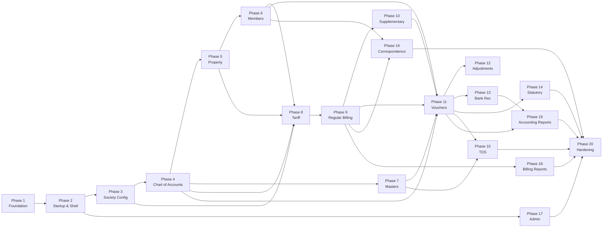

# Development Plan — Society Accounting & Management System (SAMS)

| **Document Version** | 1.0 |
| -------------------- | --- |
| **Status**           | Draft |
| **Prepared By**      | Arvin |
| **Date**             | 7 June 2026 |
| **Based On**         | `SRS.md` v1.0 · `SDD.md` v2.0 |
| **Implementation By** | Cursor Agent (phase-by-phase) |

---

## Table of Contents

1. [Purpose & How to Use This Plan](#1-purpose--how-to-use-this-plan)
2. [Phase Overview & Dependencies](#2-phase-overview--dependencies)
3. [Cross-Phase Standards (Apply From Phase 1)](#3-cross-phase-standards-apply-from-phase-1)
4. [Phase 1 — Platform Foundation & Monorepo Scaffold](#phase-1--platform-foundation--monorepo-scaffold)
5. [Phase 2 — Startup Wizards, Authentication & Application Shell](#phase-2--startup-wizards-authentication--application-shell)
6. [Phase 3 — Society Configuration & Global UX Framework](#phase-3--society-configuration--global-ux-framework)
7. [Phase 4 — Chart of Accounts & Ledger Engine Core](#phase-4--chart-of-accounts--ledger-engine-core)
8. [Phase 5 — Property Tree, Units & Parking](#phase-5--property-tree-units--parking)
9. [Phase 6 — Members, Tenants & Opening Balances](#phase-6--members-tenants--opening-balances)
10. [Phase 7 — Miscellaneous Masters](#phase-7--miscellaneous-masters)
11. [Phase 8 — Tariff Configuration & Billing Calendar](#phase-8--tariff-configuration--billing-calendar)
12. [Phase 9 — Regular Billing Engine](#phase-9--regular-billing-engine)
13. [Phase 10 — Supplementary Billing](#phase-10--supplementary-billing)
14. [Phase 11 — Receipt, Payment & Contra Vouchers + Settlement](#phase-11--receipt-payment--contra-vouchers--settlement)
15. [Phase 12 — Adjustments, Petty Cash & Cheque Printing](#phase-12--adjustments-petty-cash--cheque-printing)
16. [Phase 13 — Bank Reconciliation](#phase-13--bank-reconciliation)
17. [Phase 14 — Statutory Registers](#phase-14--statutory-registers)
18. [Phase 15 — TDS Management & Form 16A](#phase-15--tds-management--form-16a)
19. [Phase 16 — Correspondence & Communication](#phase-16--correspondence--communication)
20. [Phase 17 — Administration, Backup & Year-End](#phase-17--administration-backup--year-end)
21. [Phase 18 — Billing & Member Reports](#phase-18--billing--member-reports)
22. [Phase 19 — Accounting & Financial Statement Reports](#phase-19--accounting--financial-statement-reports)
23. [Phase 20 — Statutory/TDS Reports, CSV Import & Release Hardening](#phase-20--statutorytds-reports-csv-import--release-hardening)
24. [Appendix A — Complete SDD Section → Phase Map](#appendix-a--complete-sdd-section--phase-map)
25. [Appendix B — Database Entity → Phase Map](#appendix-b--database-entity--phase-map)
26. [Appendix C — Screen → Phase Map](#appendix-c--screen--phase-map)
27. [Appendix D — IPC Channel → Phase Map](#appendix-d--ipc-channel--phase-map)
28. [Appendix E — Service → Phase Map](#appendix-e--service--phase-map)
29. [Appendix F — Report → Phase Map](#appendix-f--report--phase-map)
30. [Appendix G — Algorithm → Phase Map](#appendix-g--algorithm--phase-map)
31. [Appendix H — SRS Requirement ID → Phase Map](#appendix-h--srs-requirement-id--phase-map)

---

## 1. Purpose & How to Use This Plan

This document defines **20 sequential implementation phases** for SAMS. Each phase is a self-contained unit of work that an implementing agent completes before moving to the next. Every item in `SDD.md` v2.0 is assigned to **exactly one primary phase** (with cross-references where a feature spans layers).

**For each phase, the implementing agent must:**

1. Read the listed SDD sections in full before writing code.
2. Implement all deliverables listed under **Scope**.
3. Verify **Acceptance Criteria** before marking the phase complete.
4. Not begin Phase N+1 until Phase N acceptance criteria pass.

**SDD reference shorthand used throughout:**

| Shorthand | SDD Location |
| --------- | ------------ |
| `SDD §N` | Main section N (e.g. `SDD §10` = Billing Engine) |
| `SDD §24.x` | Appendix A database entity |
| `SDD §25` | Appendix B IPC channels |
| `SDD §26.x` | Appendix C service |
| `SDD §27.x` | Appendix D algorithm |
| `SDD §28.x` | Appendix E report spec |
| `SDD §29.x` | Appendix F screen/field spec |
| `SDD §30` | Appendix G enums/seeds |
| `SDD §31.x` | Appendix H requirement index |
| `SDD §23.x` | Detailed feature implementation subsection |

---

## 2. Phase Overview & Dependencies



| Phase | Title | Primary SDD Sections |
| ----- | ----- | -------------------- |
| 1 | Platform Foundation & Monorepo Scaffold | §2, §3.1, §4, §21 (partial), §24.1, §24.7, §25 (core), §29.3, §30 |
| 2 | Startup Wizards, Authentication & Application Shell | §2.3, §20, §18 (partial), §23 (GAP-034–039), §24.6, §29.1 (SCR-START, SCR-LOGIN, WIZ) |
| 3 | Society Configuration & Global UX Framework | §5, §23 (§5.7), §24.2–§24.5, §24.23, §29 (SOC-*), §31.1 |
| 4 | Chart of Accounts & Ledger Engine Core | §8, §23 (§8.5), §24.15, §26 (CoA/Ledger), §29 (COA-*), §31.4 |
| 5 | Property Tree, Units & Parking | §6, §23 (§6.8), §24.8–§24.12, §25 (building/unit/parking), §29 (BLD-*), §31.2 |
| 6 | Members, Tenants & Opening Balances | §7, §23 (§7.7), §24.13–§24.14, §26 (Member/Tenant/OB), §29 (MEM-*), §31.3 |
| 7 | Miscellaneous Masters | §17, §23 (§17.6), §24.22, §25 (masters), §29 (MST-*), §31 (partial) |
| 8 | Tariff Configuration & Billing Calendar | §9, §23 (§9.6), §24.16, §27.1, §27.3, §29 (TAR-*), §31.5 |
| 9 | Regular Billing Engine | §10, §23 (§10.8), §24.17, §27.2–§27.12, §29 (BIL-001/002/004/005), §31.6 (RB, GAP-001–011, GAP-028–033) |
| 10 | Supplementary Billing | §10 (SB), §23 (SB section), §24.17, §29 (BIL-003), §31.6 (SB) |
| 11 | Receipt, Payment & Contra Vouchers + Settlement | §11, §23 (§11.8), §24.18, §27.11, §29 (VCH-001), §31.7 (BC, GAP-043, GAP-046–048) |
| 12 | Adjustments, Petty Cash & Cheque Printing | §12, §11 (petty/cheque), §23, §27.15–§27.16, §29 (VCH-002/003/005), §31.7 (AJ, GAP-012–019) |
| 13 | Bank Reconciliation | §13, §23 (§13.5), §26 (BankRec), §29 (BNK-001), §31.8 |
| 14 | Statutory Registers | §14, §23 (§14.6), §24.19, §26 (StatutoryRegister), §29 (REG-*), §31.9 |
| 15 | TDS Management & Form 16A | §15, §23 (§15.5), §24.20, §27.17, §29 (TDS-*), §31.10 |
| 16 | Correspondence & Communication | §16, §23 (§16.6), §24.21, §27.18, §29 (COR-*), §31.11 |
| 17 | Administration, Backup & Year-End | §18, §20, §23 (§18.7, §20.5), §26 (YearEnd/Backup), §29 (ADM-*), §31.12–§31.15 |
| 18 | Billing & Member Reports | §19 (billing), §28 (RPT-B*, RPT-M*), §29 (RPT billing/member) |
| 19 | Accounting & Financial Statement Reports | §19 (accounting), §28 (RPT-A*), §26 (LedgerBalance reports) |
| 20 | Statutory/TDS Reports, CSV Import & Release Hardening | §28 (RPT-T*, remaining), §20.4, §21, §23 (§21.7), §31 (remaining), IMP-* |

---

## 3. Cross-Phase Standards (Apply From Phase 1)

These SDD items are **foundational** and must be present before any feature phase UI work begins. They are implemented primarily in Phases 1–3 but enforced in every subsequent phase.

| Standard | SDD Reference | Enforcement |
| -------- | ------------- | ----------- |
| Layered IPC architecture | `SDD §2.1`, `§2.7–§2.9`, `NF-022` | Renderer never imports Prisma |
| Typed IPC envelopes | `SDD §2.4`, `§25`, `NF-023` | All channels in shared-types |
| Audit columns on mutations | `SDD §3.1`, `§24.x`, `NF-011` | created/updated by/at |
| Standard form toolbar | `SDD §4.1`, `§29.2`, `NF-015`, SRS Appendix A | `<MasterFormToolbar />` |
| Find/filter on lists | `SDD §4.1`, `NF-016` | `<FilterDrawer />` |
| Print preview before print | `SDD §4.7`, `NF-020` | `<PrintPreviewModal />` |
| Confirm destructive actions | `SDD §4.1`, `NF-021` | `<ConfirmDialog />` |
| Money value type | `SDD §3.1`, `§4.4` | No float math on amounts |
| SQLite WAL mode | `SDD §3.1`, `NF-006` | Enabled on DB connect |
| Prisma migrations | `SDD §3.1`, `NF-025` | Versioned schema changes |
| RBAC IPC middleware | `SDD §4.2`, `NF-010` | checkPermission on every channel |
| Error codes | `SDD §2.10` | ACCOUNTING_IMBALANCE, YEAR_CLOSED, etc. |

---

## Phase 1 — Platform Foundation & Monorepo Scaffold

### Goal

Establish the Electron + React + TypeScript + Prisma monorepo, core infrastructure, and patterns that all later phases extend.

### Prerequisites

None — this is the first phase.

### SDD Scope (read before implementing)

| Area | SDD Sections |
| ---- | ------------ |
| Architecture | `§2.1–§2.6`, `§2.7` (main process layout), `§2.8` (renderer layout), `§2.9` (preload contract), `§2.10` |
| Data strategy | `§3.1`, `§3.4`, `§3.5` |
| Cross-cutting | `§4.3` (NumberSeriesService stub), `§4.4` (Money type), `§4.5` (AuditService stub) |
| Database | `§24.1` SystemMeta, `§24.7` User/Permission/AuditLog |
| IPC | `§25` middleware pattern; register `auth:getSession` stub |
| Enums | `§30.1` core enums (UserRole, PermissionAction, SeriesType shell) |
| NFR | `NF-022`, `NF-023`, `NF-025`, `NF-026`, `IMP-001`, `IMP-002`, `IMP-005` |

### Deliverables

```
sams/
├── apps/desktop/main/          # Electron main bootstrap
├── apps/desktop/preload/       # contextBridge skeleton
├── apps/desktop/renderer/      # React app shell (empty routes)
├── packages/shared-types/      # IpcRequest, IpcResponse, enums
├── packages/services/          # Money, AuditService stub
├── packages/db/                # Prisma schema: SystemMeta, User, Permission, AuditLog
└── assets/report-templates/    # empty placeholder directory
```

**Prisma models (Phase 1):** `SystemMeta`, `User`, `Permission`, `AuditLog` per `SDD §24.1`, `§24.7`.

**IPC pipeline:** `withIpcPipeline` middleware chain per `SDD §2.7`: validateSession → checkPermission → validatePayload → invokeService.

**Shared components (stubs):** `<MasterFormToolbar />`, `<FilterDrawer />`, `<ConfirmDialog />`, `<PrintPreviewModal />` per `SDD §29.3`.

### Implementation Tasks

1. Initialize monorepo (pnpm/npm workspaces) matching `SDD §2.2` package layout.
2. Configure Electron main + preload + renderer with contextIsolation enabled.
3. Create Prisma schema + initial migration; enable WAL on connect (`SDD §3.1`).
4. Implement `Money` value type with rounding helpers (`SDD §4.4`).
5. Implement IPC envelope types and middleware skeleton (`SDD §2.4`, `§25`).
6. Seed `Permission` matrix from `SDD §30.4` / `§4.2`.
7. Implement bcrypt password hashing utility (`SDD §26.2` AuthService.hashPassword).
8. Configure ESLint/TypeScript strict; services package must have zero Electron imports (`NF-024`).

### Acceptance Criteria

- [ ] App launches to empty renderer shell without errors (`NF-003` baseline).
- [ ] Prisma migration runs; `SystemMeta`, `User`, `Permission`, `AuditLog` tables exist.
- [ ] `withIpcPipeline` middleware chain callable from a test handler.
- [ ] `Money` rounds per 0/2 decimal config.
- [ ] No renderer import of Prisma or Node APIs (`NF-022` verified by lint rule).
- [ ] Services package has no Electron dependency (`NF-024`).

---

## Phase 2 — Startup Wizards, Authentication & Application Shell

### Goal

Implement the startup selector, new society / new FY wizards, login flow, and main application shell (sidebar, tabs, explorer tree skeleton).

### Prerequisites

Phase 1 complete.

### SDD Scope

| Area | SDD Sections |
| ---- | ------------ |
| Lifecycle | `§2.3.1`, `§2.3.2`, `§20.1`, `§20.2` |
| Detailed impl | `§23` (GAP-034–039), `§20.5` (WIZ steps) |
| Database | `§24.2` SocietyIdentity, `§24.6` FinancialYear, `§24.24` AppConfig |
| Screens | `§29.1` SCR-START, SCR-LOGIN, WIZ-001, WIZ-002 |
| IPC | `§25` startup:*, auth:login, auth:logout, auth:getSession |
| Services | `§26.1` SessionService, `§26.2` AuthService |
| Seeds | `§30.3` (partial — default CoA seed deferred to Phase 4) |
| Requirements | `GAP-034`–`GAP-039`, `GAP-039`, `NF-010`, `NF-012`, `NF-013`, `IMP-007` |

### Deliverables

**Screens:**
- `SCR-START` — Open Existing / Create New Society / Open New FY (`SDD §29.1`)
- `WIZ-001` — 6-step new society wizard (`SDD §20.5`, `§23` GAP-035)
- `WIZ-002` — New financial year wizard shell (full carry-forward in Phase 17)
- `SCR-LOGIN` — username/password (`SDD §29.1`)
- Main shell — sidebar + tab bar + optional explorer tree (`SDD §2.5`, `§29.7`)

**Database additions:** `SocietyIdentity`, `FinancialYear` (`SDD §24.2`, `§24.6`).

**IPC channels:** all `startup:*` and `auth:*` from `SDD §25` §24.1–24.2.

**AppConfig:** `recentDatabases[]`, window bounds in Electron userData (`SDD §24.24`).

### Implementation Tasks

1. Build startup selector route before authenticated shell (`GAP-034`).
2. Implement `startup:validateDatabase` — check `_prisma_migrations`, `SystemMeta`, `SocietyIdentity` (`SDD §2.3.1`).
3. Implement `WIZ-001`: collect identity fields, pick DB path, run migrations, create admin user (`SDD §20.5` step table).
4. Implement `auth:login` with bcrypt verify + in-memory session (`NF-012`, `NF-013`).
5. Build main shell with tab store and explorer tree placeholder (`IMP-007`, `NF-018`).
6. Ensure main menu has **no** New Society / New Year entries (`GAP-039`).
7. `WIZ-002` skeleton: file picker + validation only; carry-forward logic deferred to Phase 17.

### Acceptance Criteria

- [ ] Startup shows three options; recent DB list works (`GAP-037`).
- [ ] WIZ-001 creates valid SQLite file with SocietyIdentity + admin user (`GAP-035`).
- [ ] Login required before main shell; session cleared on app close (`NF-013`).
- [ ] Invalid DB file rejected with descriptive error.
- [ ] Main menu does not expose New Society / New Year (`GAP-039`).

---

## Phase 3 — Society Configuration & Global UX Framework

### Goal

Implement all society setup screens, billing period calendar generation, report format selection, and complete the shared UX component library.

### Prerequisites

Phase 2 complete (authenticated shell exists).

### SDD Scope

| Area | SDD Sections |
| ---- | ------------ |
| Module | `§5`, `§23` (§5.7) |
| Database | `§24.2`, `§24.3`, `§24.4`, `§24.5`, `§24.23` BillingPeriodCalendar, `§24.5` ReportTemplate |
| Screens | `§29.1` SOC-001–004, `§29.4` (all SP fields), `§29.2`, `§29.3` (complete all shared components) |
| IPC | `§25` society:* |
| Services | `§26.3` SocietyConfigService, `§26.11` BillingPeriodService (§27.1 algorithm) |
| Algorithms | `§27.1` BillingPeriodCalendar |
| Requirements | `SP-001`–`SP-021`, `GAP-008`, `GAP-011`, `GAP-049`, `GAP-050`, `NF-015`–`NF-021`, `NF-019` |

### Deliverables

**Screens:** SOC-001, SOC-002, SOC-003, SOC-004 per `SDD §29.1` field specs.

**Database:** `SocietyParameters` (all SP columns `SDD §24.3`), `PropertyInformation` (`§24.4`), `ReportFormatConfig`, `ReportTemplate` (`§24.5`), `BillingPeriodCalendar` (`§24.23`).

**Services:**
- `SocietyConfigService` — all methods `SDD §26.3`
- `BillingPeriodService.generateCalendar` — `SDD §27.1`

**UX components (complete):** `<AccountPickerModal />`, `<MoneyInput />`, `<InlineHelpPopover />` with GAP-049 help text from SRS 9.13, `<AuditIdentityModal />` per `SDD §29.3`.

### Implementation Tasks

1. SOC-001 singleton edit form (`SDD §5.2`, `§23` §5.7.1 field table).
2. SOC-002 all parameter sections with SP-002 frequency change warning (`SDD §5.3`, `§29.4`).
3. SOC-003 property information form (`SDD §5.4`).
4. SOC-004 report template selectors + preview thumbnails (`SDD §5.5`); seed 2 templates per type (`SDD §30.5`).
5. Generate `BillingPeriodCalendar` on FY creation and frequency change (`GAP-001` foundation).
6. Inline help on interest sub-type labels (`GAP-049`).
7. Wire `<MasterFormToolbar />` to all four screens with full Appendix A keyboard bindings (`SRS Appendix A`).

### Acceptance Criteria

- [ ] All SP-001–SP-021 fields persist and reload correctly (incl. GAP-011 NOC %).
- [ ] Bill frequency change triggers SP-002 warning when bills exist.
- [ ] BillingPeriodCalendar rows generated for all 6 frequency types (`SDD §30.4`).
- [ ] Report format selection stored globally (`SDD §5.5` note).
- [ ] Inline help popover shows Delay Days/Months/Complete Cycle text (`GAP-049`).
- [ ] All CRUD toolbar actions work on society screens (`NF-015`).

---

## Phase 4 — Chart of Accounts & Ledger Engine Core

### Goal

Implement the four-tier Chart of Accounts, account master with billing flags, ledger balance computation, and member subsidiary ledger auto-creation hook.

### Prerequisites

Phase 3 complete (Society Parameters account linkages need CoA targets — seed default CoA in this phase).

### SDD Scope

| Area | SDD Sections |
| ---- | ------------ |
| Module | `§8`, `§23` (§8.5) |
| Database | `§24.15` AccountCategory/Group/Subgroup/Master |
| Screens | `§29.1` COA-001, COA-002, COA-003 |
| IPC | `§25` coa:* |
| Services | `§26.8` ChartOfAccountsService, `§26.9` LedgerBalanceService, `§26.32` ReferenceGuardService |
| Seeds | `§30.3` default CoA groups + billing accounts (MAINT, PARK, SINK, INTR, NOC, STAX) |
| Requirements | `COA-001`–`COA-010`, `SP-012` (linkage targets now exist) |

### Deliverables

**Default CoA seed** per `SDD §30.3` — minimum groups and billing ledger short codes.

**Screens:** COA tree explorer + Group/Subgroup/Account forms (`SDD §8.1–§8.3`, `§29.1` COA-*).

**Services:**
- `ChartOfAccountsService` — CRUD all tiers + `createMemberSubsidiaryLedger` stub (`SDD §26.8`)
- `LedgerBalanceService.getClosingBalance` (`COA-007`, `SDD §26.9`)
- `AccountValidationService` — hierarchy consistency (`COA-009`)
- `ReferenceGuardService` — foundation (`SDD §26.32`)

**IPC:** all `coa:*` channels `SDD §25` §24.7.

### Implementation Tasks

1. Seed AccountCategory (4 fixed values), default groups/subgroups/accounts (`COA-001`, `SDD §30.3`).
2. COA-001/002 Group and Subgroup CRUD with balanceSheetSr ordering.
3. COA-003 Account Master: opening balances, shortCode, billing flags, pettyCash, isActive (`SDD §8.3`, `§23` §8.5).
4. Computed closing balance on account load (`COA-007`).
5. Archive guard (`COA-008`); inactive excluded from pickers (`COA-010`).
6. F3/F4/general account picker modals (`BC-005` foundation via `coa:searchMembers`, `coa:searchBanks`, `coa:searchForPicker`).
7. Update SOC-002 linkage dropdowns to resolve against live CoA (`SP-012`).

### Acceptance Criteria

- [ ] Four-tier hierarchy navigable in tree explorer.
- [ ] shortCode 4-char unique enforced (`COA-005`).
- [ ] Closing balance = OB ± posted lines (0 when no vouchers yet).
- [ ] Archive blocked when voucher lines reference account (`COA-008`).
- [ ] Default billing accounts seeded with correct short codes.
- [ ] SP-012 linkages in Society Parameters selectable and saved.

---

## Phase 5 — Property Tree, Units & Parking

### Goal

Implement buildings, wings, reference masters, units, and full parking management.

### Prerequisites

Phase 4 complete (CoA exists for parking charge account linkage).

### SDD Scope

| Area | SDD Sections |
| ---- | ------------ |
| Module | `§6`, `§23` (§6.8) |
| Database | `§24.8`–`§24.12` |
| Screens | `§29.1` BLD-001–007 |
| IPC | `§25` building:*, wing:*, unit:*, referenceMaster:*, parking:* |
| Services | `§26.4` PropertyTreeService, `§26.5` ParkingService |
| Requirements | `BU-001`–`BU-003`, `UI-001`–`UI-007`, `PK-001`–`PK-005`, `SP-004`, `SP-017` |

### Deliverables

All property entities per `SDD §24.8–§24.12`. All BLD screens per `SDD §29.1`. `ParkingService.calculateParkingCharges` per `SDD §27.4`.

### Implementation Tasks

1. BLD-001 Building CRUD + delete guard (`BU-003`, `ReferenceGuardService`).
2. BLD-002 Wing CRUD scoped to building; '.' shortName allowed.
3. BLD-003 Reference masters tabbed CRUD (UnitArea, UnitType, Composition, FloorMaster).
4. BLD-004 Unit form: composite uniqueness, serialNo auto, areas (`UI-001`–`UI-007`), embedded unit tariff when simple method (`UI-004`), opening balance button (`UI-005`), soft archive (`UI-006`).
5. BLD-005/006/007 Parking tariff types (effective-dated rates), spaces, assignments.
6. `parking:calculateForBill` IPC for billing phase consumption.

### Acceptance Criteria

- [ ] Multiple buildings supported (`BU-001`).
- [ ] Unit number uniqueness on building+wing+unitNo (`UI-002`).
- [ ] serialNo auto-increments (`UI-007`).
- [ ] Parking rates immutable — new rate = new row (`PK-001`).
- [ ] Delete building blocked when referenced (`BU-003`).
- [ ] Dual residential/commercial areas stored (`SP-017`, `UI-003`).

---

## Phase 6 — Members, Tenants & Opening Balances

### Goal

Implement full member management (all tabs/sub-tables), tenant records, member disposal, and opening balance posting with ledger integration.

### Prerequisites

Phases 4–5 complete (units exist; member subsidiary ledger in CoA).

### SDD Scope

| Area | SDD Sections |
| ---- | ------------ |
| Module | `§7`, `§23` (§7.7) |
| Database | `§24.13`, `§24.14` |
| Screens | `§29.1` MEM-001–006 |
| IPC | `§25` member:*, tenant:* |
| Services | `§26.6` MemberService, `§26.7` TenantService, `§26.28` OpeningBalanceService, `§27.14` OB ledger posting |
| Requirements | `MM-001`–`MM-007`, `GAP-023`–`GAP-027`, `GAP-040`–`GAP-042`, SRS `§6.2` |

### Deliverables

Full Member entity + all sub-tables (`SDD §24.13`). Tenant entity (`§24.14`). Opening balance with JV posting (`§27.14`, `§27.15` reconciliation).

### Implementation Tasks

1. MEM-001 identification form with vacancy check (`MM-001`), bill flags (`MM-006`), disposal (`MM-007`).
2. MEM-002 personal + photo upload; MEM-003 dependents/nominees/vehicles/shares/housing loans; MEM-004 address.
3. MEM-005 opening balance: Regular (principal+interest+ST) and Supplementary partitions (`SDD §7.4`).
4. OpeningBalanceService posts balanced JV; reconciliation warning vs member control account (`SRS §6.2`).
5. MEM-006 tenant register (`GAP-023`–`GAP-027`); tenant occupancy validation (`GAP-027`).
6. ChartOfAccountsService.createMemberSubsidiaryLedger on member save.
7. Class and club deposit fields (`GAP-040`, `GAP-041`).

### Acceptance Criteria

- [ ] Cannot assign member to occupied unit (`MM-001`).
- [ ] Disposal sets unit VACANT; member archived not deleted (`MM-007`).
- [ ] One active tenant per unit (`GAP-024`).
- [ ] Opening balance generates JV with ΣDr=ΣCr (`§6.2` note).
- [ ] Tenant picker filters active only (`GAP-026` foundation).
- [ ] All sub-tables CRUD functional.

---

## Phase 7 — Miscellaneous Masters

### Goal

Implement all supporting master data modules required by vouchers, TDS, and bank workflows.

### Prerequisites

Phase 4 complete (Address Book links to AccountMaster).

### SDD Scope

| Area | SDD Sections |
| ---- | ------------ |
| Module | `§17`, `§23` (§17.6) |
| Database | `§24.22` |
| Screens | `§29.1` MST-001–005 |
| IPC | `§25` masters:* |
| Seeds | `§30.6` narrations, `§30.7` cheque cancellation reasons |
| Requirements | SRS `§3.13.1`–`§3.13.5`, `GAP-021` (SOCIETY_BANK party type) |

### Deliverables

All five master modules with CRUD + specialized behaviors (MICR lookup, dishonoured cheque list).

### Implementation Tasks

1. MST-001 Bank master + MICR sub-grid; 9-digit MICR unique.
2. MST-002 Narration master scoped by voucher type; shortcode field.
3. MST-003 Address Book with partyType including SOCIETY_BANK (`GAP-021`).
4. MST-004 Cheque cancellation reasons + dishonoured cheque drill-down list.
5. MST-005 Contractors CRUD.
6. Seed default narrations and cancellation reasons (`SDD §30.6`, `§30.7`).

### Acceptance Criteria

- [ ] MICR code lookup returns bank/branch (`SDD §17.2` MST-001).
- [ ] Address Book links to AccountMaster parties.
- [ ] SOCIETY_BANK party type storable (`GAP-021`).
- [ ] Cheque reason master shows linked dishonoured cheques with drill-down.
- [ ] Narration shortcodes selectable scope per voucher type.

---

## Phase 8 — Tariff Configuration & Billing Calendar

### Goal

Implement tariff definitions (simple + advance method), settlement sequence, bill register column mapping, and tariff resolution engine.

### Prerequisites

Phases 3–6 complete (parameters, CoA billing accounts, members/units exist).

### SDD Scope

| Area | SDD Sections |
| ---- | ------------ |
| Module | `§9`, `§23` (§9.6) |
| Database | `§24.16` |
| Screens | `§29.1` TAR-001, TAR-002, TAR-003 |
| IPC | `§25` tariff:* |
| Services | `§26.10` TariffService, SettlementSequenceService |
| Algorithms | `§27.3` TariffResolution, `TD-005` advance method |
| Requirements | `TD-001`–`TD-005`, `SP-011`, SRS `§3.5.2`, `§3.5.3` |

### Deliverables

Tariff CRUD with effective-date immutability. `tariff:resolveForMember` IPC. Settlement sequence + bill register mapping screens.

### Implementation Tasks

1. TAR-001 tariff definition with scope levels per SP-011; line grid with srNo reorder (`TD-003`).
2. Effective-date immutability — rate change creates new header (`TD-001`).
3. Tenant-type line filtering logic (`TD-004`).
4. Advance method toggle + rateable value formula (`TD-005`, `SDD §27.3`).
5. TAR-002 settlement sequence (effective-dated ordered charge heads).
6. TAR-003 bill register column mapping (short code / full name).
7. `TariffService.resolveForMember` with priority order Unit > Wing > Building > … (`SDD §9.2`).

### Acceptance Criteria

- [ ] Prior tariff rows read-only after new effective date (`TD-001`).
- [ ] Tenant lines excluded when tenantOccupancy=false (`TD-004`).
- [ ] Settlement sequence user-reorderable with effective dates.
- [ ] Bill register mapping controls column order for RPT-B01 (Phase 18).
- [ ] resolveForMember returns correct lines for unit-level tariff test case.

---

## Phase 9 — Regular Billing Engine

### Goal

Implement the complete regular (maintenance) billing engine: single bill entry, bulk generation, interest, NOC, arrears, rebates, service tax, and bill reference panel.

### Prerequisites

Phases 3, 6, 8 complete.

### SDD Scope

| Area | SDD Sections |
| ---- | ------------ |
| Module | `§10`, `§23` (§10.8) |
| Database | `§24.17` Bill, BillLine, BillInterestDetail, BillSettlement (schema only) |
| Screens | `§29.1` BIL-001, BIL-002, BIL-004, BIL-005; `§29.5` field spec |
| IPC | `§25` billing:* (regular subset) |
| Services | `§26.12` BillingService, `§26.13` InterestCalculationService, `§26.14` NocChargeService, `§26.15` RebateService, ServiceTaxService, `§26.16` ArrearsService, `§26.17` NumberSeriesService (RB) |
| Algorithms | `§27.2`–`§27.12` (all except settlement allocation) |
| Requirements | `RB-001`–`RB-012`, `GAP-001`–`GAP-003`, `GAP-007`–`GAP-011`, `GAP-028`–`GAP-033`, `NF-001`, `NF-004` |

### Deliverables

Full regular bill pipeline per `SDD §23` 15-step table. Bulk generation in single transaction. Interest detail modal.

### Implementation Tasks

1. BIL-001 form per `SDD §29.5`; Bill For period dropdown from BillingPeriodCalendar (`GAP-001`).
2. Duplicate member+period rejection (`GAP-001` unique constraint).
3. 15-step generation pipeline (`SDD §23` §10.8 table): tariff → parking → NOC → arrears → interest → rebate → ST → adjustment → billAmount.
4. `InterestCalculationService` — all 4 simple sub-types + compound (`SDD §27.6`, `GAP-029`–`GAP-032`).
5. BIL-004 Interest Detail modal (`GAP-028`, `GAP-033`); manual override when SP-009.
6. BIL-002 bulk generation with period banner (`GAP-003`), starting bill no (`SP-016`), single TX rollback (`RB-010`, `NF-004`).
7. RB number series via NumberSeriesService (`GAP-046`).
8. BIL-005 reference panel shortcuts (`RB-012`); settlement panel read-only placeholder until Phase 11.
9. Bill print using selected template from SOC-004 (`GAP-002` billForLabel on document).

### Acceptance Criteria

- [ ] Bill amount formula correct: charges + interest + ST − rebate − adjustment (`RB-007`).
- [ ] NOC line appears when tenantOccupancy effective (`GAP-007`–`GAP-011`).
- [ ] Duplicate bill for same member+period rejected (`GAP-001`).
- [ ] Bulk 500 members completes < 5s on target hardware (`NF-001`).
- [ ] Interest detail shows per-source-bill breakdown (`GAP-028`).
- [ ] Bulk rollback on any single member failure (`NF-004`).
- [ ] Zero tariffs suppressed when SP-003 enabled.

---

## Phase 10 — Supplementary Billing

### Goal

Implement supplementary bills for Member, Tenant, and General bill-to types with separate ledger partition and number series.

### Prerequisites

Phase 9 complete.

### SDD Scope

| Area | SDD Sections |
| ---- | ------------ |
| Module | `§10` (SB), `§23` (SB section) |
| Database | `§24.17` (billType=SUPPLEMENTARY, billToType, generalPartyName) |
| Screens | `§29.1` BIL-003 |
| IPC | `§25` billing:saveSupplementaryBill, billing:listSupplementaryBills, etc. |
| Requirements | `SB-001`–`SB-005`, `GAP-026` |

### Deliverables

BIL-003 supplementary bill entry with three bill-to modes. SB number series. Separate supplementary OB partition.

### Implementation Tasks

1. BIL-003 billToType toggle: MEMBER / TENANT / GENERAL (`SB-001`).
2. Tenant picker — active tenants only (`GAP-026`); unit auto-fill.
3. General mode — free-text party, no unit required.
4. SB number series independent from RB (`SB-002`, `GAP-046`).
5. bookSr manual field (`SB-004`).
6. Same interest/rebate/ST mechanics as regular but supplementary partition (`SB-003`, `SB-005`).
7. Supplementary arrears via ArrearsService supplementary partition.

### Acceptance Criteria

- [ ] Three bill-to types functional with correct field behavior.
- [ ] SB and RB number series independent.
- [ ] Supplementary OB tracked separately from regular (`SB-005`).
- [ ] Interest engine uses supplementary interest config (`SP-006`).

---

## Phase 11 — Receipt, Payment & Contra Vouchers + Settlement

### Goal

Implement the unified voucher entry form, double-entry posting, bill settlement (regular FIFO + supplementary explicit), cheque details, MICR lookup, and number series for all voucher types.

### Prerequisites

Phases 7, 9, 10 complete (bills exist to settle; masters for MICR/narration).

### SDD Scope

| Area | SDD Sections |
| ---- | ------------ |
| Module | `§11`, `§23` (§11.8) |
| Database | `§24.18` Voucher, VoucherLine, ChequeDetail, VoucherNumberSeries, BillSettlement, GeneralBillSettlement |
| Screens | `§29.1` VCH-001, VCH-004; `§29.6` |
| IPC | `§25` voucher:* |
| Services | `§26.17` NumberSeriesService, `§26.18` VoucherService, `§26.19` SettlementService, `§26.20` ChequeService/MicrLookupService, LedgerPostingService |
| Algorithms | `§27.11` SettlementAllocation |
| Requirements | `BC-001`–`BC-014`, `GAP-004`–`GAP-006`, `GAP-043`, `GAP-046`–`GAP-048`, `NF-005`, `NF-008` |

### Deliverables

Full VCH-001 with posting, settlement, and cheque panel. All voucher number series. LedgerPostingService with ΣDr=ΣCr enforcement.

### Implementation Tasks

1. VCH-001 unified form: type/subType, multi-line Dr/Cr grid (`BC-004`), balance indicator (`NF-005`).
2. F3/F4/account pickers (`BC-005`); narration + shortcode (`BC-013`).
3. Cheque panel all fields + MICR lookup (`BC-006`, `GAP-043` bankSlipNo).
4. Number series MR/GR/CP/BP/CO (`GAP-046`–`GAP-048`); manual no duplicate warning.
5. `SettlementService.allocateRegularFIFO` + manual override (`BC-010`); tariffwise sequence (`BC-011`).
6. Supplementary settlement explicit pick only (`BC-012`).
7. General Reference panel for general supplementary bills (`GAP-004`–`GAP-006`, VCH-004).
8. BillSettlement rows created on post; BIL-001 settlement panel populated (`RB-009`).
9. ReconciliationAudited + RecordAudited flags (`BC-009`).
10. SinkingFundRegisterService hook stub (full register in Phase 14).

### Acceptance Criteria

- [ ] Unbalanced voucher cannot save (`NF-005`, `AJ-002` pattern).
- [ ] Member receipt settles regular bills FIFO by default (`BC-010`).
- [ ] Settlement respects tariffwise sequence order (`BC-011`).
- [ ] Supplementary requires explicit bill selection (`BC-012`).
- [ ] General supplementary bill linkable via General Reference (`GAP-005`).
- [ ] All 5 voucher number series increment independently (`GAP-046`).
- [ ] MICR auto-fills bank/branch (`BC-006`).

---

## Phase 12 — Adjustments, Petty Cash & Cheque Printing

### Goal

Implement JV/DN/CN adjustment vouchers, petty cash workflow, cheque cancellation with reversal, and cheque printing.

### Prerequisites

Phase 11 complete.

### SDD Scope

| Area | SDD Sections |
| ---- | ------------ |
| Modules | `§12`, `§11` (petty cash, cheque print portions) |
| Detailed impl | `§23` (§12.3, petty cash §11.8, cheque §11.8) |
| Screens | `§29.1` VCH-002, VCH-003, VCH-005 |
| Services | `§26.22` PettyCashService, `§26.20` ChequeService, `§27.15` ChequeCancellationReversal, `§27.16` AmountInWords |
| Requirements | `AJ-001`–`AJ-005`, `GAP-012`–`GAP-019`, `BC-008`, `SP-020` |

### Deliverables

Adjustment voucher screen, petty cash entry, cheque print preview, cheque cancellation flow.

### Implementation Tasks

1. VCH-005 JV/DN/CN with separate series (`AJ-001`); bill linkage panel (`AJ-003`).
2. Partial waiver proportional algorithm (`AJ-005`, `SDD §12.2`).
3. Cancel adjustment → reversal voucher, not delete (`AJ-004`, `NF-008`).
4. VCH-002 petty cash form — pettyCash flagged accounts only (`GAP-012`–`GAP-013`).
5. VCH-003 cheque print preview: payee, amount, amountWords read-only (`GAP-016`–`GAP-019`, `SP-020`).
6. `AmountInWordsService` Indian rupees/paise (`SDD §27.16`).
7. Cheque cancellation on bank vouchers (`BC-008`, `SDD §27.15`).

### Acceptance Criteria

- [ ] JV/DN/CN separate number series (`AJ-001`).
- [ ] Partial waiver creates proportional entries (`AJ-005`).
- [ ] Petty cash posts to GL same as cash payment (`GAP-013`).
- [ ] Cheque amount in words auto-generated and read-only (`GAP-019`).
- [ ] Cheque cancellation creates reversal; original preserved (`BC-008`, `NF-008`).
- [ ] Cheque uses template from SOC-004 (`GAP-017`).

---

## Phase 13 — Bank Reconciliation

### Goal

Implement clearing entry screen, bulk clearing date propagation, reconciliation statement, and voucher drill-down.

### Prerequisites

Phase 11 complete (bank vouchers with cheque details exist).

### SDD Scope

| Area | SDD Sections |
| ---- | ------------ |
| Module | `§13`, `§23` (§13.5) |
| Screens | `§29.1` BNK-001 |
| IPC | `§25` bankrec:* |
| Services | `§26.23` BankReconciliationService |
| Requirements | `BR-001`–`BR-006` |

### Deliverables

BNK-001 clearing entry screen + reconciliation statement report data (print in Phase 19 as RPT-A09).

### Implementation Tasks

1. BNK-001 filters: bank account, date range, status (`BR-001`).
2. Grid columns per `BR-002`; deposits/withdrawals derived from voucher lines.
3. Bulk clearing date: toolbar date + double-click propagate (`BR-003`).
4. Save updates ChequeDetail.clearedOnDate (`BR-004`).
5. `bankrec:getStatement` per `BR-005` formula (`SDD §13.3`).
6. Drill-down to VCH-001 readonly (`BR-006`).

### Acceptance Criteria

- [ ] Uncleared/Cleared/All filters work correctly.
- [ ] Bulk clearing date propagates to selected visible rows.
- [ ] Cleared date persists on original voucher cheque detail.
- [ ] Reconciliation statement numbers balance (`BR-005`).
- [ ] Double-click opens source voucher readonly.

---

## Phase 14 — Statutory Registers

### Goal

Implement FD, Property, Sinking Fund (auto-populated), and I-Form registers.

### Prerequisites

Phase 11 complete (receipts trigger sinking fund); Phase 6 complete (members for I-Form).

### SDD Scope

| Area | SDD Sections |
| ---- | ------------ |
| Module | `§14`, `§23` (§14.6) |
| Database | `§24.19` |
| Screens | `§29.1` REG-001–004 |
| Services | `§26.24` StatutoryRegisterService |
| Requirements | SRS `§3.10.1`–`§3.10.4`, `SF-001`–`SF-003`, `IF-001`–`IF-003`, `IMP-012` (MAY — maturity query stub) |

### Deliverables

All four statutory register screens. Auto sinking fund entry on receipt post.

### Implementation Tasks

1. REG-001 FD register CRUD + maturity status (`SDD §14.2`).
2. REG-002 Property register CRUD with auto Sr.No (`SDD §14.3`).
3. REG-003 Sinking fund read-only grid; `StatutoryRegisterService.onReceiptPosted` (`SF-001`, `SDD §14.4`).
4. REG-004 I-Form with header sync from member + share sub-tables (`IF-001`–`IF-003`).
5. Member disposal updates I-Form cessation fields.
6. FD maturity upcoming query stub for future notification (`IMP-012` MAY).

### Acceptance Criteria

- [ ] Sinking fund entry auto-created on qualifying receipt line (`SF-001`).
- [ ] Sinking fund fields match SF-002 spec.
- [ ] I-Form share and transfer sub-tables functional.
- [ ] Property register Sr.No auto-increments.
- [ ] FD maturity date tracked; status Active/Matured.

---

## Phase 15 — TDS Management & Form 16A

### Goal

Implement TDS auto-creation from payments, challan tracking, TDS record editing, and Form 16A generation.

### Prerequisites

Phases 7, 11 complete (Address Book; payment vouchers).

### SDD Scope

| Area | SDD Sections |
| ---- | ------------ |
| Module | `§15`, `§23` (§15.5) |
| Database | `§24.20` |
| Screens | `§29.1` TDS-001, TDS-002, TDS-003 |
| Services | `§26.25` TdsService, Form16AService |
| Algorithms | `§27.17` Form16AGeneration |
| Requirements | `TDS-001`–`TDS-005`, `GAP-020`–`GAP-022` |

### Deliverables

TDS record lifecycle + Form 16A with address validation.

### Implementation Tasks

1. Auto-create TdsRecord when payment hits TDS Payable account (`TDS-001`).
2. TDS-001 all TDS-002 amount fields editable.
3. TDS-002 challan sub-form (`TDS-003`).
4. Form 16A: block if AddressBook missing for party (`GAP-020`); use SOCIETY_BANK for deposit ref (`GAP-021`); group by nature+quarter+challan (`GAP-022`).
5. TDS-003 generation screen with party + FY picker.

### Acceptance Criteria

- [ ] TDS record auto-created on qualifying payment voucher line.
- [ ] Form 16A blocked with warning when party address missing (`GAP-020`).
- [ ] Form 16A includes all FY deductions for party (`GAP-022`).
- [ ] Challan details linkable to TDS records.

---

## Phase 16 — Correspondence & Communication

### Goal

Implement reminder letters (incl. MCACT-101), general letters, committee management, and meeting minutes.

### Prerequisites

Phases 6, 9 complete (members; outstanding data for reminders).

### SDD Scope

| Area | SDD Sections |
| ---- | ------------ |
| Module | `§16`, `§23` (§16.6) |
| Database | `§24.21` |
| Screens | `§29.1` COR-001–004 |
| Services | `§26.26` CorrespondenceService |
| Algorithms | `§27.18` McAct101ReferenceNumber |
| Requirements | `CL-001`–`CL-004`, `IMP-014` |

### Deliverables

Full correspondence module with placeholder engine and MCACT-101 legal trail.

### Implementation Tasks

1. LetterTemplate CRUD with types (`CL-001`).
2. Placeholder engine: `{amount}`, `[date]` (`CL-002`).
3. MCACT-101 auto reference MCACT-101/YYYY/NNNN + persisted GeneratedLetter (`CL-003`, `IMP-014`, `SDD §27.18`).
4. COR-001 reminder generator; bulk defaulters with threshold (`CL-004` SHOULD).
5. COR-002 general letters rich text.
6. COR-003 committee terms with history.
7. COR-004 meeting minutes with attendee grid + print template.

### Acceptance Criteria

- [ ] MCACT-101 reference number unique and immutable on reprint (`CL-003`).
- [ ] Placeholders replaced correctly in preview/print.
- [ ] GeneratedLetter persisted before print returns.
- [ ] Committee history preserved across terms.
- [ ] Meeting minutes printable with formal template.

---

## Phase 17 — Administration, Backup & Year-End

### Goal

Implement user management, backup/restore, year-end close/reopen, new FY wizard carry-forward, and audit log viewer.

### Prerequisites

Phases 2, 4, 6, 9, 11 complete (full data lifecycle for year-end).

### SDD Scope

| Area | SDD Sections |
| ---- | ------------ |
| Module | `§18`, `§20`, `§23` (§18.7, §20.5) |
| Screens | `§29.1` ADM-001, ADM-003, ADM-004, ADM-005 |
| Services | `§26.27` YearEndService, `§26.29` BackupService, `§26.2` AuthService (user CRUD), `§26.33` AuditService |
| Algorithms | `§27.13` YearEndCarryForward |
| Requirements | `NF-006`–`NF-009`, `NF-014`, `GAP-038`, `GAP-036`, `IMP-013` (SHOULD), `SRS §6.3` |

### Deliverables

Complete admin module + WIZ-002 carry-forward completion.

### Implementation Tasks

1. ADM-001 user CRUD with role assignment (`NF-010`, `NF-012`).
2. ADM-003 backup: WAL checkpoint → copy → integrity_check (`NF-006`, `NF-007`, `NF-029`).
3. Restore with validation + confirmation.
4. Scheduled backup job skeleton (`IMP-013` SHOULD).
5. ADM-004 year-end close: mark read-only, compute closings (`NF-009`).
6. Complete WIZ-002: carry-forward masters, OB rules, member arrears → OB (`GAP-038`, `SDD §27.13`).
7. Reopen year: Admin + confirmation gate (`NF-009`).
8. ADM-005 audit log viewer + CSV export (`NF-014`).

### Acceptance Criteria

- [ ] Backup file passes PRAGMA integrity_check (`NF-007`).
- [ ] WAL checkpoint runs before backup copy (`NF-006`).
- [ ] Year close sets SystemMeta.isReadOnly; postings blocked (`NF-009`).
- [ ] New FY carry-forward: Asset/Liability OB=closing; I&E zero; member arrears carried (`GAP-038`).
- [ ] Source year DB becomes read-only after WIZ-002.
- [ ] Admin can reopen year with confirmation (`NF-009`).
- [ ] Passwords stored bcrypt only (`NF-012`).

---

## Phase 18 — Billing & Member Reports

### Goal

Implement all billing and member/property reports with preview, print, PDF, CSV export, and drill-down where specified.

### Prerequisites

Phases 9–11, 16 complete (billing, vouchers, letters data exists).

### SDD Scope

| Area | SDD Sections |
| ---- | ------------ |
| Module | `§19` (billing/member) |
| Report specs | `§28` RPT-B01–B08, RPT-M01–M08 |
| Services | `§26.30` ReportService (foundation) |
| Infrastructure | `§4.6`, `§19.1`, `NF-002`, `NF-027`, `NF-020` |
| Requirements | `GAP-051`–`GAP-053`, `GAP-042`, SRS `§5.1`, `§5.3` |

### Deliverables

ReportService pipeline + 16 reports. Bill print templates wired. Contribution Summary accessible from BIL-005 (`GAP-053`).

### Implementation Tasks

1. ReportService: query → template → preview/print/pdf/csv (`SDD §4.6`, `§19.1`).
2. RPT-B01 Bill Register Regular — dynamic columns from TAR-003 mapping (`SDD §28` RPT-B01).
3. RPT-B02 Supplementary bill register.
4. RPT-B03 Member Ledger with running balance.
5. RPT-B04 All Bills Summary.
6. RPT-B05 Contribution Summary (`GAP-051`–`GAP-053`); link from BIL-005.
7. RPT-B06 Tariffwise Settlement.
8. RPT-B07 Outstanding Statement (also View menu SRS `§5.5`).
9. RPT-B08 Reminder Letter Print (uses COR-001 output).
10. RPT-M01 Member Directory incl. class + club deposit (`GAP-042`).
11. RPT-M02–M08 member/property/parking/I-Form/FD/Sinking Fund listing reports.
12. Drill-down on RPT-B01/B07 → bill/member ledger entries.

### Acceptance Criteria

- [ ] All 16 reports render preview < 3s on 10-year seed data (`NF-002`).
- [ ] Every report exports PDF and CSV locally (`NF-027`, `IMP-009`).
- [ ] RPT-B01 columns match TAR-003 mapping order.
- [ ] RPT-B05 columns match GAP-052 spec.
- [ ] Contribution Summary accessible from bill reference panel (`GAP-053`).
- [ ] Print preview shown before printer (`NF-020`).

---

## Phase 19 — Accounting & Financial Statement Reports

### Goal

Implement all accounting reports including Trial Balance, Balance Sheet, Income & Expenditure, bank reconciliation statement, and drill-down View menu reports.

### Prerequisites

Phases 11–13, 12 complete (vouchers, bank rec, petty cash).

### SDD Scope

| Area | SDD Sections |
| ---- | ------------ |
| Report specs | `§28` RPT-A01–A12 |
| Services | `§26.9` LedgerBalanceService (TB, BS, I&E, R&P) |
| Requirements | SRS `§5.2`, `§5.5` (View menu partial), `COA-002` substitute names, `SP-018`, `GAP-045` |

### Deliverables

12 accounting reports + View menu drill-down for Voucher Register and General Ledger.

### Implementation Tasks

1. RPT-A01 Voucher Register with drill-down to VCH-001 (`SRS §5.5`).
2. RPT-A02 Cash Book; RPT-A03 Bank Book.
3. RPT-A04 General Ledger with drill-down (`SRS §5.5`).
4. RPT-A05 Trial Balance via LedgerBalanceService.
5. RPT-A06 Balance Sheet with substitute group/subgroup names (`COA-002`).
6. RPT-A07 Income & Expenditure.
7. RPT-A08 Receipt & Payment Statement per cashBankGroup (`SP-018`).
8. RPT-A09 Bank Reconciliation Statement (data from Phase 13).
9. RPT-A10 Bank Deposit Slip grouped by bankSlipNo (`GAP-044`, `GAP-045` header from AddressBook).
10. RPT-A11 Day Book.
11. RPT-A12 Petty Cash Register (`GAP-014`).
12. View menu nav group for Member Outstanding (RPT-B07), Voucher Register, General Ledger, Bill Register (`SRS §5.5`).

### Acceptance Criteria

- [ ] Trial Balance debits = credits for balanced dataset.
- [ ] Balance Sheet uses substitute names where configured.
- [ ] Bank deposit slip lists all cheques in batch with total (`GAP-044`).
- [ ] Petty cash register separate from main cash book (`GAP-015`).
- [ ] View menu drill-down opens correct readonly screen with refId.
- [ ] All 12 reports export PDF/CSV.

---

## Phase 20 — Statutory/TDS Reports, CSV Import & Release Hardening

### Goal

Complete remaining reports, CSV member import, optional features, and non-functional hardening for release readiness.

### Prerequisites

All prior phases complete.

### SDD Scope

| Area | SDD Sections |
| ---- | ------------ |
| Reports | `§28` RPT-T01–T03; any remaining report polish |
| Migration | `§20.4`, `§26.31` ImportService |
| NFR | `§21`, `§23` (§21.7), all remaining `NF-*`, `IMP-*` |
| UX | `SP-021` MAY colour grids, `IMP-012` MAY FD notifications |
| Requirements | `NF-028`, `NF-030`, `IMP-010`–`IMP-013`, remaining `GAP-*` verification |

### Deliverables

Final three TDS reports. CSV import. NFR verification checklist complete. Optional MAY features if time permits.

### Implementation Tasks

1. RPT-T01 TDS Register; RPT-T02 TDS Challan Register; RPT-T03 Form 16A print (uses Phase 15 service).
2. CSV member import: template download, validate-only pass, all-or-nothing commit (`SRS §6.4`, `NF-028`, `IMP-010`).
3. Year-end archive read-only snapshot option (`NF-030` SHOULD).
4. NFR hardening pass per `SDD §21.7` checklist:
   - NF-001 bulk billing perf verification
   - NF-002 report perf verification
   - NF-003 startup time
   - NF-004 atomic bulk ops
   - NF-018 explorer tree complete
   - NF-019 inline help on all complex fields
5. Optional: colour-coded grid rows (`SP-021` MAY).
6. Optional: FD maturity in-app notification (`IMP-012` MAY).
7. Optional: scheduled backup (`IMP-013` SHOULD).
8. Full SDD Appendix H requirement spot-check — every REQ-ID has working feature.
9. GST field placeholder wired in Society Parameters (`IMP-011` SHOULD — field only, no billing logic change).

### Acceptance Criteria

- [ ] CSV import rejects file with any row error; no partial commit (`SRS §6.4`).
- [ ] All 28+ reports from `SDD §28` functional with preview/print/pdf/csv.
- [ ] Every SRS MUST requirement from `SDD §31` verified manually or by test.
- [ ] Startup to login < 4s on min-spec (`NF-003`).
- [ ] No renderer DB access; all IPC typed (`NF-022`, `NF-023`).
- [ ] Application usable end-to-end: create society → configure → add members → bill → receipt → TB/BS.

---

## Appendix A — Complete SDD Section → Phase Map

| SDD Section | Title | Phase |
| ----------- | ----- | ----- |
| §1 | Introduction | — (reference only) |
| §2.1–§2.6 | Architecture core | 1 |
| §2.7–§2.9 | Main/Renderer/Preload detail | 1–2 |
| §2.10 | Error handling | 1 |
| §3.1 | Database strategy | 1 |
| §3.2 | ER overview | 1 (diagram); entities per phase |
| §3.3–§3.5 | Entity summaries | respective entity phases |
| §4.1 | Standard form framework | 1 (stub), 3 (complete) |
| §4.2 | Permission model | 1 (seed), 2 (enforce) |
| §4.3 | Number series | 1 (stub), 9 (RB), 11 (vouchers) |
| §4.4 | Money & rounding | 1, 3 |
| §4.5 | Audit trail | 1 (stub), 17 (complete) |
| §4.6 | Report engine | 18 (foundation) |
| §4.7 | Print preview | 1 (stub), 18 (enforce) |
| §5 | Society Configuration | 3 |
| §6 | Building & Unit | 5 |
| §7 | Member Management | 6 |
| §8 | Chart of Accounts | 4 |
| §9 | Tariff Configuration | 8 |
| §10 | Billing Engine | 9 (regular), 10 (supplementary) |
| §11 | Cash & Bank Transactions | 11, 12 (petty/cheque) |
| §12 | Adjustment Vouchers | 12 |
| §13 | Bank Reconciliation | 13 |
| §14 | Statutory Registers | 14 |
| §15 | TDS Management | 15 |
| §16 | Correspondence | 16 |
| §17 | Miscellaneous Masters | 7 |
| §18 | Administration | 17 |
| §19 | Reporting Design | 18, 19, 20 |
| §20 | Initial Setup & Migration | 2 (wizards), 17 (year-end), 20 (CSV) |
| §21 | Non-Functional Design | 1, 3, 20 (hardening) |
| §22 | Traceability Matrix | — (reference) |
| §23 | Detailed Feature Implementation | split across phases 2–20 |
| §24 Appendix A | Database Schema | entity table in Appendix B |
| §25 Appendix B | IPC Catalog | channel table in Appendix D |
| §26 Appendix C | Service API | service table in Appendix E |
| §27 Appendix D | Algorithms | algorithm table in Appendix G |
| §28 Appendix E | Report Specs | report table in Appendix F |
| §29 Appendix F | UI Screens | screen table in Appendix C |
| §30 Appendix G | Enums & Seeds | 1, 3, 4, 7, 17 |
| §31 Appendix H | Requirement Index | requirement table in Appendix H |

---

## Appendix B — Database Entity → Phase Map

| Entity | SDD §24 | Phase |
| ------ | ------- | ----- |
| SystemMeta | §24.1 | 1 |
| User | §24.7 | 1 |
| Permission | §24.7 | 1 |
| AuditLog | §24.7 | 1 (schema), 17 (UI) |
| SocietyIdentity | §24.2 | 2 |
| FinancialYear | §24.6 | 2 |
| SocietyParameters | §24.3 | 3 |
| PropertyInformation | §24.4 | 3 |
| ReportTemplate | §24.5 | 3 |
| ReportFormatConfig | §24.5 | 3 |
| BillingPeriodCalendar | §24.23 | 3 |
| AccountCategory | §24.15 | 4 |
| AccountGroup | §24.15 | 4 |
| AccountSubgroup | §24.15 | 4 |
| AccountMaster | §24.15 | 4 |
| Building | §24.8 | 5 |
| Wing | §24.9 | 5 |
| UnitArea, UnitType, UnitComposition, FloorMaster | §24.10 | 5 |
| Unit | §24.11 | 5 |
| ParkingTariffType, ParkingTariffRate | §24.12 | 5 |
| ParkingSpace | §24.12 | 5 |
| MemberParkingAssignment | §24.12 | 5 |
| Member + all sub-tables | §24.13 | 6 |
| Tenant | §24.14 | 6 |
| BankMaster, BankMicrCode | §24.22 | 7 |
| NarrationMaster | §24.22 | 7 |
| AddressBookEntry | §24.22 | 7 |
| ChequeCancellationReason | §24.22 | 7 |
| ContractorDetail | §24.22 | 7 |
| TariffDefinition, TariffLine | §24.16 | 8 |
| TariffSettlementSequence + Line | §24.16 | 8 |
| TariffBillRegisterMapping | §24.16 | 8 |
| Bill, BillLine, BillInterestDetail | §24.17 | 9–10 |
| BillSettlement | §24.17 | 11 |
| Voucher, VoucherLine, ChequeDetail | §24.18 | 11–12 |
| VoucherNumberSeries | §24.18 | 9, 11 |
| GeneralBillSettlement | §24.18 | 11 |
| FixedDepositRegister | §24.19 | 14 |
| PropertyRegisterEntry | §24.19 | 14 |
| SinkingFundRegisterEntry | §24.19 | 14 |
| IFormRegister + share sub-tables | §24.19 | 14 |
| TdsRecord, TdsChallan | §24.20 | 15 |
| LetterTemplate, GeneratedLetter | §24.21 | 16 |
| CommitteeMember | §24.21 | 16 |
| MeetingMinutes, MeetingAttendee | §24.21 | 16 |
| AppConfig (local JSON) | §24.24 | 2 |

---

## Appendix C — Screen → Phase Map

| Screen ID | SDD §29.1 | Phase |
| --------- | --------- | ----- |
| SCR-START | Startup selector | 2 |
| SCR-LOGIN | Login | 2 |
| WIZ-001 | New society wizard | 2 |
| WIZ-002 | New financial year wizard | 2 (shell), 17 (carry-forward) |
| SOC-001 | Society identity | 3 |
| SOC-002 | Society parameters | 3 |
| SOC-003 | Property information | 3 |
| SOC-004 | Report formats | 3 |
| COA-001 | Account group | 4 |
| COA-002 | Account subgroup | 4 |
| COA-003 | Account master | 4 |
| BLD-001 | Building master | 5 |
| BLD-002 | Wing master | 5 |
| BLD-003 | Reference masters | 5 |
| BLD-004 | Unit identity | 5 |
| BLD-005 | Parking tariff types | 5 |
| BLD-006 | Parking spaces | 5 |
| BLD-007 | Parking assignments | 5 |
| MEM-001–005 | Member forms/tabs | 6 |
| MEM-006 | Tenant register | 6 |
| MST-001–005 | All misc masters | 7 |
| TAR-001–003 | Tariff screens | 8 |
| BIL-001 | Regular bill | 9 |
| BIL-002 | Bulk regular bills | 9 |
| BIL-003 | Supplementary bill | 10 |
| BIL-004 | Interest detail modal | 9 |
| BIL-005 | Bill reference panel | 9 |
| VCH-001 | Unified voucher | 11 |
| VCH-004 | General reference panel | 11 |
| VCH-002 | Petty cash | 12 |
| VCH-003 | Cheque print preview | 12 |
| VCH-005 | Adjustments JV/DN/CN | 12 |
| BNK-001 | Bank reconciliation | 13 |
| REG-001–004 | Statutory registers | 14 |
| TDS-001–003 | TDS screens | 15 |
| COR-001–004 | Correspondence | 16 |
| ADM-001 | User management | 17 |
| ADM-003 | Backup & restore | 17 |
| ADM-004 | Year-end | 17 |
| ADM-005 | Audit log | 17 |
| RPT-* | All reports | 18, 19, 20 |

---

## Appendix D — IPC Channel → Phase Map

| IPC Namespace | SDD §25 Section | Phase |
| ------------- | --------------- | ----- |
| startup:* | §25 §24.1 | 2 |
| auth:* | §25 §24.2 | 2 |
| society:* | §25 §24.3 | 3 |
| coa:* | §25 §24.7 | 4 |
| building:*, wing:*, unit:*, referenceMaster:* | §25 §24.4 | 5 |
| parking:* | §25 §24.5 | 5 |
| member:*, tenant:* | §25 §24.6 | 6 |
| masters:* | §25 §24.12 | 7 |
| tariff:* | §25 §24.8 | 8 |
| billing:* (regular) | §25 §24.9 | 9 |
| billing:* (supplementary) | §25 §24.9 | 10 |
| voucher:* | §25 §24.10 | 11 |
| pettycash:* | §25 §24.10 | 12 |
| adjustment:* | §25 §24.10 | 12 |
| bankrec:* | §25 §24.11 | 13 |
| registers:* | §25 §24.12 | 14 |
| tds:* | §25 §24.12 | 15 |
| correspondence:* | §25 §24.12 | 16 |
| admin:* | §25 §24.13 | 17 |
| report:* | §25 §24.13 | 18–20 |
| import:* | §25 §24.13 | 20 |

---

## Appendix E — Service → Phase Map

| Service | SDD §26 | Phase |
| ------- | ------- | ----- |
| SessionService | §26.1 | 2 |
| AuthService | §26.2 | 2, 17 |
| SocietyConfigService | §26.3 | 3 |
| PropertyTreeService | §26.4 | 5 |
| ParkingService | §26.5 | 5 |
| MemberService | §26.6 | 6 |
| TenantService | §26.7 | 6 |
| ChartOfAccountsService | §26.8 | 4, 6 |
| LedgerBalanceService | §26.9 | 4, 19 |
| TariffService | §26.10 | 8 |
| SettlementSequenceService | §26.10 | 8 |
| BillingPeriodService | §26.11 | 3 |
| BillingService | §26.12 | 9, 10 |
| InterestCalculationService | §26.13 | 9 |
| NocChargeService | §26.14 | 9 |
| RebateService / ServiceTaxService | §26.15 | 9 |
| ArrearsService | §26.16 | 9, 10 |
| NumberSeriesService | §26.17 | 9, 11 |
| VoucherService | §26.18 | 11, 12 |
| SettlementService | §26.19 | 11 |
| ChequeService / MicrLookupService | §26.20 | 11, 12 |
| AmountInWordsService | §26.20 | 12 |
| PettyCashService | §26.22 | 12 |
| BankReconciliationService | §26.23 | 13 |
| StatutoryRegisterService | §26.24 | 14 |
| TdsService / Form16AService | §26.25 | 15 |
| CorrespondenceService | §26.26 | 16 |
| YearEndService | §26.27 | 17 |
| OpeningBalanceService | §26.28 | 6 |
| BackupService | §26.29 | 17 |
| ReportService | §26.30 | 18 |
| ImportService | §26.31 | 20 |
| ReferenceGuardService | §26.32 | 4, 5 |
| AuditService | §26.33 | 1 (stub), 17 |

---

## Appendix F — Report → Phase Map

| Report ID | SDD §28 | Phase |
| --------- | ------- | ----- |
| RPT-B01 | Bill Register Regular | 18 |
| RPT-B02 | Bill Register Supplementary | 18 |
| RPT-B03 | Member Ledger | 18 |
| RPT-B04 | All Bills Summary | 18 |
| RPT-B05 | Contribution Summary | 18 |
| RPT-B06 | Tariffwise Settlement | 18 |
| RPT-B07 | Outstanding Statement / View menu | 18 |
| RPT-B08 | Reminder Letter Print | 18 |
| RPT-M01 | Member Directory | 18 |
| RPT-M02 | Member Profile | 18 |
| RPT-M03 | Occupancy Report | 18 |
| RPT-M04 | Parking Allocation | 18 |
| RPT-M05 | I-Form Register | 18 |
| RPT-M06 | Property Register | 18 |
| RPT-M07 | FD Register | 18 |
| RPT-M08 | Sinking Fund Register | 18 |
| RPT-A01 | Voucher Register / View menu | 19 |
| RPT-A02 | Cash Book | 19 |
| RPT-A03 | Bank Book | 19 |
| RPT-A04 | General Ledger / View menu | 19 |
| RPT-A05 | Trial Balance | 19 |
| RPT-A06 | Balance Sheet | 19 |
| RPT-A07 | Income & Expenditure | 19 |
| RPT-A08 | Receipt & Payment Statement | 19 |
| RPT-A09 | Bank Reconciliation Statement | 19 |
| RPT-A10 | Bank Deposit Slip | 19 |
| RPT-A11 | Day Book | 19 |
| RPT-A12 | Petty Cash Register | 19 |
| RPT-T01 | TDS Register | 20 |
| RPT-T02 | TDS Challan Register | 20 |
| RPT-T03 | Form 16A | 20 |

---

## Appendix G — Algorithm → Phase Map

| Algorithm | SDD §27 | Phase |
| --------- | ------- | ----- |
| BillingPeriodCalendar | §27.1 | 3 |
| DueDateCalculation | §27.2 | 9 |
| TariffResolution | §27.3 | 8 |
| ParkingChargeCalculation | §27.4 | 5 (service), 9 (consume) |
| NocChargeCalculation | §27.5 | 9 |
| InterestCalculation (all methods) | §27.6 | 9 |
| RebateCalculation | §27.7 | 9 |
| ServiceTaxCalculation | §27.8 | 9 |
| ArrearsCalculation | §27.9 | 9, 10 |
| BillAmountCalculation | §27.10 | 9, 10 |
| SettlementAllocation | §27.11 | 11 |
| BulkBillGeneration | §27.12 | 9 |
| YearEndCarryForward | §27.13 | 17 |
| OpeningBalanceLedgerPosting | §27.14 | 6 |
| MemberOpeningBalanceReconciliation | §27.15 | 6 |
| ChequeCancellationReversal | §27.15 (§27 D.15) | 12 |
| AmountInWords | §27.16 | 12 |
| Form16AGeneration | §27.17 | 15 |
| McAct101ReferenceNumber | §27.18 | 16 |

---

## Appendix H — SRS Requirement ID → Phase Map

| ID Range | Phase(s) |
| -------- | -------- |
| SP-001–SP-021 | 3 (SP-021 MAY also 20) |
| BU-001–BU-003 | 5 |
| UI-001–UI-007 | 5 |
| PK-001–PK-005 | 5, 9 |
| MM-001–MM-007 | 6 |
| COA-001–COA-010 | 4 |
| TD-001–TD-005 | 8 |
| RB-001–RB-012 | 9 |
| SB-001–SB-005 | 10 |
| BC-001–BC-014 | 11 |
| AJ-001–AJ-005 | 12 |
| BR-001–BR-006 | 13, 19 (RPT-A09) |
| SF-001–SF-003 | 14, 18 (RPT-M08) |
| IF-001–IF-003 | 14, 18 (RPT-M05) |
| TDS-001–TDS-005 | 15, 20 (reports) |
| CL-001–CL-004 | 16, 18 (RPT-B08) |
| GAP-001–GAP-003 | 3 (calendar), 9 |
| GAP-004–GAP-006 | 11 |
| GAP-007–GAP-011 | 3 (NOC %), 9 |
| GAP-012–GAP-015 | 12, 19 (RPT-A12) |
| GAP-016–GAP-019 | 12 |
| GAP-020–GAP-022 | 7 (address), 15, 20 |
| GAP-023–GAP-027 | 6, 10 |
| GAP-028–GAP-033 | 9 |
| GAP-034–GAP-039 | 2, 17 |
| GAP-040–GAP-042 | 6, 18 |
| GAP-043–GAP-045 | 11, 19 |
| GAP-046–GAP-048 | 9, 11 |
| GAP-049–GAP-050 | 3, 9 |
| GAP-051–GAP-053 | 18 |
| NF-001–NF-004 | 9, 18, 20 |
| NF-005–NF-009 | 11, 12, 17, 20 |
| NF-010–NF-014 | 1, 2, 17, 20 |
| NF-015–NF-021 | 1, 3, 18, 20 |
| NF-022–NF-026 | 1, 20 |
| NF-027–NF-030 | 18, 20 |
| IMP-001–IMP-014 | distributed per IMP table in SDD §31.13; hardening 20 |

---

**End of Development Plan**
