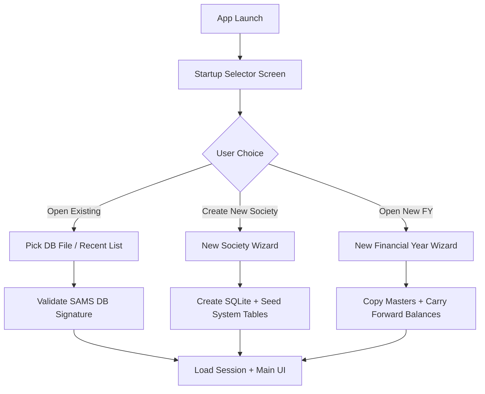
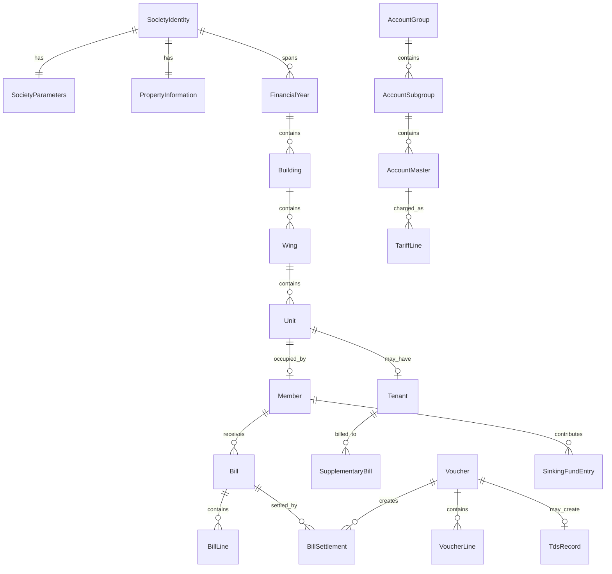
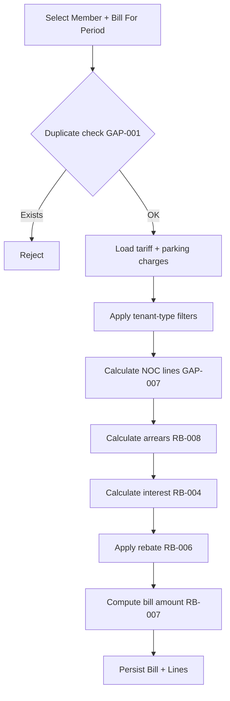
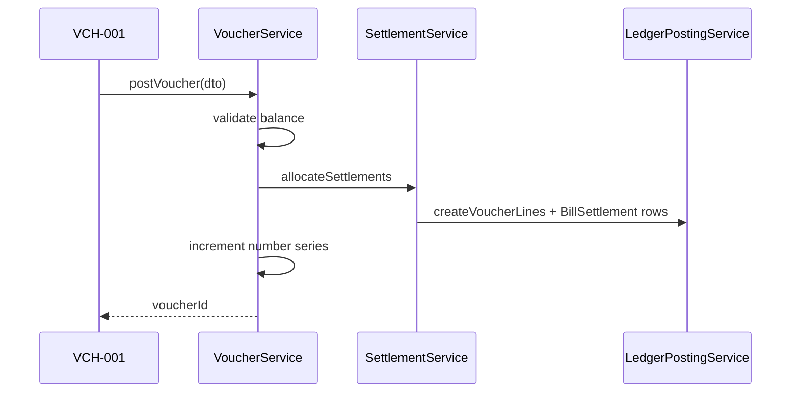

# Software Design Document (SDD)

## Society Accounting & Management System (SAMS)

| **Document Version** | 2.0 |
| -------------------- | --- |
| **Status**           | Draft — Comprehensive Implementation Design |
| **Prepared By**      | Arvin |
| **Date**             | 7 June 2026 |
| **Based On**         | SRS.md v1.0 |
| **Platform Target**  | Electron (Windows / macOS / Linux) — Offline-First |
| **Technology Stack** | Electron · React · TypeScript · SQLite (via Prisma) |

---

## Table of Contents

1. [Introduction](#1-introduction)
2. [System Architecture](#2-system-architecture)
3. [Data Design](#3-data-design)
4. [Cross-Cutting Design](#4-cross-cutting-design)
5. [Module Design — Society Configuration](#5-module-design--society-configuration)
6. [Module Design — Building & Unit Management](#6-module-design--building--unit-management)
7. [Module Design — Member Management](#7-module-design--member-management)
8. [Module Design — Chart of Accounts](#8-module-design--chart-of-accounts)
9. [Module Design — Tariff & Billing Configuration](#9-module-design--tariff--billing-configuration)
10. [Module Design — Billing Engine](#10-module-design--billing-engine)
11. [Module Design — Cash & Bank Transactions](#11-module-design--cash--bank-transactions)
12. [Module Design — Adjustment Vouchers](#12-module-design--adjustment-vouchers)
13. [Module Design — Bank Reconciliation](#13-module-design--bank-reconciliation)
14. [Module Design — Statutory Registers](#14-module-design--statutory-registers)
15. [Module Design — TDS Management](#15-module-design--tds-management)
16. [Module Design — Correspondence & Communication](#16-module-design--correspondence--communication)
17. [Module Design — Miscellaneous Masters](#17-module-design--miscellaneous-masters)
18. [Module Design — Administration](#18-module-design--administration)
19. [Reporting Design](#19-reporting-design)
20. [Initial Setup & Data Migration Design](#20-initial-setup--data-migration-design)
21. [Non-Functional Design](#21-non-functional-design)
22. [Traceability Matrix](#22-traceability-matrix)
23. [Detailed Feature Implementation — All Modules](#23-detailed-feature-implementation--all-modules)
24. [Appendix A — Complete Database Schema](#24-appendix-a--complete-database-schema)
25. [Appendix B — Complete IPC Channel Catalog](#25-appendix-b--complete-ipc-channel-catalog)
26. [Appendix C — Complete Service Layer API](#26-appendix-c--complete-service-layer-api)
27. [Appendix D — Core Algorithms Reference](#27-appendix-d--core-algorithms-reference)
28. [Appendix E — Complete Report Specifications](#28-appendix-e--complete-report-specifications)
29. [Appendix F — UI Screen & Field Specifications](#29-appendix-f--ui-screen--field-specifications)
30. [Appendix G — Enumerations & Seed Data](#30-appendix-g--enumerations--seed-data)
31. [Appendix H — Per-Requirement Implementation Index](#31-appendix-h--per-requirement-implementation-index)

---

## 1. Introduction

### 1.1 Purpose

This Software Design Document (SDD) translates **every** functional and non-functional requirement in `SRS.md` into an implementable technical design for SAMS. Version 2.0 expands v1.0 with complete database schemas, IPC channel catalogs, service APIs, algorithms, screen field specifications, and a per-requirement traceability index (Appendices A–H).

### 1.2 Scope

The SDD covers the complete design of:

- All modules listed in SRS Sections 3–9
- All reports listed in SRS Section 5
- Non-functional requirements in SRS Section 4
- Initial setup, year-end, backup, and migration flows in SRS Section 6
- CRUD and UX standards in SRS Appendices A and B

Out of scope for this document: source code, test cases, deployment scripts, and third-party license procurement.

### 1.3 Definitions

Terms and acronyms are inherited from SRS Section 1.3. Additional design terms:

| Term | Definition |
| ---- | ---------- |
| Main Process | Electron Node.js process owning DB access and business services |
| Renderer | Electron Chromium window running the React UI |
| Preload | Electron sandbox bridge exposing typed IPC to the renderer |
| Service Layer | Pure TypeScript business logic invoked only from Main Process |
| Financial Year Context | Active FY metadata bound to the open database session |
| Posting | Persisting a balanced voucher and updating derived balances/settlements |

### 1.4 References

- `SRS.md` v1.0 — Society Accounting & Management System
- Maharashtra Co-operative Societies Act, 1960
- Income Tax Act, 1961 — TDS provisions
- ISO/IEC/IEEE 42010:2022 — Architecture description (informative)

### 1.5 Document Conventions

- **Entity** — persistent database table/object
- **Service** — Main-process business operation
- **Screen** — React route/view
- **IPC Channel** — typed request/response between renderer and main
- Requirement IDs from SRS (e.g., SP-001, GAP-034) are referenced inline

---

## 2. System Architecture

### 2.1 Architectural Style

SAMS follows a **strict layered, offline-first desktop architecture**:

```
┌─────────────────────────────────────────────────────────────┐
│                    Renderer (React/TS)                       │
│  Screens · Forms · Grids · Report Preview · Wizards          │
└──────────────────────────┬──────────────────────────────────┘
                           │ contextBridge (typed API only)
┌──────────────────────────▼──────────────────────────────────┐
│                    Preload Script                            │
│  Exposes sam.* namespaces · Validates channel names          │
└──────────────────────────┬──────────────────────────────────┘
                           │ ipcMain.handle / ipcRenderer.invoke
┌──────────────────────────▼──────────────────────────────────┐
│                    Main Process                              │
│  IPC Router · Session Manager · Auth · Backup · Print        │
│  ┌────────────────────────────────────────────────────────┐  │
│  │              Service Layer (pure TS)                    │  │
│  │  Accounting · Billing · Settlement · Interest · TDS   │  │
│  └──────────────────────────┬─────────────────────────────┘  │
│                             │ Prisma Client                   │
│  ┌──────────────────────────▼─────────────────────────────┐  │
│  │              SQLite (WAL mode)                          │  │
│  └────────────────────────────────────────────────────────┘  │
└─────────────────────────────────────────────────────────────┘
```

**Invariant (NF-022):** The renderer NEVER imports Prisma or opens SQLite directly.

### 2.2 Process & Package Structure

Recommended repository layout (design-level):

```
sams/
├── apps/
│   └── desktop/
│       ├── main/           # Electron main, IPC handlers, session
│       ├── preload/        # contextBridge + shared channel types
│       └── renderer/       # React app, routes, components
├── packages/
│   ├── shared-types/       # IPC payloads, DTOs, enums
│   ├── services/           # Business logic (unit-testable)
│   ├── reports/            # Report query builders + templates
│   └── db/                 # Prisma schema + migrations
└── assets/
    └── report-templates/   # Bill/receipt/cheque HTML templates
```

### 2.3 Application Lifecycle

#### 2.3.1 Startup Flow (GAP-034 to GAP-039)



**Design decisions:**

1. Startup selector is a dedicated renderer route loaded before the authenticated shell.
2. Main menu MUST NOT expose New Society / New Year actions (GAP-039).
3. Each society/year combination maps to one SQLite file path stored in app config (`recentDatabases[]`).
4. DB validation checks: Prisma `_prisma_migrations`, `SystemMeta` table with `schemaVersion`, and `SocietyIdentity` singleton.

#### 2.3.2 Runtime Session

| Session Attribute | Description |
| ----------------- | ----------- |
| `databasePath` | Absolute path to active SQLite file |
| `financialYearId` | Active FY record |
| `userId` | Logged-in user |
| `role` | RBAC role enum |
| `permissions` | Resolved permission set |
| `isYearClosed` | Blocks backdated postings |

Session is in-memory in Main Process; invalidated on app close (NF-013).

### 2.4 IPC Design (NF-023)

All channels are declared in `packages/shared-types/ipc-channels.ts`.

**Naming convention:** `{domain}:{action}` — e.g., `billing:generateBulkRegularBills`.

**Request envelope:**

```typescript
interface IpcRequest<T> {
  requestId: string;
  payload: T;
}
```

**Response envelope:**

```typescript
interface IpcResponse<T> {
  requestId: string;
  success: boolean;
  data?: T;
  error?: { code: string; message: string; fieldErrors?: Record<string, string> };
}
```

**Channel groups:**

| Namespace | Examples |
| --------- | -------- |
| `auth` | login, logout, getSession |
| `society` | getIdentity, updateParameters |
| `master` | CRUD for buildings, members, accounts |
| `billing` | createBill, generateBulk, calculateInterest |
| `voucher` | postReceipt, postPayment, cancelCheque |
| `report` | preview, exportPdf, exportCsv |
| `admin` | backup, restore, yearEndClose, reopenYear |

### 2.5 Navigation & Shell UI (IMP-007, NF-015)

Main application shell after login:

```
┌──────────┬──────────────────────────────────────────────────┐
│ Sidebar  │  Horizontal Tab Bar (open forms/reports)         │
│ (opt.)   ├──────────────────────────────────────────────────┤
│ Explorer │  Active Screen Content                           │
│ Tree     │  [Standard Toolbar: Add Edit Save Cancel ...]    │
│          │  [Form / Grid / Report Preview]                  │
└──────────┴──────────────────────────────────────────────────┘
```

- Sidebar explorer tree (NF-018 SHOULD): mirrors module hierarchy.
- Tab bar: one tab per open screen; Ctrl+W closes active tab.
- Every master/transaction screen embeds the Appendix A toolbar component.

### 2.7 Main Process Internal Architecture

```
main/
├── index.ts                 # Electron bootstrap
├── session/
│   ├── SessionManager.ts    # DB path, user, FY context
│   └── PermissionResolver.ts
├── ipc/
│   ├── middleware/
│   │   ├── validateSession.ts
│   │   ├── checkPermission.ts
│   │   ├── validatePayload.ts   # Zod schemas per channel
│   │   └── auditWrapper.ts
│   ├── startupHandler.ts
│   ├── authHandler.ts
│   ├── societyHandler.ts
│   ├── propertyHandler.ts
│   ├── memberHandler.ts
│   ├── coaHandler.ts
│   ├── tariffHandler.ts
│   ├── billingHandler.ts
│   ├── voucherHandler.ts
│   ├── bankRecHandler.ts
│   ├── registerHandler.ts
│   ├── tdsHandler.ts
│   ├── correspondenceHandler.ts
│   ├── mastersHandler.ts
│   ├── adminHandler.ts
│   └── reportHandler.ts
├── jobs/
│   ├── ScheduledBackupJob.ts  # IMP-013
│   └── FdMaturityNotifier.ts    # IMP-012 MAY
└── print/
    └── PrintManager.ts          # NF-020 printToPDF
```

**Handler pattern (every IPC channel):**

```typescript
ipcMain.handle('billing:saveRegularBill', async (event, req: IpcRequest<RegularBillSaveDto>) => {
  return withIpcPipeline(event, 'billing.regular', 'CREATE', req, async (ctx) => {
    ctx.assertWritable(); // NF-009 year lock
    return BillingService.postRegularBill(ctx.prisma, ctx.session, req.payload);
  });
});
```

### 2.8 Renderer Application Architecture

```
renderer/
├── App.tsx                  # Router shell
├── routes/                  # lazy-loaded per screen §29.1
├── components/
│   ├── toolbar/MasterFormToolbar.tsx
│   ├── grids/VoucherLineGrid.tsx
│   ├── pickers/AccountPickerModal.tsx
│   ├── reports/PrintPreviewModal.tsx
│   └── shared/...
├── hooks/
│   ├── useIpc.ts            # typed invoke wrapper
│   ├── useFormState.ts      # dirty tracking, Cancel revert
│   └── useKeyboardShortcuts.ts
└── store/
    └── tabStore.ts          # open tabs IMP-007
```

**State management:** React local state for forms; Zustand for tab shell + explorer; no direct DB access.

### 2.9 Preload Bridge Contract

```typescript
// preload/index.ts exposes:
contextBridge.exposeInMainWorld('sams', {
  auth: { login, logout, getSession, changePassword },
  startup: { getRecentDatabases, validateDatabase, openDatabase, createSociety, openNewFinancialYear },
  society: { getIdentity, updateIdentity, getParameters, updateParameters, ... },
  billing: { listPeriods, saveRegularBill, generateBulkRegular, ... },
  voucher: { post, cancel, lookupMicr, getChequePrintData, ... },
  report: { preview, print, exportPdf, exportCsv },
  admin: { backup, restore, yearEndClose, reopenYear, ... },
  // ... all namespaces from Appendix B §25
});
```

Renderer accesses ONLY `window.sams.*` — never `ipcRenderer` directly.

### 2.10 Error Handling Strategy

| Layer | Behavior |
| ----- | -------- |
| Validation | Field-level inline errors; block Save |
| Business rule | Non-blocking warnings vs blocking errors (e.g., duplicate manual no.) |
| Transaction | SQLite rollback + single toast with root cause |
| Integrity | ΣDr ≠ ΣCr → error code `ACCOUNTING_IMBALANCE` |
| Year closed | error code `YEAR_CLOSED` with attempted date |

---

## 3. Data Design

### 3.1 Database Strategy

- **Engine:** SQLite 3 with `PRAGMA journal_mode=WAL` (NF-006)
- **ORM:** Prisma with versioned migrations (NF-025)
- **Concurrency:** Single writer (Main Process); WAL supports concurrent reads during backup checkpoint
- **Money:** Stored as integer minor units (paise) or decimal(18,2) — configurable via Society Parameters rounding; all service math uses a dedicated `Money` value type to avoid float drift
- **Soft delete:** `deletedAt`, `deletedBy` on applicable entities
- **Audit columns:** `createdAt`, `createdBy`, `updatedAt`, `updatedBy` — non-nullable on all mutable entities (NF-011)

### 3.2 Entity-Relationship Overview



### 3.3 Core Entity Definitions

#### 3.3.1 System & Society

**SystemMeta** (singleton per DB file)

| Column | Type | Notes |
| ------ | ---- | ----- |
| id | PK | Always 1 |
| schemaVersion | string | Matches app compatibility |
| appVersionCreated | string | |
| isReadOnly | boolean | Set on year close |
| closedAt | datetime? | |
| closedBy | FK User? | |

**SocietyIdentity** (singleton)

All fields per SRS 3.1.1 + audit columns.

**SocietyParameters** (singleton, 1:1 with identity)

Stores all SP-001 through SP-021 and GAP-008/GAP-011 fields as typed columns + JSON for multi-select tariff basis (SP-011).

Key JSON structures:

```typescript
interface SocietyParametersDto {
  billFrequency: 'MONTHLY' | 'BI_MONTHLY' | 'QUARTERLY' | 'QUADRUPLE' | 'HALF_YEARLY' | 'YEARLY';
  suppressZeroTariffs: boolean;
  mergeParkingOnBill: boolean;
  tariffDecimalPlaces: 0 | 2;
  regularInterest: InterestConfig;
  supplementaryInterest: InterestConfig;
  tariffStructureBasis: TariffBasisFlag[];
  accountLinkages: AccountLinkageMap;
  rebate: { type: 'PERCENT' | 'FIXED'; value: number };
  serviceTaxPercent?: number;
  educationCessPercent?: number;
  gstPercent?: number; // IMP-011 future field
  billNumbering: BillNumberingConfig;
  nonOccupancyChargePercent: number; // GAP-008
  authorizedSignatories: string[]; // max 3
  chequeSignatories?: string[];
  colourCodedGrids?: boolean;
}
```

**PropertyInformation** (singleton) — SRS 3.1.3 fields.

**ReportFormatConfig** (singleton)

| Column | Type |
| ------ | ---- |
| billFormatId | FK ReportTemplate |
| supplementaryBillFormatId | FK |
| receiptFormatId | FK |
| generalReceiptFormatId | FK |
| chequePrintFormatId | FK |

**FinancialYear**

| Column | Type |
| ------ | ---- |
| id | PK |
| label | string e.g. "2025-26" |
| startDate | date |
| endDate | date |
| isClosed | boolean |
| previousYearDbPath | string? |

#### 3.3.2 Property Tree

**Building** — BU-001 to BU-003  
**Wing** — unique shortName per building  
**Unit** — UI-001 to UI-007; includes `serialNo` auto-increment, area fields, soft-delete  
**Reference Masters:** `UnitArea`, `UnitType`, `UnitComposition`, `FloorMaster`

#### 3.3.3 Parking

**ParkingTariffType** — PK-001 effective-dated rates  
**ParkingSpace** — PK-002  
**MemberParkingAssignment** — PK-003 with purchase/dispose dates

#### 3.3.4 Members & Tenants

**Member** — MM-001 to MM-007 + extended fields SRS 3.3.2–3.3.4  
Sub-entities: `MemberDependent`, `MemberNominee`, `MemberVehicle`, `MemberShare`, `MemberHousingLoan`, `MemberOpeningBalance` (Regular + Supplementary partitions)

**Tenant** (GAP-023 to GAP-025)

| Column | Type |
| ------ | ---- |
| id | PK |
| unitId | FK Unit |
| name | string |
| phone, email | string? |
| licenseAgreementDate | date |
| licenseExpiryDate | date |
| monthlyRent | decimal (informational) |
| isActive | boolean |
| deletedAt, deletedBy | soft archive |

Constraint: at most one active tenant per unit.

#### 3.3.5 Chart of Accounts

Four-tier model COA-001 to COA-010:

**AccountCategory** (fixed seed: Asset, Liability, Income, Expense)  
**AccountGroup** — balanceSheetSr, nature, substituteGroupName  
**AccountSubgroup** — subgroupSr, substituteSubgroupName  
**AccountMaster** — particulars, openingBalanceDr/Cr, previousYearAmount, estimateAmount, shortCode (4 chars, unique), flags: serviceTaxApplicable, rebateApplicable, interestFree, pettyCash, isActive

Computed view (not stored): `closingBalance = opening ± posted lines`

#### 3.3.6 Tariff Configuration

**TariffDefinition** — effectiveDate, scopeLevel (Building/Wing/Unit/...), scopeRefId  
**TariffLine** — srNo, accountMasterId, amount, tariffType (BOTH/TENANT)  
**TariffSettlementSequence** — effectiveDate, ordered accountMasterId list  
**TariffBillRegisterMapping** — column order for horizontal bill register

#### 3.3.7 Billing

**Bill** (base; discriminated by type)

| Column | Type |
| ------ | ---- |
| id | PK |
| billType | REGULAR \| SUPPLEMENTARY |
| systemBillNo | string RB-/SB- series |
| manualBillNo | string? |
| bookSr | string? SB-004 |
| billForPeriod | string GAP-001 |
| billDate, dueDate | date |
| memberId | FK? |
| tenantId | FK? supplementary tenant |
| billToType | MEMBER \| TENANT \| GENERAL |
| buildingId, wingId, unitId | FK? |
| totalCharges, interest, serviceTax, rebate, adjustment, billAmount | money |
| principalArrears, interestArrears | money |
| remark | string |
| interestOverride | money? |
| status | DRAFT \| POSTED \| CANCELLED |

Unique constraint: `(memberId, billForPeriod, billType=REGULAR)` — GAP-001

**BillLine** — accountMasterId, chargeName, amount, lineType (CHARGE/INTEREST/NOC/SERVICE_TAX/REBATE/ADJUSTMENT)

**BillInterestDetail** — GAP-028 audit rows per source unpaid bill

**BillSettlement** — links bill to voucher/adjustment with allocated principal/interest/serviceTax amounts

#### 3.3.8 Vouchers & Accounting

**Voucher**

| Column | Type |
| ------ | ---- |
| id | PK |
| voucherType | RECEIPT \| PAYMENT \| CONTRA \| JV \| DN \| CN \| PETTY_CASH |
| subType | MEMBER_RECEIPT \| GENERAL_RECEIPT \| CASH_PAYMENT \| BANK_PAYMENT |
| systemVoucherNo | string per GAP-046 series |
| manualVoucherNo | string? |
| voucherDate | date |
| narration, shortNarrationId | |
| reconciliationAudited, recordAudited | boolean BC-009 |
| status | POSTED \| CANCELLED |
| reversalOfVoucherId | FK? AJ-004 |

**VoucherLine** — accountMasterId, memberId?, drAmount, crAmount, particulars

**ChequeDetail** (1:1 optional on bank lines) — BC-006 fields, clearedOnDate, cancelledOn, cancellationReasonId

**VoucherNumberSeries** — per type per FY counter

#### 3.3.9 Statutory Registers

**FixedDepositRegister** — SRS 3.10.1  
**PropertyRegisterEntry** — SRS 3.10.2  
**SinkingFundRegisterEntry** — SF-001 auto from receipts  
**IFormMembershipRegister** — IF-001 + share sub-tables IF-002, IF-003

#### 3.3.10 TDS

**TdsRecord** — TDS-002 fields, linked to payment voucher line  
**TdsChallan** — TDS-003 challan details

#### 3.3.11 Correspondence

**LetterTemplate** — type, body with placeholders  
**GeneratedLetter** — memberId, referenceNo, issueDate, stored HTML/PDF path  
**CommitteeMemberTerm** — effective/end dates, designation  
**MeetingMinutes** + `MeetingAttendee`

#### 3.3.12 Masters

**BankMaster** + **BankMicrCode**  
**NarrationMaster** — scoped by voucher table type  
**AddressBookEntry** — linked to AccountMaster  
**ChequeCancellationReason**  
**ContractorDetail**

#### 3.3.13 Security & Audit

**User** — username, passwordHash (bcrypt), role, isActive  
**AuditLog** (NF-014 SHOULD) — action, entity, entityId, oldJson, newJson, userId, timestamp  
**Permission** — role × resource × action matrix (seed data)

### 3.4 Indexing Strategy

| Index | Purpose |
| ----- | ------- |
| Bill(memberId, billForPeriod) UNIQUE | Duplicate bill prevention |
| Voucher(voucherType, voucherDate) | Registers |
| VoucherLine(accountMasterId, voucherDate) | General Ledger |
| BillSettlement(billId) | Settlement panel |
| ChequeDetail(clearedOnDate) | Bank reconciliation |
| AuditLog(timestamp) | Audit queries |

### 3.5 Database Integrity Rules

1. **Double-entry:** Trigger or service-level check — sum(dr) = sum(cr) per voucher before commit (NF-005)
2. **Referential guards:** Delete blocked when dependents exist (buildings, wings, accounts, etc.)
3. **Year lock:** Posting service rejects `voucherDate < fy.startDate` or dates in closed FY
4. **Inactive accounts:** FK valid but excluded from pickers when `isActive = false`

---

## 4. Cross-Cutting Design

### 4.1 Standard Form Framework (Appendix A, NF-015)

**Component:** `<MasterFormToolbar />`

| Action | IPC / Local | Guard |
| ------ | ----------- | ----- |
| Add | Local state reset | Permission CREATE |
| Edit | Load record | Permission UPDATE |
| Save | `{domain}:save` | Validation pass |
| Cancel | Revert | Unsaved prompt |
| Delete | `{domain}:softDelete` | Confirm dialog; ref check |
| Find | Open filter drawer | |
| Browse | Modal grid | |
| Print | `{domain}:print` | |
| Navigate | `{domain}:getAdjacent` | |
| User Identity | Show audit modal | |
| Exit | Close tab | Unsaved prompt |

Keyboard bindings per Appendix A.

### 4.2 Permission Model (NF-010)

**Roles:** Administrator, Accountant, Data Entry Operator, Committee Member/Secretary, Auditor

**Permission matrix (design):**

| Resource | Admin | Accountant | Operator | Committee | Auditor |
| -------- | ----- | ---------- | -------- | --------- | ------- |
| Society Parameters | CRUD | R | - | - | R |
| Members | CRUD | CRUD | CRU | R | R |
| Vouchers | CRUD | CRUD | CR (receipts) | - | R |
| Billing | CRUD | CRUD | - | R | R |
| Year End / Backup | CRUD | R | - | - | R |
| Letters | CRUD | CRUD | - | CRUD | R |

Enforcement: IPC middleware checks `session.permissions` before invoking service.

### 4.3 Number Series Service (GAP-046 to GAP-048)

**Service:** `NumberSeriesService.next(type, financialYearId)`

- Atomic increment inside posting transaction
- Format: `{PREFIX}-{YYYY}-{NNNN}` padded to 4 digits
- Manual number stored separately; duplicate manual → warning, non-blocking
- Series table locked with `UPDATE ... RETURNING` pattern

### 4.4 Money & Rounding Service

Centralizes SP-005, SP-008 tariff/interest rounding.

### 4.5 Audit Trail Service

On every CREATE/UPDATE/DELETE:

1. Populate audit columns
2. If audit log enabled: insert `AuditLog` row with JSON diff

### 4.6 Report Engine

**Pipeline:**

```
ReportDefinition → QueryService (SQL via Prisma) → ReportDataModel → TemplateRenderer (HTML) → Preview / PDF / Print
```

- PDF via Electron `printToPDF` or embedded library (local, no cloud — NF-027)
- CSV via standardized column serializer
- Templates stored in `assets/report-templates/` as HTML + CSS with placeholder tokens

### 4.7 Print Preview (NF-020)

All print actions open `<PrintPreviewModal>` with page setup (A4 default), printer selection via Electron API.

---

## 5. Module Design — Society Configuration

**SRS Reference:** 3.1, SP-001 to SP-021, GAP-049, GAP-050

### 5.1 Screens

| Screen ID | Name | Access |
| --------- | ---- | ------ |
| SOC-001 | Society Identity | Admin |
| SOC-002 | Society Parameters | Admin |
| SOC-003 | Property Information | Admin |
| SOC-004 | Report Format Configuration | Admin |

### 5.2 Society Identity (SOC-001)

- Singleton form; no Add/Delete in main UI
- Created only via New Society Wizard (Section 20)
- Edit saves through `society:updateIdentity`
- Validation: societyName required

### 5.3 Society Parameters (SOC-002)

**UI sections:**

1. Billing & Frequency (SP-001, SP-002, SP-015, SP-016)
2. Tariff & Rounding (SP-003 to SP-005, SP-011, SP-017)
3. Interest Engine (SP-006 to SP-010, GAP-049 inline help on label double-click)
4. Rebates & Tax (SP-013, SP-014, GAP-011 NOC %)
5. Account Linkages (SP-012) — dropdowns filtered by CoA hierarchy
6. Signatories (SP-019, SP-020)
7. Display (SP-021)

**SP-002 warning logic:**

```
On billFrequency change:
  IF EXISTS posted RegularBill in current FY
  THEN show blocking confirmation with count of affected bills
  User must acknowledge; change logged in AuditLog
```

**Interest config structure:**

```typescript
interface InterestConfig {
  pattern: 'NONE' | 'SIMPLE' | 'COMPOUND';
  simpleSubType?: 'DELAY_DAYS' | 'DELAY_MONTHS' | 'COMPLETE_CYCLE';
  ratePercent: number; // required if pattern != NONE
  roundToRupee: boolean;
  allowManualOverride: boolean;
}
```

### 5.4 Property Information (SOC-003)

Single-form CRUD on singleton record.

### 5.5 Report Format Configuration (SOC-004)

- Dropdown per report type selecting from seeded `ReportTemplate` catalog
- Preview thumbnail per template
- Global application — stored in singleton config (SRS note)

### 5.6 Services

| Service | Responsibility |
| ------- | -------------- |
| `SocietyConfigService.getParameters()` | Read singleton |
| `SocietyConfigService.updateParameters(dto)` | Validate linkages exist in CoA |
| `SocietyConfigService.validateBillFrequencyChange()` | SP-002 |


### 5.7 Detailed Feature Implementation — Society Configuration

#### 5.7.1 Society Identity (SRS 3.1.1) — SOC-001

**Route:** `/setup/society-identity`  
**Menu:** Society Setup → Society Identity  
**Mode:** Edit-only singleton (no Add/Delete)  
**IPC:** `society:getIdentity`, `society:updateIdentity`  
**Entity:** `SocietyIdentity` §23.2  

**Save pipeline:**
1. Renderer validates required `societyName`
2. IPC → SocietyConfigService.updateIdentity
3. Service validates PAN format if present
4. UPDATE singleton row; AuditService.logMutation
5. Return updated DTO

**Field-level specification:**

| UI Label | DB Column | Control | Required | Max | Notes |
| -------- | --------- | ------- | -------- | --- | ----- |
| Society Name | societyName | TextInput | Yes | 200 | |
| Registration No. | registrationNumber | TextInput | No | 50 | |
| Registration Date | registrationDate | DatePicker | No | | |
| Address | addressLine1-3, city, state, pinCode | Multi-line | No | | |
| Telephone | telephone | TextInput | No | 20 | |
| Fax | fax | TextInput | No | 20 | |
| Email | email | EmailInput | No | | format validation |
| Website | website | TextInput | No | | |
| TAN | tan | TextInput | No | | |
| PAN | pan | TextInput | No | 10 | regex `[A-Z]{5}[0-9]{4}[A-Z]` |
| TDS Circle | tdsCircle | TextInput | No | | |

#### 5.7.2 Society Parameters (SRS 3.1.2) — SOC-002

**Route:** `/setup/society-parameters`  
**IPC:** `society:getParameters`, `society:updateParameters`, `society:validateBillFrequencyChange`, `society:getInterestHelpText`  

**SP-001 Bill Frequency implementation:**
- Dropdown bound to `BillFrequency` enum
- On FY creation, `BillingPeriodService.generateCalendar` creates `BillingPeriodCalendar` rows

**SP-002 Change warning implementation:**
```
User changes billFrequency in UI
  → IPC society:validateBillFrequencyChange
  → IF COUNT(RegularBill WHERE fy)=0: allow silently
  → ELSE: ConfirmDialog("N bills exist. Changing frequency affects future periods only. Continue?")
  → On confirm: save + AuditLog entry
```

**SP-012 Account linkages implementation:**
- Each linkage is searchable dropdown filtered by CoA tier
- Share Capital requires both Group AND Subgroup pickers
- Save blocked if any selected account is inactive or archived

**GAP-049 Inline help:** double-click on "Simple Interest Sub-Type" label opens `<InlineHelpPopover>` with static markdown from SRS 9.13.

#### 5.7.3 Property Information (SRS 3.1.3) — SOC-003

All 18 SRS fields mapped 1:1 to PropertyInformation columns §23.4. Single Save updates singleton.

#### 5.7.4 Report Format Configuration (SRS 3.1.4) — SOC-004

Five template selectors. Preview button calls `report:preview` with sample mock data for template type. Selection stored in ReportFormatConfig; applied globally on all print operations for that document class.

---

## 6. Module Design — Building & Unit Management

**SRS Reference:** 3.2, BU-001 to BU-003, UI-001 to UI-007, PK-001 to PK-005

### 6.1 Screens

| Screen ID | Name |
| --------- | ---- |
| BLD-001 | Building Master |
| BLD-002 | Wing Master |
| BLD-003 | Reference Masters (tabbed) |
| BLD-004 | Unit Identity |
| BLD-005 | Parking Tariff Types |
| BLD-006 | Parking Space Master |
| BLD-007 | Member Parking Assignment (also accessible from Member form) |

### 6.2 Building Master (BLD-001)

- Grid + form; shortName max 10, unique
- Delete → `ReferenceGuardService.canDeleteBuilding()` — blocks if units/members/vouchers reference

### 6.3 Wing Master (BLD-002)

- Filtered by selected building
- ShortName unique within building; '.' allowed for no-wing societies

### 6.4 Reference Masters (BLD-003)

Tabbed CRUD for Unit Area, Unit Type, Unit Composition, Floor Master.

### 6.5 Unit Identity (BLD-004)

**Key behaviors:**

- Composite uniqueness: building + wing + unitNo (UI-002)
- Auto serial number on create (UI-007)
- Embedded sub-panels:
  - Tariff lines when Simple Tariff mode active (UI-004)
  - Opening balance entry (UI-005) — delegates to OpeningBalanceService
- Soft archive on member disposal (UI-006) — never hard delete

**Unit number validation:**

```
Pattern hint: {wingShort}-{001 padded}
Uniqueness check on Save
```

### 6.6 Parking Design

**ParkingTariffType (BLD-005):** effective-dated rate history; new rate = new row (immutable history)

**ParkingSpace (BLD-006):** links tariff type + billing account from CoA

**Assignment (BLD-007 / Member form):**

- Multiple spaces per member
- Bill engine queries active assignments where `purchaseDate <= billDate` AND (`disposeDate IS NULL OR disposeDate >= billDate`)

**Merge logic (PK-005, SP-004):**

During bill line generation, if merge enabled, collapse parking lines sharing same account into one line with summed amount.

### 6.7 Services

| Service | Methods |
| ------- | ------- |
| `PropertyTreeService` | CRUD buildings/wings/units |
| `ParkingService` | tariff CRUD, assignment CRUD, calculateParkingCharges(member, billDate) |
| `ReferenceGuardService` | delete guards |

---

## 7. Module Design — Member Management

**SRS Reference:** 3.3, GAP-023 to GAP-027, GAP-040 to GAP-042

### 7.1 Screens

| Screen ID | Name |
| --------- | ---- |
| MEM-001 | Member Identification |
| MEM-002 | Member Personal Information |
| MEM-003 | Dependents / Nominees / Vehicles / Shares (tabbed) |
| MEM-004 | Member Address |
| MEM-005 | Member Opening Balance |
| MEM-006 | Tenant Register |

### 7.2 Member Identification (MEM-001)

**Assignment rule (MM-001):**

```
Before save new member on unit:
  ASSERT no active member on unit (member.disposedAt IS NULL)
```

**Tenant Occupancy flag (MM-003, GAP-007, GAP-027):**

- When set Yes → require active Tenant record on unit (SHOULD prompt to create)
- Drives NOC billing and tenant-type tariff lines

**Bill flags (MM-006):** per-member overrides for regular/supplementary generation and interest

**Disposal (MM-007):**

```
On dispose:
  member.disposedAt = date
  unit.status = VACANT
  archive member (soft)
  optional: archive unit if society policy
```

### 7.3 Sub-tables

Standard nested grid CRUD with foreign key to memberId.

**Share details** feed I-Form share sub-register.

### 7.4 Opening Balance (MEM-005, SRS 3.3.5, 6.2)

Two partitions:

| Type | Fields | Ledger Effect |
| ---- | ------ | ------------- |
| Regular | principalOB, interestOB, serviceTaxOB | Posts to member subsidiary + income/charge heads |
| Supplementary | principalOB, interestOB | Separate ledger partition |

**Reconciliation rule (6.2):**

```
SUM(member regular principal OB) ≈ Member Subgroup control account opening balance
Mismatch → warning with difference amount; Admin can force with acknowledgment
```

### 7.5 Tenant Register (MEM-006)

- CRUD lightweight tenant records (GAP-023)
- One active tenant per unit; historical view by unit
- Soft archive on license expiry (GAP-025)
- Supplementary bill tenant picker filters `isActive = true` (GAP-026)

### 7.6 Services

| Service | Responsibility |
| ------- | -------------- |
| `MemberService` | CRUD, disposal, vacancy checks |
| `TenantService` | CRUD, archive, unit history |
| `OpeningBalanceService` | Member OB entry + ledger posting + reconciliation |

---

## 8. Module Design — Chart of Accounts

**SRS Reference:** 3.4, COA-001 to COA-010

### 8.1 Screens

| Screen ID | Name |
| --------- | ---- |
| COA-001 | Account Group |
| COA-002 | Account Subgroup |
| COA-003 | Account Master |

### 8.2 Hierarchy Navigation

Tree explorer: Category → Group → Subgroup → Ledger

### 8.3 Account Master (COA-003)

**Sections:**

1. Identity: particulars, subgroup, category (derived read-only)
2. Opening balances: Dr/Cr for Asset/Liability; Previous Year + Estimate for Income/Expense
3. Bill tariff details: shortCode (4 char unique), ST/rebate/interestFree flags
4. Petty Cash flag (COA-006)
5. Closing balance (computed read-only, COA-007)

**Validation (COA-009):**

```
On save:
  account.category must match subgroup.group.category
  nature must align with group.nature rules
```

**Archive guard (COA-008):** block if unposted or current-year voucher lines exist.

### 8.4 Services

| Service | Methods |
| ------- | ------- |
| `ChartOfAccountsService` | CRUD all tiers |
| `LedgerBalanceService` | computeClosingBalance(accountId, asOnDate) |
| `AccountValidationService` | hierarchy consistency |

---

## 9. Module Design — Tariff & Billing Configuration

**SRS Reference:** 3.5, TD-001 to TD-005

### 9.1 Screens

| Screen ID | Name |
| --------- | ---- |
| TAR-001 | Tariff Definition |
| TAR-002 | Tariffwise Settlement Sequence |
| TAR-003 | Tariff Mapping for Bill Register |

### 9.2 Tariff Definition (TAR-001)

**Effective-date immutability (TD-001):** rate changes create new `TariffDefinition` header row; prior rows read-only.

**Scope resolution (TD-002, SP-011):**

For each member at bill generation:

```
definition = find latest TariffDefinition where
  effectiveDate <= billDate AND
  scope matches member/unit/building per enabled basis flags
Priority order (design): Unit > Wing > Building > Composition > Type > Area bands > Per Person > Floor
```

**Tariff lines (TD-003, TD-004):**

- Ordered by srNo (user reorder via drag-drop → update srNo)
- tariffType TENANT → include only if member.tenantOccupancy = Yes

**Advance Method (TD-005 SHOULD):**

Alternate mode using rateable value formula:

```
charge = (unit.rateableValue / totalSocietyRateableValue) * budgetAmount
```

UI toggle at society level; when enabled, replaces flat amounts on affected lines.

### 9.3 Settlement Sequence (TAR-002)

Defines FIFO allocation order across charge heads (BC-011). Effective-dated; used by `SettlementService`.

Default seed suggestion: Service Tax → Interest → Principal (override by user config).

### 9.4 Bill Register Mapping (TAR-003)

Maps charge heads to horizontal columns (short code + full name display modes).

### 9.5 Services

| Service | Methods |
| ------- | ------- |
| `TariffService` | CRUD definitions, resolveTariff(member, date) |
| `SettlementSequenceService` | getSequence(effectiveDate) |

---

## 10. Module Design — Billing Engine

**SRS Reference:** 3.6, RB-001 to RB-012, SB-001 to SB-005, GAP-001 to GAP-003, GAP-007 to GAP-011, GAP-028 to GAP-033, GAP-051 to GAP-053

### 10.1 Screens

| Screen ID | Name |
| --------- | ---- |
| BIL-001 | Regular Bill Entry |
| BIL-002 | Bulk Regular Bill Generation |
| BIL-003 | Supplementary Bill Entry |
| BIL-004 | Interest Detail Panel (modal) |
| BIL-005 | Bill Reference Panel (slide-over) |

### 10.2 Regular Bill Entry (BIL-001)

**Form layout:**

```
┌─────────────────────────────────────────────────┐
│ Bill For [period ▼]  Bill No  Date  Due Date    │
│ Member / Building / Wing / Unit / Area          │
├─────────────────────────────────────────────────┤
│ Charges Grid (auto + manual lines)              │
│ [Interest Detail]  Interest (auto/override)     │
│ Rebate  Adjustment  Service Tax                 │
│ Principal Arrears | Interest Arrears            │
│ Bill Amount (computed)                        │
├─────────────────────────────────────────────────┤
│ Receipt / Settlement Panel (read-only)        │
│ Remark                                          │
├─────────────────────────────────────────────────┤
│ Reference: Opening Bill | All Bills | Contrib.  │
│   Summary | Member Ledger | Receipts | Adj.     │
└─────────────────────────────────────────────────┘
```

**Generation pipeline (`BillingService.generateRegularBill`):**



**Bill amount formula (RB-007):**

```
billAmount = charges + interest + serviceTax - rebate - adjustment
```

**Member eligibility (RB-001):** active member AND regularBillsFlag = Yes

**Manual mode (RB-003):** charges grid editable; tariff provides defaults

**Non-Occupancy Charge (GAP-007 to GAP-011):**

```
IF member.tenantOccupancy = Yes AND billDate >= tenantFlagEffectiveDate:
  nocBase = SUM(charge lines where serviceTaxApplicable OR maintenance category)
  nocAmount = nocBase * (society.nonOccupancyChargePercent / 100)
  append BillLine type=NOC linked to Non-Occupancy Account from SP-012
```

Mid-year flag change: store `tenantOccupancyEffectiveFrom` on member; NOC suppressed when `billDate >= revertDate`.

### 10.3 Interest Calculation Engine

**Service:** `InterestCalculationService`

Separate configs for regular vs supplementary (SP-006).

**Inputs:** unpaid prior bills, due dates, rate, pattern, bill date

**Algorithms (GAP-029 to GAP-032):**

| Method | Formula |
| ------ | ------- |
| Delay Days | `(principal × rate/100 / 365) × daysOverdue` |
| Delay Months | `(principal × rate/100 / 12) × fullMonthsOverdue` |
| Complete Cycle | `principal × rate/100` once per billing cycle if any overdue |
| Compound | iterate cycles: `principal += accruedInterest; interest += principal × rate/100` |

**Interest Detail panel (GAP-028, GAP-033):**

Displays row per source bill: method, base, rate, period, computed amount.  
Editable override field when SP-009 enabled; otherwise read-only.

### 10.4 Bulk Regular Bill Generation (BIL-002)

- Single SQLite transaction (RB-010, NF-004)
- Prominent Bill For period display before confirm (GAP-003)
- Configurable starting bill number (SP-016)
- Rollback entire batch on any member failure
- Performance target: 500 units < 5s (NF-001) — batch prefetch tariffs/members

### 10.5 Supplementary Bills (BIL-003)

| billToType | Behavior |
| ---------- | ---------- |
| MEMBER | member picker, unit auto-fill |
| TENANT | active tenant picker (GAP-026) |
| GENERAL | free-text party, no unit required |

Separate number series SB-* (SB-002); separate OB partition (SB-005); same interest/settlement mechanics (SB-003).

### 10.6 Bill Settlement Display (RB-009)

Read-only grid on bill screen listing settlements: receipt/JV/DN/CN reference, date, allocated amounts.

### 10.7 Services Summary

| Service | Key Methods |
| ------- | ----------- |
| `BillingService` | createRegular, createSupplementary, generateBulk |
| `InterestCalculationService` | calculate, getDetailBreakdown |
| `ArrearsService` | computePrincipalAndInterestArrears |
| `RebateService` | calculateRebate |
| `NocChargeService` | calculateNocLines |

---

## 11. Module Design — Cash & Bank Transactions

**SRS Reference:** 3.7, BC-001 to BC-014, GAP-004 to GAP-006, GAP-012 to GAP-019, GAP-043, GAP-046 to GAP-048

### 11.1 Screens

| Screen ID | Name |
| --------- | ---- |
| VCH-001 | Receipt / Payment / Contra Entry |
| VCH-002 | Petty Cash Voucher Entry |
| VCH-003 | Cheque Print Preview |
| VCH-004 | General Reference Panel (on voucher form) |

### 11.2 Unified Voucher Form (VCH-001)

**Header:** type selector (Receipt/Payment/Contra), sub-type, dates, narration

**Line grid (BC-004):** multi-line Dr/Cr with running balance indicator showing ΣDr vs ΣCr

**Account pickers (BC-005):**

| Shortcut | Opens |
| -------- | ----- |
| F3 | Member subsidiary account list |
| F4 | Bank account list |
| default | General CoA picker |

**Cheque panel (BC-006):** visible for bank payment/receipt lines — cheque no/date, PDC flag, MICR lookup → auto bank/branch, cheque type, bank slip no (GAP-043)

**Settlement panels:**

1. **Regular Bill Settlement (BC-010, BC-011):** default FIFO across open regular bills; user can override bill selection; allocation follows Tariffwise Settlement Sequence
2. **Supplementary Bill Settlement (BC-012):** explicit bill pick list only — no auto FIFO
3. **General Reference (GAP-004, GAP-005):** links general supplementary bills

**Posting flow:**



### 11.3 Cheque Cancellation (BC-008)

```
On cancel:
  1. Set cheque.cancelledOn, reasonId
  2. Create reversal voucher (equal/opposite lines) AJ-004
  3. Reverse related BillSettlement rows
  4. Original voucher status = CANCELLED (not deleted)
```

### 11.4 Petty Cash Voucher (VCH-002, GAP-012 to GAP-015)

- Separate menu entry; simplified payment form
- Only accounts with pettyCash flag selectable
- Posts identically to cash payment (GAP-013)
- Appears in Petty Cash Register, not mixed into standard payment list UI
- Supports simultaneous Main Cash and Petty Cash heads (GAP-015)

### 11.5 Cheque Printing (GAP-016 to GAP-019)

**Trigger:** Print Cheque action on Bank Payment voucher

**Data mapping:**

| Cheque Field | Source |
| ------------ | ------ |
| Payee | VoucherLine.particulars |
| Amount figures | Payment amount |
| Amount words | auto-generated INR words, read-only (GAP-019) |
| Date | Cheque date |
| Bank | Bank account master / cheque detail |
| Signatory | Society Parameters chequeSignatories |

Template from ReportFormatConfig.chequePrintFormatId (GAP-017)

### 11.6 TDS Hook (TDS-001)

When payment line hits account flagged `TDS Payable` → auto-create `TdsRecord` draft linked to voucher.

### 11.7 Services

| Service | Responsibility |
| ------- | -------------- |
| `VoucherService` | post, cancel, reverse |
| `SettlementService` | FIFO + manual allocation |
| `ChequeService` | MICR lookup, cancel, print data |
| `MicrLookupService` | resolve from BankMaster |
| `PettyCashService` | petty cash posting wrapper |

---

## 12. Module Design — Adjustment Vouchers

**SRS Reference:** 3.8, AJ-001 to AJ-005

### 12.1 Screen

**VCH-005:** Journal Voucher / Debit Note / Credit Note Entry

### 12.2 Design

- Type toggle selects independent series JV/DN/CN (AJ-001)
- Multi-line grid with live ΣDr/ΣCr indicator; Save disabled until balanced (AJ-002)
- Bill linkage panel: pick Regular or Supplementary bill → allocate waiver/settlement (AJ-003)
- Cancel → reversal voucher, not delete (AJ-004)
- Partial waiver: proportional line generation (AJ-005)

**Partial waiver algorithm:**

```
waiverRatio = waiverAmount / billOutstanding
For each open charge component:
  reverseAmount = componentOutstanding × waiverRatio
  create reversal JV lines + reduce BillSettlement outstanding
```

---

## 13. Module Design — Bank Reconciliation

**SRS Reference:** 3.9, BR-001 to BR-006

### 13.1 Screen

**BNK-001:** Clearing Entry

### 13.2 UI Design

**Filters:** bank account, date range, status (Uncleared/Cleared/All)

**Grid columns (BR-002):** voucherNo, date, chequeNo, chequeDate, clearedDate, deposits, withdrawals, remark

**Bulk clearing (BR-003):**

- User enters clearing date in toolbar field
- Double-click first grid cell → propagates to all visible selected rows

**Save (BR-004):** updates `chequeDetail.clearedOnDate` on source vouchers

**Drill-down (BR-006):** row double-click opens VCH-001 in read-only mode

### 13.3 Reconciliation Statement (BR-005)

**Report logic:**

```
Closing per books = openingBookBalance + receipts - payments
Uncleared cheques/deposits = sum items where clearedOn IS NULL
Pass-book balance = Closing per books - uncleared deposits + uncleared withdrawals
```

Printable from BNK-001 toolbar.

### 13.4 Service

`BankReconciliationService.getUnclearedItems()`, `.bulkUpdateClearingDates()`, `.generateStatement()`

---

## 14. Module Design — Statutory Registers

**SRS Reference:** 3.10, SF-001 to SF-003, IF-001 to IF-003

### 14.1 Screens

| Screen ID | Register |
| --------- | -------- |
| REG-001 | Fixed Deposit Register |
| REG-002 | Property Register |
| REG-003 | Sinking Fund Register (read-only auto-populated) |
| REG-004 | I-Form Membership Register |

### 14.2 Fixed Deposit Register (REG-001)

Manual CRUD for FD entries per SRS fields.  
Report: maturity alert list (feeds IMP-012 MAY notification)

### 14.3 Property Register (REG-002)

Manual CRUD; Sr.No. auto-generated.

### 14.4 Sinking Fund Register (REG-003)

**Auto-population (SF-001):**

```
On member receipt posted:
  IF receipt line account == Sinking Fund charge account:
    INSERT SinkingFundRegisterEntry(
      member, flat, flatValueExclLand,
      requiredContribution = constructionCost * 0.0025, // 0.25% p.a. design note: per receipt event
      receiptDate, amountContributed
    )
```

Flat value sourced from unit/property register cost fields.

Printable statutory format (SF-003).

### 14.5 I-Form Register (REG-004)

**Header fields (IF-001):** auto-filled from member/nominee where available

**Share sub-table (IF-002):** manual entry linked to membership record

**Transfer/Surrender sub-table (IF-003):** manual entry

Member disposal updates Date of Cessation + Reason.

---

## 15. Module Design — TDS Management

**SRS Reference:** 3.11, TDS-001 to TDS-005, GAP-020 to GAP-022

### 15.1 Screens

| Screen ID | Name |
| --------- | ---- |
| TDS-001 | TDS Record Entry / View |
| TDS-002 | Challan Details |
| TDS-003 | Form 16A Generation |

### 15.2 TDS Record (TDS-001)

- Auto-created from payment voucher (TDS-001)
- Editable challan linkage (TDS-003)
- All amount fields per TDS-002

### 15.3 Form 16A (TDS-003, GAP-020 to GAP-022)

**Preconditions:**

```
FOR each selected party/year:
  address = AddressBook WHERE accountMasterId = party
  IF address missing → block print with warning GAP-020
```

**Certificate content:**

- Deductor: Society identity + PAN
- Deductee: party name + address from Address Book
- Summary grouped by Nature of Payment and challan quarter
- Society bank details from Address Book party type SOCIETY_BANK (GAP-021)

### 15.4 Services

`TdsService.createFromVoucher()`, `TdsService.updateChallan()`, `Form16AService.generate()`

---

## 16. Module Design — Correspondence & Communication

**SRS Reference:** 3.12, CL-001 to CL-004

### 16.1 Screens

| Screen ID | Name |
| --------- | ---- |
| COR-001 | Reminder Letter Generator |
| COR-002 | General Letters & Notices |
| COR-003 | Committee Members |
| COR-004 | Minutes of Meeting |

### 16.2 Reminder Letters (COR-001)

**Letter types (CL-001):** General Reminder, MCACT-101, custom templates

**Placeholder engine (CL-002):**

| Token | Replacement |
| ----- | ----------- |
| `{amount}` | outstanding principal + interest |
| `[date]` | balance-as-on date |

**MCACT-101 (CL-003, IMP-014):**

- Auto reference number + issue date
- Persist `GeneratedLetter` record for legal trail

**Bulk generation (CL-004 SHOULD):**

Filter defaulters by minimum outstanding → batch render PDFs

### 16.3 General Letters (COR-002)

Rich text editor; stored with reference no; printable

### 16.4 Committee Members (COR-003)

Term-based records; new committee = new row set; history preserved

### 16.5 Meeting Minutes (COR-004)

Auto meeting number; attendee grid; resolutions + notings; formal print template

---

## 17. Module Design — Miscellaneous Masters

**SRS Reference:** 3.13

### 17.1 Screens

| Screen ID | Master |
| --------- | ------ |
| MST-001 | Bank Name Master (Payee Banks) + MICR sub-grid |
| MST-002 | Narration Master |
| MST-003 | Address Book |
| MST-004 | Cheque Cancellation Reason |
| MST-005 | Contractors Details |

### 17.2 Key Designs

**Bank Master (MST-001):** MICR 9-digit → auto-fill bank/branch on voucher entry

**Narration Master (MST-002):** scoped by voucher type; shortcode insertion on voucher form

**Address Book (MST-003):** party linked to AccountMaster; supports SOCIETY_BANK type for TDS

**Cheque Cancellation Reason (MST-004):** master list + dishonoured cheque register with voucher drill-down

**Contractors (MST-005):** standalone CRUD

---

## 18. Module Design — Administration

**SRS Reference:** 2.3, 4.3, 4.6, 6.3, NF-009 to NF-014, IMP-013, GAP-034 to GAP-039

### 18.1 Screens

| Screen ID | Name |
| --------- | ---- |
| ADM-001 | User Management |
| ADM-002 | Login |
| ADM-003 | Backup & Restore |
| ADM-004 | Year-End Close / Reopen |
| ADM-005 | Audit Log Viewer |

### 18.2 User Management (ADM-001)

- CRUD users with role assignment
- Password bcrypt hashed (NF-012)
- Password change requires current password or Admin reset

*Note: User CRUD is implied by NF-010/NF-012 but not itemized in SRS Section 3; design included for completeness.*

### 18.3 Authentication (ADM-002)

- Login screen after DB open, before main shell
- Session token in Main Process memory
- Failed attempts logged

### 18.4 Backup & Restore (ADM-003)

**Backup pipeline (NF-006, NF-007, NF-029):**

```
1. WAL checkpoint (PRAGMA wal_checkpoint(FULL))
2. Copy SQLite file to user-selected path with timestamp
3. Run PRAGMA integrity_check on copy
4. Store backup manifest (path, datetime, checksum)
```

**Scheduled backup (IMP-013 SHOULD):** cron-like scheduler in Main Process with configurable interval

**Restore:** Admin selects backup file → validate integrity → replace active DB path (with confirmation)

### 18.5 Year-End Processing (ADM-004, GAP-038, NF-009)

**Close year:**

```
1. Verify all vouchers posted (optional warning)
2. Compute closing balances for all accounts
3. Mark FinancialYear.isClosed = true, SystemMeta.isReadOnly = true
4. Optionally spawn New FY wizard (separate DB file per 6.3 config)
```

**Carry-forward rules (GAP-038):**

| Account Type | New Year OB |
| ------------ | ----------- |
| Asset/Liability | Closing balance |
| Income/Expense | Zero (no carry) |
| Member arrears | Member OB regular/supplementary partitions |

**Reopen:** Administrator only, confirmation gate (NF-009) — clears read-only flag with audit entry

### 18.6 Audit Log Viewer (ADM-005)

Filter by user, date, entity, action; export CSV

---

## 19. Reporting Design

**SRS Reference:** Section 5, GAP-044, GAP-045, GAP-051 to GAP-053

### 19.1 Report Infrastructure

**ReportDefinition metadata:**

```typescript
interface ReportDefinition {
  id: string;
  name: string;
  category: 'BILLING' | 'ACCOUNTING' | 'MEMBER' | 'TDS' | 'VIEW';
  parameters: ReportParameter[];
  queryKey: string;
  templateId: string;
  supportsDrillDown?: boolean;
}
```

**Common outputs (all reports):** Preview, Print, PDF, CSV (NF-027)

**Performance (NF-002):** queries use indexed date filters; 10-year dataset preview < 3s

### 19.2 Society & Billing Reports

| Report ID | Query Design | Drill-Down |
| --------- | ------------ | ---------- |
| RPT-B01 | Bill Register Regular — pivot charge columns via Tariff Mapping | Bill entry |
| RPT-B02 | Bill Register Supplementary | Bill entry |
| RPT-B03 | Member Ledger — union bills/settlements/vouchers for member | Voucher/Bill |
| RPT-B04 | All Bills Summary — running balance per member/year | Bill |
| RPT-B05 | Contribution Summary — aggregate by billForPeriod (GAP-051–053) | None |
| RPT-B06 | Tariffwise Settlement — outstanding per charge head | Settlement detail |
| RPT-B07 | Outstanding Statement — principal/interest split as-on date | Member ledger |
| RPT-B08 | Reminder Letter Print | Generated letter |

**Contribution Summary columns (GAP-052):**

Bill For | No. of Bills | Total Principal | Total Interest | Total Service Tax | Grand Total

### 19.3 Accounting Reports

| Report ID | Name |
| --------- | ---- |
| RPT-A01 | Voucher Register |
| RPT-A02 | Cash Book |
| RPT-A03 | Bank Book |
| RPT-A04 | General Ledger |
| RPT-A05 | Trial Balance |
| RPT-A06 | Balance Sheet (substitute names COA-002) |
| RPT-A07 | Income & Expenditure |
| RPT-A08 | Receipt & Payment Statement |
| RPT-A09 | Bank Reconciliation Statement |
| RPT-A10 | Bank Deposit Slip (GAP-044, GAP-045) |
| RPT-A11 | Day Book |
| RPT-A12 | Petty Cash Register |

**Trial Balance / Balance Sheet / I&E:** sourced from `LedgerBalanceService` aggregating voucher lines by CoA hierarchy as-on date.

**Bank Deposit Slip:** filter by bankSlipNo; lists cheques with drawer, totals; society bank header from Address Book.

### 19.4 Member & Property Reports

| Report ID | Name |
| --------- | ---- |
| RPT-M01 | Member Directory (incl. Class, Club Deposit GAP-042) |
| RPT-M02 | Member Profile |
| RPT-M03 | Occupancy Report |
| RPT-M04 | Parking Allocation |
| RPT-M05 | I-Form Register |
| RPT-M06 | Property Register |
| RPT-M07 | FD Register |
| RPT-M08 | Sinking Fund Register |

### 19.5 TDS Reports

| Report ID | Name |
| --------- | ---- |
| RPT-T01 | TDS Register |
| RPT-T02 | TDS Challan Register |
| RPT-T03 | Form 16A |

### 19.6 View Menu — Drill-Down Reports (Section 5.5)

Curated shortcuts: Member Outstanding, Voucher Register, General Ledger, Bill Register

**Drill-down contract:**

```
On row activate:
  IF row.refType == VOUCHER → open VCH-001 readonly
  IF row.refType == BILL → open BIL-001/BIL-003 readonly
```

---

## 20. Initial Setup & Data Migration Design

**SRS Reference:** Section 6, GAP-034 to GAP-039, NF-028, NF-030

### 20.1 New Society Wizard

**Steps:**

1. Society Identity fields (3.1.1)
2. Financial year dates (typically Apr–Mar)
3. Database file path picker
4. Seed: default CoA template, voucher series, report templates, default permissions
5. Create SQLite + run migrations
6. Open main app

### 20.2 New Financial Year Wizard

**Steps:**

1. Select source DB (previous FY)
2. Confirm carry-forward rules (GAP-038)
3. New DB path
4. Copy masters; transform balances; reset income/expense OB
5. Carry unpaid bill arrears → member opening balances
6. Mark source DB read-only
7. Open new DB

**Multi-year storage (6.3):** configurable setting `yearStorageMode: SAME_FILE | SEPARATE_FILES` — default SEPARATE_FILES per GAP-036

### 20.3 Opening Balance Entry (6.2)

| Entry Point | Balance Type |
| ----------- | ------------ |
| Account Master | Ledger OB Dr/Cr |
| Unit Identity / Member form | Member bill OB |

Validation service runs reconciliation before FY go-live checklist passes.

### 20.4 CSV Member Import (6.4, NF-028)

**Template columns (design minimum):**

memberName, buildingShort, wingShort, unitNo, tenantOccupancy, phone, email, regularPrincipalOB, regularInterestOB, ...

**Import pipeline:**

```
Parse CSV → row-level validation → collect errors
IF any errors → show report, no commit
ELSE → single transaction bulk insert members + units linkage
```

---

## 21. Non-Functional Design

### 21.1 Performance (NF-001 to NF-004)

| Requirement | Design Approach |
| ----------- | --------------- |
| NF-001 Bulk billing 500 < 5s | Batch queries; prefetch tariffs; single TX; minimal per-row IPC |
| NF-002 Reports < 3s | Indexed queries; pre-aggregated views for TB/BS optional |
| NF-003 Startup < 4s | Lazy-load renderer routes; defer non-critical seeds |
| NF-004 Atomic bulk | Prisma `$transaction` wrapping batch services |

### 21.2 Reliability (NF-005 to NF-009)

- Double-entry enforced in `LedgerPostingService`
- WAL checkpoint before backup
- `PRAGMA integrity_check` post-backup
- Reversal pattern for all cancellations
- Year reopen: Admin + typed confirmation + audit

### 21.3 Security (NF-010 to NF-014)

- RBAC middleware on IPC
- bcrypt cost factor 12
- Session scoped to app lifetime
- Optional full audit log table

### 21.4 Usability (NF-015 to NF-021)

- Shared toolbar component
- Filter drawer on all lists
- Keyboard shortcuts registry per screen
- Optional explorer tree
- Inline help popovers (GAP-049)
- Print preview mandatory path
- Confirm dialogs on destructive ops

### 21.5 Maintainability (NF-022 to NF-026)

- Strict IPC typing in shared package
- Services free of Electron imports (NF-024)
- Prisma migrations only — no codegen production scripts

### 21.6 Portability (NF-027 to NF-030)

- Local PDF/CSV generation
- CSV import template
- Portable SQLite backup files
- Year-end archive = read-only DB snapshot (NF-030 SHOULD)

---


## 22. Traceability Matrix

High-level mapping of SRS sections to SDD sections:

| SRS Section | SDD Section |
| ----------- | ----------- |
| 3.1 Society Configuration | §5 |
| 3.2 Building & Unit | §6 |
| 3.3 Member Management | §7 |
| 3.4 Chart of Accounts | §8 |
| 3.5 Tariff Configuration | §9 |
| 3.6 Billing Engine | §10 |
| 3.7 Cash & Bank | §11 |
| 3.8 Adjustments | §12 |
| 3.9 Bank Reconciliation | §13 |
| 3.10 Statutory Registers | §14 |
| 3.11 TDS | §15 |
| 3.12 Correspondence | §16 |
| 3.13 Misc Masters | §17 |
| 4 Non-Functional | §21 |
| 5 Reporting | §19 |
| 6 Migration & Setup | §20 |
| 7 Appendix A CRUD | §4.1, §29.2 |
| 8 Appendix B Improvements | §2, §4, §21 |
| 9 Gap Fill (GAP-*) | §23 + Appendices A–H (§24–§31) |

**Appendix quick reference:**

| Appendix | Section | Contents |
| -------- | ------- | -------- |
| A | §24 | Complete database schema (67 entities) |
| B | §25 | 120+ IPC channels with payloads |
| C | §26 | 33 service classes with methods |
| D | §27 | 19 core algorithms with pseudocode |
| E | §28 | 28+ report specifications |
| F | §29 | All screens, routes, field specs |
| G | §30 | Enums, seeds, number series |
| H | §31 | Per-REQ-ID implementation index |

All MUST requirements in SRS are addressed in module design sections §5–§21, detailed implementation §23, and Appendix H. SHOULD and MAY items are designed where specified; MAY items (SP-021, IMP-012) are noted as optional implementation phases.

---


---


---

## 23. Detailed Feature Implementation — All Modules

This section consolidates per-feature implementation specifications for every SRS module (Sections 3–9, 5, 6), cross-referencing Appendices A–H.
### 6.8 Detailed Feature Implementation — Building & Unit (SRS 3.2)

**BU-001 Multiple buildings:** `Building` table unrestricted count per FY; BLD-001 browse grid sorted by shortName.

**BU-002 Field spec:** shortName VARCHAR(10) UNIQUE; fullName required; totalUnits/numberOfFloors informational for reports.

**BU-003 Delete guard:** `ReferenceGuardService.canDeleteBuilding` checks Unit.buildingId, Member via Unit, Bill.buildingId, VoucherLine indirect refs → returns `{ allowed: false, references: ["12 units", "3 bills"] }`.

**UI-002 Unit number:** client-side pattern hint `{wingShort}-{###}`; server enforces `@@unique([buildingId, wingId, unitNo])`.

**UI-004 Unit tariff embed:** When `SocietyParameters.tariffMethod=SIMPLE`, BLD-004 shows embedded grid writing `TariffDefinition` with `scopeLevel=UNIT`, `scopeRefId=unit.id`, `effectiveDate=userSelected`.

**UI-005 Unit opening balance:** Button opens MEM-005 modal scoped to unit's current member if any.

**UI-007 serialNo:** DB trigger alternative — service assigns `MAX(serialNo)+1` on INSERT within transaction.

**PK-001–005:** See ParkingService §25.5, algorithm §26.4, entities §23.12.

---

### 7.7 Detailed Feature Implementation — Member Management (SRS 3.3)

**MM-001 Vacancy enforcement:**
```sql
-- pseudo
SELECT COUNT(*) FROM Member WHERE unitId=? AND disposedAt IS NULL
-- must be 0 before INSERT new member
```

**MM-003 Tenant occupancy + GAP-007/010/027:**
- Toggle Yes → IPC `tenant:validateForOccupancy`; if false → ConfirmDialog "Create tenant?" navigates MEM-006
- On toggle change: persist `tenantOccupancyEffectiveFrom=today` for NOC cutoff GAP-010

**MM-007 Disposal workflow:**
1. User clicks Dispose → date + reason modal
2. `member:dispose` → disposedAt set, unit.status=VACANT
3. IFormRegister cessation fields updated via StatutoryRegisterService
4. Member excluded from bulk billing RB-001
5. Record soft-archived; never hard deleted

**3.3.2–3.3.4:** Every optional field mapped in Member entity §23.13; photo stored as file path in app data directory `{userData}/photos/{memberId}.jpg`.

**3.3.5 Opening balance ledger:** OpeningBalanceService posts JV debiting Member Subsidiary Ledger; credits split across charge heads per opening allocation rules; reconciliation warning if Σ member OB ≠ control account OB (Admin override flag).

**GAP-040 Class:** free text with optional autocomplete from distinct existing values; filter in RPT-M01.

**GAP-041 Club deposit:** Decimal informational; displayed MEM-002 and RPT-M02/M01; no billing hook.

**GAP-023–027 Tenant:** MEM-006 full CRUD; supplementary BIL-003 tenant picker uses `tenant:list?activeOnly=true`.

---

### 8.5 Detailed Feature Implementation — Chart of Accounts (SRS 3.4)

**COA-001 Categories:** seeded 4 rows; not user-editable.

**COA-002 Group form fields:** groupName, balanceSheetSr (sort key), nature DEBIT/CREDIT, substituteGroupName optional for balance sheet presentation flip on RPT-A06.

**COA-004 Income/Expense accounts:** use previousYearAmount + estimateAmount instead of opening Dr/Cr; TB shows period activity.

**COA-005 shortCode:** regex `[A-Z0-9]{4}` uppercase; unique index; required when account used in tariff lines.

**COA-006 pettyCash:** when true, account appears in VCH-002 picker and RPT-A12; may still appear in COA tree with badge.

**COA-007 closingBalance:** computed on every COA-003 load via `coa:getAccount` → LedgerBalanceService; never persisted.

**COA-008 archive:** blocked if `EXISTS VoucherLine WHERE accountMasterId=? AND voucher.status=POSTED AND voucher.fy=current`.

**COA-009 validation matrix:**

| Category | Allowed Nature on Group |
| -------- | ------------------------ |
| ASSET | DEBIT |
| LIABILITY | CREDIT |
| INCOME | CREDIT |
| EXPENSE | DEBIT |

**COA-010 inactive picker filter:** all `coa:searchForPicker` queries include `isActive=true AND isArchived=false`.

**Member subsidiary auto-creation:** on Member save, ChartOfAccountsService.createMemberSubsidiaryLedger creates AccountMaster under Member Subgroup with particulars = member name + unit no, linked via memberSubsidiaryId.

---

### 9.6 Detailed Feature Implementation — Tariff (SRS 3.5)

**TD-001 Immutability:** UI shows effective date banner; editing rates on old definition disabled; "New Rate Effective From" button clones header+lines to new effectiveDate row.

**TD-002 Scope levels:** each enabled SP-011 basis exposes separate TAR-001 tab/filter; scopeRefId points to Building.id, Wing.id, Unit.id, etc.

**TD-003 Line grid columns:** Sr.No (drag reorder), Charge Name (AccountMaster picker billing accounts only), Amount, Tariff Type Both/Tenant, Remark.

**TD-004 Tenant filter at bill time:** see TariffService.applyTariffLines §26.3.

**TD-005 Advance method SHOULD:** when enabled society-wide, TariffDefinition.isAdvanceMethod=true; formula §26.3 applyAdvanceMethod using unit.rateableValue / society total rateable value.

**3.5.2 Settlement sequence:** TAR-002 effective-dated ordered list; used exclusively by SettlementService.applyTariffwiseSequence §26.11.

**3.5.3 Bill register mapping:** TAR-003 controls RPT-B01 dynamic column order and header labels Short Code vs Full Name.

---

### 10.8 Detailed Feature Implementation — Billing Engine (SRS 3.6, Section 9 GAPs)

**Complete Regular Bill generation sequence (ordered steps):**

| Step | Action | REQ |
| ---- | ------ | --- |
| 1 | Validate member active, generateRegularBills=true | RB-001 |
| 2 | Assert unique (memberId, billForPeriodKey) | GAP-001 |
| 3 | Resolve tariff lines | TD-002, RB-003 |
| 4 | Append parking lines | PK-004 |
| 5 | Merge parking if SP-004 | PK-005 |
| 6 | Append NOC line if tenant occupied | GAP-007–011 |
| 7 | Compute arrears split | RB-008 |
| 8 | Compute interest + detail rows | RB-004/005, GAP-028–033 |
| 9 | Apply rebate | RB-006, SP-013 |
| 10 | Compute service tax on applicable charges | SP-014 |
| 11 | Apply user adjustment | RB-006 |
| 12 | Calculate billAmount | RB-007 |
| 13 | Assign bill number RB series | GAP-046 |
| 14 | Persist Bill + BillLine + BillInterestDetail | |
| 15 | Bill printable via selected template + billForLabel | GAP-002 |

**RB-009 Settlement panel query:**
```sql
SELECT v.systemVoucherNo, v.voucherDate, bs.principalAllocated, bs.interestAllocated, bs.serviceTaxAllocated
FROM BillSettlement bs JOIN Voucher v ON bs.voucherId=v.id
WHERE bs.billId=? ORDER BY v.voucherDate
```

**RB-012 Reference panel IPC map:**

| Button | IPC/Navigation |
| ------ | -------------- |
| Opening Bill | first bill for member or OB screen |
| All Bills | RPT-B04 preview filtered |
| Contribution Summary | RPT-B05 GAP-053 |
| Member Ledger | RPT-B03 |
| Receipts | voucher list filtered member |
| Adjustments | JV/DN/CN list filtered member |

**Supplementary SB-001 billToType behaviors:**
- MEMBER: memberId required; unit/building auto
- TENANT: tenantId required GAP-026; no member bill flags check
- GENERAL: generalPartyName + generalReferenceNo text; settlement via GAP-004 General Reference on voucher

**SB-002 separate series:** SeriesType.SB independent counter.

**SB-005 OB partition:** MemberOpeningBalance.balanceType=SUPPLEMENTARY; separate outstanding tracking in ArrearsService.

---

### 11.8 Detailed Feature Implementation — Cash & Bank (SRS 3.7)

**BC-001 type switch:** changing type resets subType options and number series preview.

**BC-002/003 sub-types determine SeriesType:** Member Receipt→MR, General→GR, Cash Payment→CP, Bank→BP.

**BC-004 compound entries:** unlimited lines; footer shows Dr total, Cr total, difference; Save disabled until difference=0.

**BC-005 pickers:** modal searchable grids; F3/F4 global hotkeys registered in VCH-001 route.

**BC-006 Cheque panel fields:**

| Field | DB Column | Behavior |
| ----- | --------- | -------- |
| Cheque No. | chequeNo | GAP-018 printed on cheque |
| Cheque Date | chequeDate | |
| PDC | isPostDated | flag |
| Bank Slip No. | bankSlipNo | GAP-043 deposit batch |
| MICR | micrCode | 9 digit → lookupMicr |
| Cheque Type | chequeType | Crossed/DD/Outstation |
| Bank/Branch | bankName, branchName | auto from MICR or manual |

**BC-007 Clearing date:** maps to ChequeDetail.clearedOnDate; used BR-001 filter.

**BC-008 Cancellation:** menu action on posted bank voucher; spawns reversal per §26.15.

**BC-010 FIFO:** default loads open bills oldest first; user can uncheck auto and pick bills.

**BC-011:** allocation within each bill follows TAR-002 sequence.

**BC-012 Supplementary:** no FIFO checkbox; bill dropdown mandatory for member receipts with supplementary dues.

**BC-013 Narration:** free text + optional narrationMaster shortcode expansion on blur.

**BC-014 Bank slip grouping:** RPT-A10 groups by bankSlipNo.

**GAP-004 General Reference panel:** visible on General Receipt and when payment against general supplementary bill; links GeneralBillSettlement table.

**GAP-012–015 Petty Cash:** VCH-002 separate route; posts voucherType PETTY_CASH; Cash Book shows both Main Cash and Petty Cash accounts separately GAP-015.

**GAP-016–019 Cheque print:** VCH-001 toolbar Print Cheque → VCH-003 preview → template from SOC-004 → amountWords from AmountInWordsService read-only.

---

### 12.3 Detailed Feature Implementation — Adjustments (SRS 3.8)

**AJ-001 type selector:** JV/DN/CN switches series preview DN/CN/JV.

**AJ-002 balance indicator:** real-time ΣDr/ΣCr with red/green diff display.

**AJ-003 bill linkage grid:** pick bill → enter allocation amount → creates BillSettlement on post.

**AJ-004 cancel/reverse:** Adjustment cancel uses same reversal pattern as vouchers; original status CANCELLED.

**AJ-005 partial waiver UI:** enter waiver amount on bill → system calculates proportional breakdown → generates JV with computed lines.

---

### 13.5 Detailed Feature Implementation — Bank Reconciliation (SRS 3.9)

**BR-001 filters:** bank account from CoA bank accounts; date range on voucherDate; status derives from clearedOnDate IS NULL OR NOT NULL.

**BR-002 grid column sources:** deposits = Cr amount on bank account line; withdrawals = Dr amount.

**BR-003 bulk propagate:** UI listens double-click on first Cleared Date cell → copies toolbar date to all selected visible rows client-side; Save persists via bankrec:bulkSetClearingDate.

**BR-005 statement components:**

| Line item | Source |
| --------- | ------ |
| Opening balance per books | Bank account OB + movements before fromDate |
| Add: deposits not cleared | uncleared credits |
| Less: cheques not cleared | uncleared debits |
| Closing per pass book | computed |

**BR-006 drill-down:** double-click row → `voucher:get` → open VCH-001 readonly tab.

---

### 14.6 Detailed Feature Implementation — Statutory Registers (SRS 3.10)

**REG-001 FD Register:** all SRS 3.10.1 fields; status auto MATURED when maturityDate < today; IMP-012 MAY notification queries upcoming 30-day maturities.

**REG-002 Property Register:** Sr.No auto increment; Co-Partner links Member picker optional.

**REG-003 Sinking Fund:** read-only grid; entries created only by StatutoryRegisterService.onReceiptPosted SF-001; requiredContribution = unit.constructionValue * 0.0025 design interpretation per receipt event SF-002.

**REG-004 I-Form:** header synced from Member on admission; share sub-grids IF-002/003 manual entry; print statutory layout template.

---

### 15.5 Detailed Feature Implementation — TDS (SRS 3.11)

**TDS-001 auto-create hook:** in VoucherService.postVoucher after line insert, IF account.particulars matches linked TDS Payable account from parameters OR account flagged → insert TdsRecord draft with party from voucher line particulars/account.

**TDS-002 all amount fields:** editable on TDS-001 until challan filed.

**TDS-003 challan:** separate sub-form linked 1:N to records for batch deposits.

**TDS-004 Form 16A:** Form16AService §25.25; blocked without AddressBook GAP-020.

**TDS-005 register:** RPT-T01 party-wise and nature-wise grouping.

---

### 16.6 Detailed Feature Implementation — Correspondence (SRS 3.12)

**COR-001 Reminder types CL-001:** enum + custom LetterTemplate records.

**CL-002 placeholders:** `{amount}` = outstanding total; `[date]` = formatted balance-as-on date; regex replace at render.

**CL-003 MCACT-101:** McAct101ReferenceNumber §26.18; stored GeneratedLetter immutable reference.

**CL-004 bulk SHOULD:** filter Outstanding Statement results by min amount → batch PDF zip or multi-page PDF.

**COR-002 General letters:** rich text (TipTap/similar) stored as HTML in DB.

**COR-003 Committee:** historical terms preserved; filter Active only on current committee report.

**COR-004 Minutes:** meetingNo = MAX+1 per FY; attendee grid from active members; print formal template with society header + signatories SP-019.

---

### 17.6 Detailed Feature Implementation — Miscellaneous Masters (SRS 3.13)

**MST-001 Bank master + MICR sub-grid:** unique micrCode 9 digits; voucher MICR blur → auto-fill.

**MST-002 Narration:** scoped by voucherTableType enum matching VoucherType; shortcode typed in narration field + F9 lookup NF-017.

**MST-003 Address Book:** partyType SOCIETY_BANK used Form 16A GAP-021 and bank deposit slip header GAP-045.

**MST-004 Cheque cancellation reason:** lower panel lists ChequeDetail rows with that reasonId; click → drill to voucher.

**MST-005 Contractors:** standalone; optional link to vendor AccountMaster future enhancement.

---

### 18.7 Detailed Feature Implementation — Administration

**ADM-001 Users:** username unique; password never returned; Admin reset generates temp password hash.

**ADM-002 Login flow:** startup → open DB → login screen → main shell; session in Main Process Map.

**ADM-003 Backup:** BackupService §25.29; manifest JSON alongside backup with checksum SHA256.

**ADM-004 Year-end:** pre-close checklist UI: unreconciled cheques count, unposted drafts warning; close triggers YearEndService; optional chain to WIZ-002.

**ADM-005 Audit log:** NF-014 SHOULD; filter + export CSV.

**GAP-034–039 Startup wizards WIZ-001/WIZ-002:** step-by-step spec in §20 with field lists; main menu explicitly excludes new society/year GAP-039.

**IMP-013 scheduled backup:** AppConfig.scheduledBackup; Main Process setInterval; runs backup to configured folder.

---

### 19.7 Detailed Feature Implementation — Reporting (SRS Section 5)

All 28+ reports enumerated in Appendix E with parameters, columns, queries, drill-down. Common `ReportToolbar`: Preview | Print | Export PDF | Export CSV NF-027. All require print preview path NF-020.

**View menu (SRS 5.5):** separate nav group launching RPT-B07, RPT-A01, RPT-A04, RPT-B01 with drill-down enabled.

---

### 20.5 Detailed Feature Implementation — Setup & Migration (SRS Section 6)

**WIZ-001 Create New Society steps:**

| Step | Content | Service calls |
| ---- | ------- | ------------- |
| 1 | Identity fields | validate |
| 2 | FY start/end dates | |
| 3 | File save dialog .sqlite | |
| 4 | Admin user creation | AuthService |
| 5 | Progress: migrate + seed | prisma migrate; seed §29 |
| 6 | Open session | startup:createSociety |

**WIZ-002 New Financial Year:** YearEndService.carryForward §26.13; source DB read-only.

**6.2 Opening balance reconciliation UI:** dashboard widget showing member OB total vs control account difference.

**6.4 CSV import columns:**

| Column | Required | Validation |
| ------ | -------- | ---------- |
| memberName | Yes | |
| buildingShort | Yes | must exist |
| wingShort | Yes | must exist |
| unitNo | Yes | unique/vacant |
| tenantOccupancy | No | Y/N |
| phone, email | No | |
| regularPrincipalOB | No | decimal |
| regularInterestOB | No | decimal |
| regularServiceTaxOB | No | decimal |
| supplementaryPrincipalOB | No | decimal |
| supplementaryInterestOB | No | decimal |

All-or-nothing commit per 6.4.

---

### 21.7 Detailed Non-Functional Implementation Notes

**NF-001:** BillingService bulk uses single prefetch query batch size 100 members; target profiling checkpoint at 500 units.

**NF-002:** Report queries MUST filter by financialYearId + date indexes first.

**NF-003:** Lazy import renderer routes; main process DB connect async parallel with splash.

**NF-004:** Prisma `$transaction({ timeout: 120000 })` for bulk bill.

**NF-005:** LedgerPostingService.assertBalanced(lines) throws ACCOUNTING_IMBALANCE.

**NF-006:** `PRAGMA journal_mode=WAL` on connect; backup runs checkpoint.

**NF-007:** Post-backup integrity_check on copy; surface error to user if not 'ok'.

**NF-008:** No DELETE on Voucher/Bill tables in production code paths — only status CANCELLED + reversal.

**NF-009:** reopenYear requires Admin + typing society name confirmation.

**NF-010–014:** RBAC middleware; bcrypt; session; audit columns on all writes; AuditLog optional feature flag default true for Admin-enabled installs.

**NF-015–021:** Shared components library in renderer; ConfirmDialog wrapper; PrintPreviewModal mandatory path.

**NF-022–026:** monorepo structure §2.2; shared-types package imported by main/preload/renderer; services package zero electron imports.

**NF-027–030:** pdf via printToPDF; csv via papaparse or manual; backup is raw sqlite file; year archive = read-only copy NF-030.

## 24. Appendix A — Complete Database Schema

This appendix defines every persistent entity in SAMS. All mutable entities include audit columns unless noted: `createdAt DateTime`, `createdBy String (FK User.id)`, `updatedAt DateTime`, `updatedBy String (FK User.id)`.

**Money columns:** `Decimal(18,2)` stored in INR; application layer uses integer paise internally where rounding-sensitive.

**Prisma naming:** PascalCase models, camelCase fields, `@@map` to snake_case table names.

### 23.1 SystemMeta

| Column | Type | Nullable | Default | Constraints |
| ------ | ---- | -------- | ------- | ----------- |
| id | Int | No | 1 | PK, singleton |
| schemaVersion | String | No | — | semver e.g. "1.0.0" |
| appVersionCreated | String | No | — | |
| isReadOnly | Boolean | No | false | NF-009 year close |
| closedAt | DateTime | Yes | — | |
| closedById | String | Yes | — | FK → User |
| yearStorageMode | Enum | No | SEPARATE_FILES | SAME_FILE \| SEPARATE_FILES (SRS 6.3) |

**Indexes:** PK only.

### 23.2 SocietyIdentity (SRS 3.1.1)

| Column | Type | Nullable | Validation |
| ------ | ---- | -------- | ---------- |
| id | String (cuid) | No | PK |
| societyName | String | No | required, max 200 |
| registrationNumber | String | Yes | max 50 |
| registrationDate | Date | Yes | |
| addressLine1 | String | Yes | |
| addressLine2 | String | Yes | |
| addressLine3 | String | Yes | |
| city | String | Yes | |
| state | String | Yes | |
| pinCode | String | Yes | 6 digits |
| telephone | String | Yes | |
| fax | String | Yes | |
| email | String | Yes | email format |
| website | String | Yes | URL |
| tan | String | Yes | Temporary Account Number |
| pan | String | Yes | 10 char PAN |
| tdsCircle | String | Yes | |

**Business rules:** Singleton; created in New Society Wizard only; Edit via SOC-001.

### 23.3 SocietyParameters (SRS 3.1.2 SP-001 to SP-021, GAP-008/011)

| Column | Type | SRS | Notes |
| ------ | ---- | --- | ----- |
| id | String | — | PK singleton |
| billFrequency | Enum | SP-001 | MONTHLY, BI_MONTHLY, QUARTERLY, QUADRUPLE, HALF_YEARLY, YEARLY |
| billFrequencyChangedAt | DateTime | SP-002 | audit of last change |
| suppressZeroTariffs | Boolean | SP-003 | default true |
| mergeParkingOnBill | Boolean | SP-004 | default false |
| tariffDecimalPlaces | Int | SP-005 | 0 or 2 |
| regularInterestPattern | Enum | SP-006 | NONE, SIMPLE, COMPOUND |
| regularSimpleSubType | Enum | SP-007 | DELAY_DAYS, DELAY_MONTHS, COMPLETE_CYCLE |
| regularInterestRate | Decimal | SP-010 | >0 when pattern active |
| regularInterestRoundToRupee | Boolean | SP-008 | |
| regularAllowManualOverride | Boolean | SP-009 | |
| supplementaryInterestPattern | Enum | SP-006 | independent |
| supplementarySimpleSubType | Enum | SP-007 | |
| supplementaryInterestRate | Decimal | SP-010 | |
| supplementaryInterestRoundToRupee | Boolean | SP-008 | |
| supplementaryAllowManualOverride | Boolean | SP-009 | |
| tariffStructureBasis | Json | SP-011 | array of enabled basis flags |
| tariffMethod | Enum | TD-005 | SIMPLE, ADVANCE |
| shareCapitalGroupId | String | SP-012 | FK AccountGroup |
| shareCapitalSubgroupId | String | SP-012 | FK AccountSubgroup |
| bankSubgroupId | String | SP-012 | FK |
| cashSubgroupId | String | SP-012 | FK |
| memberSubgroupId | String | SP-012 | FK |
| tenantSubgroupId | String | SP-012 | FK |
| incomeExpenseSubgroupId | String | SP-012 | FK |
| interestAccountId | String | SP-012 | FK AccountMaster |
| adjustmentAccountId | String | SP-012 | FK |
| nonOccupancyAccountId | String | SP-012 | FK |
| serviceTaxAccountId | String | SP-012 | FK |
| educationCessAccountId | String | SP-012 | FK |
| nonOccupancyChargePercent | Decimal | GAP-008/011 | default 10.00 |
| rebateType | Enum | SP-013 | PERCENT, FIXED |
| rebateValue | Decimal | SP-013 | |
| serviceTaxPercent | Decimal | SP-014 | legacy |
| educationCessPercent | Decimal | SP-014 | on service tax |
| gstPercent | Decimal | IMP-011 | future |
| billNumberingMode | Enum | SP-015 | USER_INPUT, AUTO_SERIAL, BUILDING_WISE |
| bulkBillStartingNumber | Int | SP-016 | |
| dualTypeUnitSupport | Boolean | SP-017 | |
| cashBankGroupId | String | SP-018 | FK AccountGroup |
| authorizedSignatory1 | String | SP-019 | max 100 |
| authorizedSignatory2 | String | SP-019 | |
| authorizedSignatory3 | String | SP-019 | |
| chequeSignatory1 | String | SP-020 | |
| chequeSignatory2 | String | SP-020 | |
| colourCodedGrids | Boolean | SP-021 | default false |
| dueDateOffsetDays | Int | design | days after bill date for due date |

### 23.4 PropertyInformation (SRS 3.1.3)

| Column | Type |
| ------ | ---- |
| id | String PK |
| municipalHouseNo | String |
| surveySubDivisionNo | String |
| landType | Enum FREEHOLD, LEASEHOLD |
| annualLeaseRent | Decimal |
| totalPlotAreaSqFt | Decimal |
| constructedAreaSqFt | Decimal |
| totalFlats | Int |
| landCost | Decimal |
| annualNonAgriAssessment | Decimal |
| buildingParticulars | Text |
| completionCertificateDetails | Text |
| occupationCertificateDetails | Text |
| occupationDate | Date |
| municipalAssessmentYear | String |
| totalRateableValue | Decimal |
| dateOfConveyance | Date |
| remarks | Text |

### 23.5 ReportFormatConfig & ReportTemplate (SRS 3.1.4)

**ReportTemplate**

| Column | Type |
| ------ | ---- |
| id | String PK |
| reportType | Enum BILL_REGULAR, BILL_SUPPLEMENTARY, RECEIPT_MEMBER, RECEIPT_GENERAL, CHEQUE, MEETING_MINUTES, ... |
| templateCode | String unique |
| templateName | String |
| htmlTemplatePath | String |
| cssPath | String |
| thumbnailPath | String |
| pageSize | Enum A4, LEGAL |
| isActive | Boolean |

**ReportFormatConfig** (singleton): billFormatId, supplementaryBillFormatId, receiptFormatId, generalReceiptFormatId, chequePrintFormatId — all FK → ReportTemplate.

### 23.6 FinancialYear

| Column | Type |
| ------ | ---- |
| id | String PK |
| label | String | e.g. "2025-26" |
| startDate | Date | |
| endDate | Date | |
| isClosed | Boolean | |
| previousYearDbPath | String? | |
| societyIdentityId | String | FK |

### 23.7 User & Security (NF-010 to NF-014)

**User**

| Column | Type |
| ------ | ---- |
| id | String PK |
| username | String unique |
| passwordHash | String | bcrypt |
| displayName | String |
| role | Enum ADMIN, ACCOUNTANT, OPERATOR, COMMITTEE, AUDITOR |
| isActive | Boolean |
| lastLoginAt | DateTime? |

**Permission** (seed matrix)

| Column | Type |
| ------ | ---- |
| id | String PK |
| role | Enum |
| resource | String | e.g. "billing.regular" |
| action | Enum CREATE, READ, UPDATE, DELETE, PRINT, EXPORT |

**AuditLog** (NF-014)

| Column | Type |
| ------ | ---- |
| id | String PK |
| userId | String FK |
| action | Enum CREATE, UPDATE, DELETE |
| entityName | String |
| entityId | String |
| oldValueJson | Json? |
| newValueJson | Json? |
| timestamp | DateTime |
| ipAddress | String? |

**Indexes:** AuditLog(timestamp), AuditLog(entityName, entityId)

### 23.8 Building (BU-001 to BU-003)

| Column | Type | Validation |
| ------ | ---- | ---------- |
| id | String PK | |
| shortName | String | max 10, unique |
| fullName | String | max 200 |
| totalUnits | Int | >= 0 |
| numberOfFloors | Int | >= 0 |
| financialYearId | String FK | |
| deletedAt | DateTime? | soft delete |
| deletedById | String? | |

**Delete guard:** blocked if Unit, Member, Voucher, or Bill references buildingId.

### 23.9 Wing

| Column | Type | Validation |
| ------ | ---- | ---------- |
| id | String PK | |
| buildingId | String FK | |
| shortName | String | unique per building; '.' allowed |
| fullName | String | |
| deletedAt | DateTime? | |

**Unique:** `@@unique([buildingId, shortName])`

### 23.10 Reference Masters (SRS 3.2.3)

**UnitArea:** id, areaSqFt Decimal, description String, isActive Boolean  
**UnitType:** id, typeName String (Residential/Commercial/Shop), isActive  
**UnitComposition:** id, compositionName String (1RK/1BHK/2BHK/1 Gala), isActive  
**FloorMaster:** id, srNo Int, floorName String (Ground Floor), isActive

### 23.11 Unit (UI-001 to UI-007)

| Column | Type | Notes |
| ------ | ---- | ----- |
| id | String PK | |
| buildingId | String FK | |
| wingId | String FK | |
| unitNo | String | composite unique with building+wing |
| floorMasterId | String FK | |
| unitTypeId | String FK | |
| unitCompositionId | String FK | |
| unitAreaId | String FK | reference area |
| carpetAreaSqFt | Decimal | UI-003 |
| residentialAreaSqFt | Decimal | UI-003 |
| commercialAreaSqFt | Decimal | UI-003 SP-017 |
| residentialRateableValue | Decimal | SP-017 |
| commercialRateableValue | Decimal | SP-017 |
| serialNo | Int | auto-increment UI-007 |
| status | Enum OCCUPIED, VACANT, ARCHIVED | |
| constructionValue | Decimal | SF-002 sinking fund |
| landValue | Decimal | |
| deletedAt | DateTime? | UI-006 soft archive |
| deletedById | String? | |

**Unique:** `@@unique([buildingId, wingId, unitNo])`  
**Index:** Unit(serialNo)

### 23.12 Parking (PK-001 to PK-005)

**ParkingTariffType:** id, typeName String (4-wheeler), isActive  
**ParkingTariffRate:** id, parkingTariffTypeId FK, effectiveDate Date, monthlyRate Decimal — PK-001 immutable rate rows  
**ParkingSpace:** id, parkingNo String unique, parkingTariffTypeId FK, chargeAccountId FK AccountMaster, isActive  
**MemberParkingAssignment:** id, memberId FK, parkingSpaceId FK, purchaseDate Date, disposeDate Date?, isActive

### 23.13 Member & Sub-Tables (SRS 3.3, GAP-040/041)

**Member**

| Column | Type | SRS |
| ------ | ---- | --- |
| id | String PK | |
| unitId | String FK unique when active | MM-001 |
| title | String | Mr/Mrs/Dr |
| memberName | String | MM-002 required |
| tenantOccupancy | Boolean | MM-003 |
| tenantOccupancyEffectiveFrom | Date | GAP-010 design |
| generateRegularBills | Boolean | MM-006 default true |
| generateSupplementaryBills | Boolean | MM-006 |
| chargeInterest | Boolean | MM-006 default true |
| disposedAt | Date? | MM-007 |
| disposeReason | String? | |
| photographPath | String? | 3.3.2 |
| gender | Enum? | |
| dateOfBirth | Date? | age computed |
| qualification | String? | |
| religion | String? | |
| occupation | String? | |
| panNo | String? | |
| bloodGroup | String? | |
| maritalStatus | Enum? | |
| anniversaryType | String? | |
| anniversaryDate | Date? | |
| unitPurchaseDate | Date? | |
| dateOfSale | Date? | on disposal |
| associateMember | String? | |
| jointMember | String? | |
| votingRightsMember | String? | |
| memberBankName | String? | |
| memberBankBranch | String? | |
| totalFamilyMembers | Int? | tariff per-person |
| memberClass | String? | GAP-040 |
| clubMembershipDeposit | Decimal? | GAP-041 informational |
| address | Text? | MEM-004 |
| residencePhone | String? | |
| officePhone | String? | |
| emailPrimary | String? | |
| emailSecondary | String? | |
| fax | String? | |

**MemberDependent:** memberId, name, relation, occupation, age, gender, dateOfBirth, idCardNo, bloodGroup  
**MemberNominee:** memberId, nominationDate, nomineeName, committeeMeetingDate, subject, revocationDate, remark  
**MemberVehicle:** memberId, vehicleName, vehicleNo, registrationNo, registrationDate  
**MemberShare:** memberId, allotmentDate, certificateNo, folioNo, numberOfShares, fromShareNo, toShareNo  
**MemberHousingLoan:** memberId, bankName, branchName, nocDate, loanAmount, remark  
**MemberOpeningBalance:** memberId, balanceType Enum REGULAR/SUPPLEMENTARY, principalOB, interestOB, serviceTaxOB (regular only), ledgerVoucherId FK?

### 23.14 Tenant (GAP-023 to GAP-027)

| Column | Type |
| ------ | ---- |
| id | String PK |
| unitId | String FK |
| tenantName | String |
| phone | String? |
| email | String? |
| licenseAgreementDate | Date |
| licenseExpiryDate | Date |
| monthlyRent | Decimal? informational |
| isActive | Boolean |
| archivedAt | DateTime? |
| archivedById | String? |

**Constraint:** partial unique — one active tenant per unit (`isActive=true`).

### 23.15 Chart of Accounts (COA-001 to COA-010)

**AccountCategory** (seed): id, name Enum ASSET, LIABILITY, INCOME, EXPENSE  
**AccountGroup:** id, categoryId FK, groupName, balanceSheetSr Int, nature Enum DEBIT, CREDIT, substituteGroupName String?  
**AccountSubgroup:** id, groupId FK, subgroupName, subgroupSr Int, substituteSubgroupName String?  
**AccountMaster:** id, subgroupId FK, particulars String, openingBalanceDr Decimal, openingBalanceCr Decimal, previousYearAmount Decimal (I&E), estimateAmount Decimal (I&E), shortCode String(4) unique, serviceTaxApplicable Boolean, rebateApplicable Boolean, interestFree Boolean, pettyCash Boolean COA-006, isActive Boolean COA-010, isArchived Boolean, memberSubsidiaryId String? FK Member (auto-created member ledgers)

**Computed (view/query):** closingBalanceDr/Cr via LedgerBalanceService COA-007

### 23.16 Tariff (TD-001 to TD-005, 3.5.2, 3.5.3)

**TariffDefinition:** id, effectiveDate Date, scopeLevel Enum BUILDING/WING/UNIT/COMPOSITION/TYPE/AREA/PERSON/FLOOR, scopeRefId String?, isAdvanceMethod Boolean  
**TariffLine:** id, tariffDefinitionId FK, srNo Int unique per definition, accountMasterId FK, amount Decimal, tariffType Enum BOTH/TENANT, remark String?  
**TariffSettlementSequence:** id, effectiveDate Date  
**TariffSettlementSequenceLine:** id, sequenceId FK, srNo Int, accountMasterId FK, remark String?  
**TariffBillRegisterMapping:** id, srNo Int, accountMasterId FK, displayMode Enum SHORT_CODE/FULL_NAME

### 23.17 Billing (RB, SB, GAP-001 to GAP-033)

**Bill**

| Column | Type |
| ------ | ---- |
| id | String PK |
| billType | Enum REGULAR, SUPPLEMENTARY |
| systemBillNo | String |
| manualBillNo | String? |
| bookSr | String? SB-004 |
| billSerialNo | Int |
| billForPeriodKey | String | GAP-001 e.g. "2025-04" |
| billForPeriodLabel | String | GAP-002 printed label |
| billDate | Date |
| dueDate | Date |
| memberId | String? FK |
| tenantId | String? FK |
| billToType | Enum MEMBER, TENANT, GENERAL |
| generalPartyName | String? SB-001 general |
| generalReferenceNo | String? |
| buildingId, wingId, unitId | String? FK |
| areaSnapshot | Decimal | area at bill time |
| totalCharges | Decimal |
| interestAmount | Decimal |
| interestOverride | Decimal? SP-009 |
| serviceTaxAmount | Decimal |
| rebateAmount | Decimal |
| adjustmentAmount | Decimal |
| billAmount | Decimal |
| principalArrears | Decimal RB-008 |
| interestArrears | Decimal RB-008 |
| remark | Text RB-011 |
| status | Enum DRAFT, POSTED, CANCELLED |
| isManualEntry | Boolean RB-003 |

**Unique:** `@@unique([memberId, billForPeriodKey, billType])` WHERE billType=REGULAR  
**BillLine:** billId, lineType Enum CHARGE/INTEREST/NOC/SERVICE_TAX/REBATE/ADJUSTMENT/PARKING, accountMasterId, chargeName, amount, srNo  
**BillInterestDetail:** billId, sourceBillId, method, baseAmount, ratePercent, periodFrom, periodTo, daysOrMonths, computedInterest, overriddenInterest?  
**BillSettlement:** billId, voucherId FK, settlementDate, principalAllocated, interestAllocated, serviceTaxAllocated, chargeHeadBreakdown Json?

### 23.18 Vouchers (BC, AJ, GAP-012 to GAP-048)

**Voucher**

| Column | Type |
| ------ | ---- |
| id | String PK |
| voucherType | Enum RECEIPT, PAYMENT, CONTRA, JV, DN, CN, PETTY_CASH |
| subType | Enum MEMBER_RECEIPT, GENERAL_RECEIPT, CASH_PAYMENT, BANK_PAYMENT, null |
| systemVoucherNo | String GAP-046 |
| manualVoucherNo | String? GAP-048 |
| voucherDate | Date |
| narration | Text BC-013 |
| narrationMasterId | String? FK |
| reconciliationAudited | Boolean BC-009 |
| recordAudited | Boolean BC-009 |
| status | Enum POSTED, CANCELLED |
| reversalOfVoucherId | String? FK self AJ-004 |
| reversedByVoucherId | String? FK self |
| financialYearId | String FK |

**VoucherLine:** voucherId, lineNo Int, accountMasterId FK, memberId FK?, drAmount Decimal, crAmount Decimal, particulars String, bankAccountId String? (for bank lines)  
**ChequeDetail:** voucherLineId FK unique, chequeNo, chequeDate, isPostDated Boolean, bankSlipNo String GAP-043, micrCode String(9), chequeType Enum CROSSED, DD, OUTSTATION, bankName, branchName, drawerName, clearedOnDate Date BC-007, cancelledOn Date?, cancellationReasonId FK?, bankMasterId FK?  
**VoucherNumberSeries:** financialYearId, seriesType Enum (MR/GR/CP/BP/CO/JV/DN/CN/RB/SB), prefix, lastNumber Int — GAP-046/047  
**GeneralBillSettlement:** voucherId, supplementaryBillId FK GAP-004/005

### 23.19 Statutory Registers

**FixedDepositRegister:** fdDate, fdrNo, bankName, amount, fdType, durationMonths, interestRate, effectiveDate, maturityDate, remarks, status Enum ACTIVE/MATURED  
**PropertyRegisterEntry:** srNo auto, coPartnerMemberName, possessionDate, tenementNo, flatNo, floorNo, description, area, cost, landValue, constructionValue, annualGroundRent, cessationDate, remark  
**SinkingFundRegisterEntry:** srNo auto, memberId, flatNo, flatValueExclLand, requiredContribution, receiptDate, amountContributed, remark, sourceVoucherId FK SF-001  
**IFormRegister:** srNo auto, memberId, admissionDate, admissionFeeDate, fullName, unitNo, address, occupation, ageOnAdmission, nomineeName, nominationDate, cessationDate, cessationReason, remarks  
**IFormShareEntry:** iFormRegisterId, onDate, cashBookFolio, applicationDetails, amountCall1, amountCall2, totalAmount, numberOfShares, certificateSerialNo  
**IFormShareTransfer:** iFormRegisterId, onDate, cashBookFolio, unitNo, registerNo, serialNo, certificatesCount, sharesTransferred, balanceShares, balanceCertificateSerial, balanceAmount

### 23.20 TDS (TDS-001 to TDS-005, GAP-020 to GAP-022)

**TdsRecord:** voucherId FK, voucherLineId FK, paymentDate, natureOfPayment, partyAccountId FK, partyName, billNo, billDate, billAmount, taxableAmount, tdsRate, tdsAmount, surchargeRate, surchargeAmount, educationCessRate, educationCessAmount, totalRate, totalAmount, financialYearId  
**TdsChallan:** tdsRecordId FK?, bsrCode, bankName, branchName, challanNo, challanDate, chequeNo, chequeDate

### 23.21 Correspondence (SRS 3.12)

**LetterTemplate:** letterType Enum GENERAL_REMINDER, MCACT_101, CUSTOM, name, bodyTemplate Text with {amount} [date] tokens, isActive  
**GeneratedLetter:** letterTemplateId, memberId?, referenceNo, issueDate, balanceAsOnDate, amountDue, renderedHtml, pdfPath  
**CommitteeMember:** effectiveDate, termEndsOn, buildingId, wingId, unitId, memberId FK, designation, status Enum ACTIVE/INACTIVE  
**MeetingMinutes:** meetingNo auto, meetingDate, meetingTime, natureOfMeeting, resolutionDetails Text, commentsNotings Text  
**MeetingAttendee:** meetingId FK, memberId FK, designation, attended Boolean, comments String?

### 23.22 Miscellaneous Masters (SRS 3.13)

**BankMaster:** bankName, branchName, address, telephone, fax, email, url, contactPerson  
**BankMicrCode:** bankMasterId FK, micrCode String(9) unique, isActive  
**NarrationMaster:** voucherTableType Enum, shortCode String, narrationText, isActive  
**AddressBookEntry:** accountMasterId FK, partyType Enum VENDOR, CONTRACTOR, SOCIETY_BANK, OTHER, officeAddress, otherAddress, bankBranchName, bankAccountNo, pan String?  
**ChequeCancellationReason:** reasonCode, reasonDescription, category  
**ContractorDetail:** contractorName, contractType, contractDate, buildingName, address, telephone

### 23.23 BillingPeriodCalendar (GAP-001 design)

| Column | Type |
| ------ | ---- |
| id | String PK |
| financialYearId | String FK |
| periodKey | String | e.g. "2025-04" |
| periodLabel | String | e.g. "April 2025" |
| periodStartDate | Date | |
| periodEndDate | Date | |
| sequenceNo | Int | order within FY |

Generated on FY creation from billFrequency + FY dates.

### 23.24 AppConfig (local app settings, not in society DB)

Stored in Electron userData JSON (outside SQLite): recentDatabases[], windowBounds, explorerExpandedNodes[], scheduledBackupConfig.

---


## 25. Appendix B — Complete IPC Channel Catalog

All channels registered in `packages/shared-types/ipc-channels.ts`. Handler path: `apps/desktop/main/ipc/{domain}Handler.ts`. Preload exposure: `window.sams.{domain}.{action}(payload)`.

**Middleware chain (every channel):** `validateSession` → `checkPermission(resource, action)` → `validatePayload(zodSchema)` → `invokeService` → `wrapResponse`.

### 24.1 startup:*

| Channel | Request | Response | Permission |
| ------- | ------- | -------- | ---------- |
| `startup:getRecentDatabases` | `{}` | `{ paths: {path, label, lastOpened}[] }` | public |
| `startup:validateDatabase` | `{ path: string }` | `{ valid: boolean, schemaVersion, societyName, fyLabel, isReadOnly }` | public |
| `startup:openDatabase` | `{ path: string }` | `{ sessionToken: string }` | public |
| `startup:createSociety` | `CreateSocietyWizardDto` | `{ dbPath, sessionToken }` | public |
| `startup:openNewFinancialYear` | `{ sourceDbPath, targetDbPath, carryForwardOptions }` | `{ dbPath, sessionToken }` | public |

### 24.2 auth:*

| Channel | Request | Response |
| ------- | ------- | -------- |
| `auth:login` | `{ username, password }` | `{ user: UserDto, permissions: string[] }` |
| `auth:logout` | `{}` | `{ success: boolean }` |
| `auth:getSession` | `{}` | `{ user, role, permissions, dbPath, fyLabel, isReadOnly }` |
| `auth:changePassword` | `{ currentPassword, newPassword }` | `{ success }` |

### 24.3 society:*

| Channel | Request | Response | SRS |
| ------- | ------- | -------- | --- |
| `society:getIdentity` | `{}` | `SocietyIdentityDto` | 3.1.1 |
| `society:updateIdentity` | `SocietyIdentityDto` | `SocietyIdentityDto` | 3.1.1 |
| `society:getParameters` | `{}` | `SocietyParametersDto` | 3.1.2 |
| `society:updateParameters` | `SocietyParametersDto` | `{ parameters, warnings: string[] }` | SP-* |
| `society:validateBillFrequencyChange` | `{ newFrequency }` | `{ allowed, billCount, warning }` | SP-002 |
| `society:getPropertyInfo` | `{}` | `PropertyInformationDto` | 3.1.3 |
| `society:updatePropertyInfo` | `PropertyInformationDto` | `PropertyInformationDto` | 3.1.3 |
| `society:getReportFormats` | `{}` | `ReportFormatConfigDto` | 3.1.4 |
| `society:updateReportFormats` | `ReportFormatConfigDto` | `ReportFormatConfigDto` | 3.1.4 |
| `society:listReportTemplates` | `{ reportType }` | `ReportTemplateDto[]` | 3.1.4 |
| `society:getInterestHelpText` | `{ subType }` | `{ title, body }` | GAP-049 |

### 24.4 building:* / wing:* / unit:*

| Channel | Request | Response | SRS |
| ------- | ------- | -------- | --- |
| `building:list` | `{ filter?, page?, pageSize? }` | `{ items: BuildingDto[], total }` | BU-* |
| `building:get` | `{ id }` | `BuildingDto` | BU-002 |
| `building:save` | `BuildingDto` | `BuildingDto` | BU-002 |
| `building:delete` | `{ id }` | `{ deleted, blockReason? }` | BU-003 |
| `building:navigate` | `{ id, direction: FIRST\|LAST\|NEXT\|PREV }` | `BuildingDto?` | Appendix A |
| `wing:list` | `{ buildingId }` | `WingDto[]` | 3.2.2 |
| `wing:save` | `WingDto` | `WingDto` | 3.2.2 |
| `wing:delete` | `{ id }` | `{ deleted, blockReason? }` | 3.2.2 |
| `unit:list` | `{ buildingId?, wingId?, filter? }` | `{ items: UnitDto[], total }` | UI-* |
| `unit:get` | `{ id }` | `UnitDetailDto` incl. tariffs, OB | UI-* |
| `unit:save` | `UnitSaveDto` | `UnitDetailDto` | UI-001–007 |
| `unit:archive` | `{ id, reason }` | `UnitDto` | UI-006 |
| `unit:validateUnitNo` | `{ buildingId, wingId, unitNo, excludeId? }` | `{ unique: boolean, suggestion? }` | UI-002 |
| `referenceMaster:list` | `{ type: UNIT_AREA\|UNIT_TYPE\|COMPOSITION\|FLOOR }` | `ReferenceMasterDto[]` | 3.2.3 |
| `referenceMaster:save` | `{ type, data }` | `ReferenceMasterDto` | 3.2.3 |
| `referenceMaster:delete` | `{ type, id }` | `{ deleted, blockReason? }` | 3.2.3 |

### 24.5 parking:*

| Channel | Request | Response | SRS |
| ------- | ------- | -------- | --- |
| `parking:listTariffTypes` | `{}` | `ParkingTariffTypeDto[]` | PK-001 |
| `parking:saveTariffType` | `ParkingTariffTypeDto` | incl. rate history | PK-001 |
| `parking:addTariffRate` | `{ typeId, effectiveDate, monthlyRate }` | `ParkingTariffRateDto` | PK-001 |
| `parking:listSpaces` | `{ filter? }` | `ParkingSpaceDto[]` | PK-002 |
| `parking:saveSpace` | `ParkingSpaceDto` | `ParkingSpaceDto` | PK-002 |
| `parking:listAssignments` | `{ memberId? }` | `MemberParkingAssignmentDto[]` | PK-003 |
| `parking:saveAssignment` | `MemberParkingAssignmentDto` | `MemberParkingAssignmentDto` | PK-003 |
| `parking:calculateForBill` | `{ memberId, billDate }` | `{ lines: BillLineDto[] }` | PK-004 |

### 24.6 member:* / tenant:*

| Channel | Request | Response | SRS |
| ------- | ------- | -------- | --- |
| `member:list` | `{ buildingId?, wingId?, status?, filter? }` | `{ items, total }` | MM-* |
| `member:get` | `{ id }` | `MemberFullDto` all tabs | 3.3 |
| `member:saveIdentification` | `MemberIdentificationDto` | `MemberDto` | MM-001–007 |
| `member:savePersonal` | `MemberPersonalDto` | `MemberDto` | 3.3.2 |
| `member:saveAddress` | `MemberAddressDto` | `MemberDto` | 3.3.4 |
| `member:saveDependents` | `{ memberId, rows }` | `MemberDependentDto[]` | 3.3.3 |
| `member:saveNominees` | `{ memberId, rows }` | `MemberNomineeDto[]` | 3.3.3 |
| `member:saveVehicles` | `{ memberId, rows }` | `MemberVehicleDto[]` | 3.3.3 |
| `member:saveShares` | `{ memberId, rows }` | `MemberShareDto[]` | 3.3.3 |
| `member:saveHousingLoans` | `{ memberId, rows }` | `MemberHousingLoanDto[]` | MM-005 |
| `member:dispose` | `{ id, disposeDate, reason }` | `MemberDto` | MM-007 |
| `member:checkUnitVacancy` | `{ unitId }` | `{ vacant: boolean, currentMember? }` | MM-001 |
| `member:saveOpeningBalance` | `{ memberId, type, amounts }` | `{ ob, ledgerVoucherId, reconciliationWarning? }` | 3.3.5 |
| `member:uploadPhoto` | `{ memberId, filePath }` | `{ photographPath }` | 3.3.2 |
| `tenant:list` | `{ unitId?, activeOnly? }` | `TenantDto[]` | GAP-023 |
| `tenant:getHistory` | `{ unitId }` | `TenantDto[]` incl. archived | GAP-025 |
| `tenant:save` | `TenantDto` | `TenantDto` | GAP-023 |
| `tenant:archive` | `{ id }` | `TenantDto` | GAP-025 |
| `tenant:validateForOccupancy` | `{ unitId }` | `{ hasActiveTenant: boolean }` | GAP-027 |

### 24.7 coa:*

| Channel | Request | Response | SRS |
| ------- | ------- | -------- | --- |
| `coa:getTree` | `{ includeInactive? }` | `CoaTreeNode[]` | COA-001 |
| `coa:listGroups` | `{ categoryId? }` | `AccountGroupDto[]` | COA-002 |
| `coa:saveGroup` | `AccountGroupDto` | `AccountGroupDto` | COA-002 |
| `coa:listSubgroups` | `{ groupId }` | `AccountSubgroupDto[]` | COA-003 |
| `coa:saveSubgroup` | `AccountSubgroupDto` | `AccountSubgroupDto` | COA-003 |
| `coa:listAccounts` | `{ subgroupId?, filter? }` | `AccountMasterDto[]` | COA-004 |
| `coa:getAccount` | `{ id }` | `AccountMasterDetailDto` incl. closingBalance | COA-007 |
| `coa:saveAccount` | `AccountMasterSaveDto` | `AccountMasterDto` | COA-004–010 |
| `coa:archiveAccount` | `{ id }` | `{ archived, blockReason? }` | COA-008 |
| `coa:searchForPicker` | `{ query, types?, activeOnly: true }` | `AccountPickerItem[]` | COA-010 |
| `coa:searchMembers` | `{ query }` | F3 picker | BC-005 |
| `coa:searchBanks` | `{ query }` | F4 picker | BC-005 |

### 24.8 tariff:*

| Channel | Request | Response | SRS |
| ------- | ------- | -------- | --- |
| `tariff:listDefinitions` | `{ scopeLevel?, asOfDate? }` | `TariffDefinitionDto[]` | TD-001 |
| `tariff:getDefinition` | `{ id }` | incl. lines | TD-001–004 |
| `tariff:saveDefinition` | `TariffDefinitionSaveDto` | new version if rate change | TD-001 |
| `tariff:reorderLines` | `{ definitionId, lineIds[] }` | `TariffLineDto[]` | TD-003 |
| `tariff:resolveForMember` | `{ memberId, billDate }` | `{ lines, sourceDefinitionId }` | TD-002 |
| `tariff:listSettlementSequences` | `{}` | `TariffSettlementSequenceDto[]` | 3.5.2 |
| `tariff:saveSettlementSequence` | `TariffSettlementSequenceSaveDto` | sequence | 3.5.2 |
| `tariff:listBillRegisterMapping` | `{}` | `TariffBillRegisterMappingDto[]` | 3.5.3 |
| `tariff:saveBillRegisterMapping` | `{ rows }` | mapping | 3.5.3 |

### 24.9 billing:*

| Channel | Request | Response | SRS |
| ------- | ------- | -------- | --- |
| `billing:listPeriods` | `{ financialYearId? }` | `BillingPeriodDto[]` | GAP-001 |
| `billing:getNextPeriod` | `{}` | `{ periodKey, periodLabel }` | GAP-001 |
| `billing:listRegularBills` | `{ filter? }` | `{ items: BillSummaryDto[], total }` | RB-* |
| `billing:getRegularBill` | `{ id }` | `RegularBillDetailDto` incl. settlements | RB-* |
| `billing:previewRegularBill` | `{ memberId, billForPeriodKey, billDate }` | computed bill without save | RB-003 |
| `billing:saveRegularBill` | `RegularBillSaveDto` | `RegularBillDetailDto` | RB-* |
| `billing:calculateInterest` | `{ billDraft }` | `{ interest, details[] }` | RB-004, GAP-028 |
| `billing:getInterestDetail` | `{ billId or draft }` | `BillInterestDetailDto[]` | RB-005 |
| `billing:generateBulkRegular` | `{ billForPeriodKey, billDate, dueDate, startingBillNo?, memberFilter? }` | `{ created: number, billIds[], errors? }` | RB-010, GAP-003 |
| `billing:listSupplementaryBills` | `{ filter? }` | bills | SB-* |
| `billing:getSupplementaryBill` | `{ id }` | detail | SB-* |
| `billing:saveSupplementaryBill` | `SupplementaryBillSaveDto` | detail | SB-001–005 |
| `billing:getBillSettlements` | `{ billId }` | `BillSettlementDto[]` | RB-009 |
| `billing:openReference` | `{ billId, refType }` | navigates: OPENING_BILL/ALL_BILLS/CONTRIBUTION/MEMBER_LEDGER/RECEIPTS/ADJUSTMENTS | RB-012 |

### 24.10 voucher:* / pettycash:* / adjustment:*

| Channel | Request | Response | SRS |
| ------- | ------- | -------- | --- |
| `voucher:list` | `{ type?, dateFrom?, dateTo?, filter? }` | vouchers | BC-* |
| `voucher:get` | `{ id }` | `VoucherDetailDto` incl. cheque, settlements | BC-* |
| `voucher:previewPost` | `VoucherSaveDto` | `{ balanced, drTotal, crTotal, warnings }` | BC-004, NF-005 |
| `voucher:post` | `VoucherSaveDto` | `VoucherDetailDto` | BC-* |
| `voucher:cancel` | `{ id, cancelDate, reasonId, reason? }` | `{ original, reversal }` | BC-008, AJ-004 |
| `voucher:lookupMicr` | `{ micrCode }` | `{ bankName, branchName, bankMasterId }` | BC-006 |
| `voucher:validateManualNo` | `{ type, manualNo }` | `{ duplicate: boolean, warning }` | GAP-048 |
| `voucher:getOpenBillsForMember` | `{ memberId, billType }` | `OpenBillDto[]` | BC-010–012 |
| `voucher:allocateSettlement` | `{ voucherDraft, amount }` | `SettlementAllocationDto[]` | BC-011 |
| `voucher:linkGeneralBill` | `{ voucherId, supplementaryBillId }` | settlement | GAP-004/005 |
| `voucher:getChequePrintData` | `{ voucherId }` | `ChequePrintDto` incl. amountWords | GAP-016–019 |
| `pettycash:list` | filter | vouchers type PETTY_CASH | GAP-012 |
| `pettycash:post` | `PettyCashVoucherDto` | voucher | GAP-012–013 |
| `adjustment:post` | `AdjustmentVoucherDto` type JV/DN/CN | voucher | AJ-* |
| `adjustment:partialWaiver` | `{ billId, waiverAmount, type }` | `{ voucher, allocations }` | AJ-005 |

### 24.11 bankrec:*

| Channel | Request | Response | SRS |
| ------- | ------- | -------- | --- |
| `bankrec:listItems` | `{ bankAccountId, dateFrom, dateTo, status }` | `BankRecGridRow[]` | BR-001/002 |
| `bankrec:bulkSetClearingDate` | `{ voucherLineIds[], clearingDate }` | `{ updated: number }` | BR-003/004 |
| `bankrec:getStatement` | `{ bankAccountId, asOnDate }` | `BankReconciliationStatementDto` | BR-005 |

### 24.12 registers:* / tds:* / correspondence:* / masters:*

| Channel | Request | Response | SRS |
| ------- | ------- | -------- | --- |
| `registers:fd:*` | CRUD | FD entries | 3.10.1 |
| `registers:property:*` | CRUD | property register | 3.10.2 |
| `registers:sinkingFund:list` | filter | auto entries read-only | SF-* |
| `registers:iform:*` | CRUD + share subtables | I-Form | IF-* |
| `tds:list` | filter | TdsRecordDto[] | TDS-* |
| `tds:update` | `TdsRecordDto` | record | TDS-002 |
| `tds:saveChallan` | `TdsChallanDto` | challan | TDS-003 |
| `tds:generateForm16A` | `{ partyAccountId, financialYearId }` | `{ pdfPath, blocked?, reason? }` | TDS-004, GAP-020 |
| `correspondence:generateReminder` | `{ type, memberIds?, minOutstanding? }` | letters | CL-* |
| `correspondence:saveGeneralLetter` | dto | letter | 3.12.2 |
| `correspondence:committee:*` | CRUD | committee | 3.12.3 |
| `correspondence:minutes:*` | CRUD | minutes | 3.12.4 |
| `masters:bank:*` | CRUD + MICR | bank master | 3.13.1 |
| `masters:narration:*` | CRUD | narration | 3.13.2 |
| `masters:addressBook:*` | CRUD | address book | 3.13.3 |
| `masters:chequeReason:*` | CRUD + dishonoured list | 3.13.4 |
| `masters:contractor:*` | CRUD | 3.13.5 |

### 24.13 admin:* / report:* / import:*

| Channel | Request | Response | SRS |
| ------- | ------- | -------- | --- |
| `admin:listUsers` | `{}` | `UserDto[]` | NF-010 |
| `admin:saveUser` | `UserSaveDto` | user | NF-010/012 |
| `admin:resetPassword` | `{ userId, newPassword }` | success | Admin |
| `admin:backup` | `{ targetPath? }` | `{ path, checksum, integrityOk }` | NF-006/007 |
| `admin:restore` | `{ backupPath }` | `{ success, newDbPath }` | NF-007 |
| `admin:scheduleBackup` | `{ enabled, intervalHours, targetDir }` | config | IMP-013 |
| `admin:yearEndClose` | `{ createNewYearFile: boolean, targetPath? }` | result | GAP-038 |
| `admin:reopenYear` | `{ confirmationText }` | `{ isReadOnly: false }` | NF-009 |
| `admin:listAuditLog` | filter | entries | NF-014 |
| `report:preview` | `{ reportId, parameters }` | `{ html, rowCount }` | NF-020 |
| `report:print` | `{ reportId, parameters, printer? }` | success | NF-020 |
| `report:exportPdf` | `{ reportId, parameters, targetPath? }` | `{ path }` | NF-027 |
| `report:exportCsv` | `{ reportId, parameters, targetPath? }` | `{ path }` | NF-027 |
| `import:memberCsvTemplate` | `{}` | `{ path }` | NF-028 |
| `import:memberCsvValidate` | `{ filePath }` | `{ valid, errors: RowError[] }` | 6.4 |
| `import:memberCsvCommit` | `{ filePath }` | `{ imported: number }` | 6.4 |

**Total channels:** 120+ typed endpoints. No `any` at boundary (NF-023).

---


## 26. Appendix C — Complete Service Layer API

Services live in `packages/services/`. No Electron imports. Each service receives `PrismaTransactionClient` and `SessionContext`. All monetary mutations run inside `$transaction`.

### 25.1 SessionService

| Method | Params → Return | Preconditions | Postconditions | Errors | Tables |
| ------ | --------------- | ------------- | -------------- | ------ | ------ |
| `openDatabase(path)` | string → Session | valid SAMS DB | session bound, WAL verified | INVALID_DB, SCHEMA_MISMATCH | — |
| `closeDatabase()` | → void | — | session cleared | — | — |
| `assertWritable()` | → void | !isReadOnly | — | YEAR_CLOSED | SystemMeta |

### 25.2 AuthService

| Method | Params → Return | Algorithm | Errors |
| ------ | --------------- | --------- | ------ |
| `login(username, password)` | → AuthResult | bcrypt.compare; load permissions | INVALID_CREDENTIALS, USER_INACTIVE |
| `hashPassword(plain)` | → hash | bcrypt cost 12 | — |
| `resolvePermissions(role)` | → Permission[] | join Permission seed | — |

### 25.3 SocietyConfigService

| Method | SRS | Tables |
| ------ | --- | ------ |
| `getIdentity()` | 3.1.1 | SocietyIdentity |
| `updateIdentity(dto)` | 3.1.1 | SocietyIdentity, AuditLog |
| `getParameters()` | 3.1.2 | SocietyParameters |
| `updateParameters(dto)` | SP-* | SocietyParameters; validates all SP-012 FKs exist; SP-002 warning via `countBillsInFY()` |
| `getPropertyInfo()` / `updatePropertyInfo()` | 3.1.3 | PropertyInformation |
| `getReportFormats()` / `updateReportFormats()` | 3.1.4 | ReportFormatConfig |
| `getInterestHelpText(subType)` | GAP-049 | static content map |

### 25.4 PropertyTreeService

| Method | SRS | Key validation |
| ------ | --- | -------------- |
| `createBuilding(dto)` | BU-001/002 | shortName unique max 10 |
| `deleteBuilding(id)` | BU-003 | ReferenceGuardService |
| `createWing(dto)` | 3.2.2 | unique shortName per building |
| `createUnit(dto)` | UI-* | composite unique; auto serialNo = MAX+1 |
| `archiveUnit(id)` | UI-006 | soft delete only |
| `saveUnitTariffLines(unitId, lines)` | UI-004 | creates TariffDefinition scope UNIT |

### 25.5 ParkingService

| Method | SRS | Algorithm |
| ------ | --- | --------- |
| `addTariffRate(typeId, date, rate)` | PK-001 | INSERT new rate row, never UPDATE |
| `calculateParkingCharges(memberId, billDate)` | PK-004 | active assignments × effective rate; merge if SP-004 |

### 25.6 MemberService

| Method | SRS | Algorithm |
| ------ | --- | --------- |
| `assignMemberToUnit(dto)` | MM-001 | check no active member on unit |
| `updateTenantOccupancy(id, yes, effectiveDate)` | GAP-010 | set flag + effectiveFrom; validate tenant exists if yes GAP-027 |
| `disposeMember(id, date, reason)` | MM-007 | disposedAt; unit VACANT; trigger IForm cessation |
| `saveSubTable(type, rows)` | 3.3.3 | replace-all or upsert pattern in TX |

### 25.7 TenantService — GAP-023–027

| Method | Algorithm |
| ------ | --------- |
| `createTenant(dto)` | deactivate prior active on same unit |
| `archiveTenant(id)` | isActive=false; archivedAt |
| `listActiveForBilling()` | isActive=true for SB tenant picker |

### 25.8 ChartOfAccountsService

| Method | SRS |
| ------ | --- |
| `saveAccountMaster(dto)` | COA-004–010; validate hierarchy COA-009 |
| `archiveAccount(id)` | COA-008 guard |
| `createMemberSubsidiaryLedger(member)` | auto under Member Subgroup on member create |

### 25.9 LedgerBalanceService

| Method | SRS | Algorithm |
| ------ | --- | --------- |
| `getClosingBalance(accountId, asOnDate)` | COA-007 | OB + SUM(dr) - SUM(cr) posted lines |
| `getTrialBalance(asOnDate)` | RPT-A05 | all accounts aggregate |
| `getBalanceSheet(asOnDate)` | RPT-A06 | hierarchy roll-up; substitute names |
| `getIncomeExpenditure(from, to)` | RPT-A07 | income/expense categories only |

### 25.10 TariffService

| Method | SRS |
| ------ | --- |
| `saveDefinition(dto)` | TD-001 immutable rates |
| `resolveForMember(memberId, billDate)` | TD-002 priority: Unit> Wing> Building> Composition> Type> Area> Person> Floor |
| `applyAdvanceMethod(lines, unit)` | TD-005 | rateable value weighted |

### 25.11 BillingPeriodService — GAP-001

| Method | Algorithm |
| ------ | --------- |
| `generateCalendar(fyId, frequency)` | split FY into periods per SP-001; assign keys/labels |
| `getNextOpenPeriod(memberId?)` | last bill period + 1 |
| `assertNotDuplicate(memberId, periodKey)` | unique constraint |

### 25.12 BillingService

| Method | SRS |
| ------ | --- |
| `buildRegularBillDraft(dto)` | RB-001–008 pipeline |
| `postRegularBill(dto)` | persist Bill+Lines; assign RB number |
| `generateBulkRegular(dto)` | RB-010 single TX; NF-001 batch |
| `buildSupplementaryBillDraft(dto)` | SB-001–005 |
| `postSupplementaryBill(dto)` | SB number series |

### 25.13 InterestCalculationService — GAP-028–032, SP-006–010

| Method | Returns |
| ------ | ------- |
| `calculate(billType, memberId, billDate, override?)` | `{ totalInterest, details[] }` |
| `calculateDelayDays(principal, rate, dueDate, billDate)` | interest |
| `calculateDelayMonths(...)` | interest |
| `calculateCompleteCycle(...)` | interest |
| `calculateCompound(unpaidBills[], rate, cycles)` | interest |

### 25.14 NocChargeService — GAP-007–011

| Method | Algorithm |
| ------ | --------- |
| `calculateNocLines(member, chargeLines, billDate)` | if tenantOccupancy effective: sum eligible charges × nocPercent |

### 25.15 RebateService / ServiceTaxService

| Method | Formula |
| ------ | ------- |
| `calculateRebate(chargeTotal, params, override?)` | SP-013 percent or fixed |
| `calculateServiceTax(taxableCharges, params)` | SP-014 sum(stApplicable) × rate; cess on tax |

### 25.16 ArrearsService — RB-008

| Method | Algorithm |
| ------ | --------- |
| `computeArrears(memberId, billType, asOfDate)` | sum unsettled principal/interest from prior bills + OB |

### 25.17 NumberSeriesService — GAP-046–048

| Method | Algorithm |
| ------ | --------- |
| `next(seriesType, fyId, tx)` | UPDATE VoucherNumberSeries SET lastNumber+1 RETURNING; format PREFIX-YYYY-NNNN |
| `checkManualDuplicate(type, manualNo)` | non-blocking warning |

### 25.18 VoucherService — BC-*, AJ-*

| Method | Algorithm |
| ------ | --------- |
| `postVoucher(dto, tx)` | validate ΣDr=ΣCr; assign number; insert lines; hook settlements/TDS/sinking fund |
| `cancelVoucher(id, reason)` | reversal voucher equal/opposite BC-008 |
| `createReversal(original, tx)` | AJ-004 |

### 25.19 SettlementService — BC-010–012

| Method | Algorithm |
| ------ | --------- |
| `allocateRegularFIFO(memberId, amount, sequence)` | oldest bills first; within bill apply tariffwise sequence |
| `allocateManual(billIds[], amount, sequence)` | user-selected bills |
| `allocateSupplementary(explicitBillId, amount)` | BC-012 no FIFO |
| `applyTariffwiseSequence(bill, amount, sequence)` | split across charge components per sequence lines |

### 25.20 ChequeService — BC-006, GAP-016–019

| Method | |
| ------ | --- |
| `lookupMicr(code)` | BankMicrCode join BankMaster |
| `preparePrintData(voucherId)` | map fields; AmountInWordsService |
| `cancelCheque(voucherId, dto)` | BC-008 orchestration |

### 25.21 AmountInWordsService — GAP-019

| Method | Indian numbering: Rupees + Paise; read-only output |

### 25.22 PettyCashService — GAP-012–015

| Method | wraps VoucherService with type PETTY_CASH; validates pettyCash flag on accounts |

### 25.23 BankReconciliationService — BR-*

| Method | |
| ------ | --- |
| `listUncleared(bankAccountId, range, status)` | join Voucher+ChequeDetail |
| `bulkUpdateClearingDates(ids, date)` | update clearedOnDate |
| `generateStatement(bankAccountId, asOnDate)` | BR-005 formula |

### 25.24 StatutoryRegisterService

| Method | SRS |
| ------ | --- |
| `onReceiptPosted(voucher, tx)` | SF-001 sinking fund auto entry |
| `syncIFormOnMemberChange(member)` | IF-001 field sync |
| `syncIFormOnDisposal(member, date, reason)` | cessation fields |

### 25.25 TdsService / Form16AService — TDS-*, GAP-020–022

| Method | |
| ------ | --- |
| `createFromPaymentLine(line, voucher, tx)` | TDS-001 |
| `generateForm16A(partyId, fyId)` | address check GAP-020; group by nature/quarter |

### 25.26 CorrespondenceService — CL-*

| Method | |
| ------ | --- |
| `renderPlaceholders(template, context)` | {amount}, [date] CL-002 |
| `generateMcAct101(memberId, asOnDate)` | reference MCACT-101/YYYY/NNNN CL-003 |
| `bulkReminders(type, filter)` | CL-004 |

### 25.27 YearEndService — GAP-038

| Method | Carry-forward algorithm |
| ------ | ----------------------- |
| `closeYear(sourceDb, targetDb)` | copy masters; Asset/Liability OB=closing; I&E zero; member arrears→OB; mark source read-only |

### 25.28 OpeningBalanceService — 6.2

| Method | posts balanced JV for member OB; reconcile with control account |

### 25.29 BackupService — NF-006/007

| Method | WAL checkpoint → file copy → integrity_check |

### 25.30 ReportService

| Method | query builder + template render + pdf/csv export |

### 25.31 ImportService — 6.4

| Method | validate all rows → single TX commit or rollback |

### 25.32 ReferenceGuardService

| Method | `canDelete(entity, id)` → `{ allowed, references[] }` for all masters |

### 25.33 AuditService — NF-011/014

| Method | `logMutation(action, entity, old, new, userId)` on every write |

---


## 27. Appendix D — Core Algorithms Reference

### 26.1 BillingPeriodCalendar (GAP-001, SP-001)

```
INPUT: financialYear (startDate, endDate), billFrequency
OUTPUT: BillingPeriodCalendar[] with periodKey, periodLabel, periodStartDate, periodEndDate, sequenceNo

FUNCTION generateBillingPeriodCalendar(fy, frequency):
  periods ← empty list
  cursor ← fy.startDate
  seq ← 1
  WHILE cursor <= fy.endDate:
    end ← addMonths(cursor, monthsFor(frequency)) - 1 day
    IF end > fy.endDate: end ← fy.endDate
    key ← format(cursor, "yyyy-MM")  // or quarter key for QUARTERLY etc.
    label ← formatPeriodLabel(cursor, end, frequency)
    APPEND { periodKey: key, periodLabel: label, periodStartDate: cursor, periodEndDate: end, sequenceNo: seq }
    cursor ← end + 1 day
    seq ← seq + 1
  RETURN periods

monthsFor: MONTHLY→1, BI_MONTHLY→2, QUARTERLY→3, QUADRUPLE→4, HALF_YEARLY→6, YEARLY→12
```

**Period label examples:** Monthly → "April 2025"; Quarterly → "Q1 2025-26"; Half-Yearly → "H1 2025-26".

### 26.2 DueDateCalculation (design assumption — SRS silent)

```
dueDate = billDate + societyParameters.dueDateOffsetDays (default 15)
User may override on bill form before save.
```

### 26.3 TariffResolution (TD-002, SP-011)

```
FUNCTION resolveTariff(member, billDate):
  unit ← member.unit
  enabledBasis ← societyParameters.tariffStructureBasis
  scopes ← ordered list by priority:
    [UNIT, WING, BUILDING, COMPOSITION, TYPE, AREA, PERSON, FLOOR]
  FOR scope IN scopes:
    IF scope NOT IN enabledBasis: CONTINUE
    refId ← resolveRefId(scope, unit, member)
    def ← TariffDefinition WHERE scopeLevel=scope AND scopeRefId=refId
            AND effectiveDate <= billDate ORDER BY effectiveDate DESC LIMIT 1
    IF def FOUND: RETURN applyTariffLines(def, member)
  THROW TARIFF_NOT_FOUND

FUNCTION applyTariffLines(def, member):
  lines ← []
  FOR line IN def.lines ORDER BY srNo:
    IF line.tariffType=TENANT AND NOT member.tenantOccupancy: SKIP
    IF line.amount=0 AND suppressZeroTariffs: SKIP
    APPEND charge line rounded per SP-005
  IF tariffMethod=ADVANCE: recalculateAdvance(lines, unit)
  RETURN lines
```

### 26.4 ParkingChargeCalculation (PK-004, PK-005, SP-004)

```
FUNCTION calculateParkingCharges(memberId, billDate):
  assignments ← MemberParkingAssignment active on billDate
  lines ← []
  FOR a IN assignments:
    rate ← latest ParkingTariffRate WHERE type=a.space.type AND effectiveDate<=billDate
    amount ← round(rate.monthlyRate, tariffDecimalPlaces)
    APPEND { account: a.space.chargeAccount, amount, parkingNo: a.space.parkingNo }
  IF mergeParkingOnBill:
    lines ← groupBy(account).sum(amount) → single line per account
  RETURN lines
```

### 26.5 NocChargeCalculation (GAP-007–011)

```
FUNCTION calculateNoc(member, chargeLines, billDate):
  IF NOT member.tenantOccupancy: RETURN []
  IF billDate < member.tenantOccupancyEffectiveFrom: RETURN []
  eligible ← SUM(line.amount WHERE line.account.serviceTaxApplicable OR isMaintenanceCharge(line))
  nocAmount ← round(eligible * nonOccupancyChargePercent / 100)
  IF nocAmount=0 AND suppressZeroTariffs: RETURN []
  RETURN [{ type: NOC, account: nonOccupancyAccountId, amount: nocAmount, label: account.particulars }]
```

### 26.6 InterestCalculation (GAP-028–032, SP-006–010, GAP-050)

**Delay Days (GAP-029):**
```
interest = (outstandingPrincipal × annualRate / 100 / 365) × daysOverdue
daysOverdue = max(0, billDate - dueDate) in days, per source bill
```

**Delay Months (GAP-030):**
```
fullMonths = complete calendar months between dueDate and billDate
interest = (outstandingPrincipal × annualRate / 100 / 12) × fullMonths
```

**Complete Cycle (GAP-031):**
```
IF any amount overdue in billing cycle:
  interest = outstandingPrincipal × annualRate / 100  // full cycle rate once
```

**Compound (GAP-032):**
```
FOR each billing cycle from first unpaid to current:
  accrued ← (principal + accumulatedInterest) × rate / 100
  accumulatedInterest += accrued
RETURN accumulatedInterest
```

**Override (GAP-033):** if allowManualOverride and user supplied override → use override; still store BillInterestDetail audit rows.

### 26.7 RebateCalculation (RB-006, SP-013)

```
base ← totalCharges (excl interest/ST/NOC unless configured)
IF rebateType=PERCENT: rebate = base × rebateValue/100
ELSE: rebate = rebateValue
rebate ← min(rebate, base)
User override on bill form stored in rebateAmount column.
```

### 26.8 ServiceTaxCalculation (SP-014)

```
taxable ← SUM(charge lines WHERE account.serviceTaxApplicable)
serviceTax ← taxable × serviceTaxPercent / 100
educationCess ← serviceTax × educationCessPercent / 100
totalTax ← serviceTax + educationCess
Post as BillLine type SERVICE_TAX linked to serviceTaxAccount + educationCessAccount split if configured.
```

### 26.9 ArrearsCalculation (RB-008)

```
principalArrears ← member.regularOB.principal
                 + SUM(unsettled prior bills.billAmount principal components)
interestArrears ← member.regularOB.interest + SUM(unsettled prior bills interest components)
Separate partition for supplementary bills.
```

### 26.10 BillAmountCalculation (RB-007)

```
billAmount = totalCharges + interestAmount + serviceTaxAmount - rebateAmount - adjustmentAmount
ASSERT billAmount >= 0 OR allow negative with warning (credit bill edge case)
```

### 26.11 SettlementAllocation (BC-010, BC-011)

```
FUNCTION allocateReceipt(memberId, receiptAmount, billSelection?, sequence):
  bills ← IF billSelection THEN selected ELSE openRegularBills ORDER BY billDate ASC  // FIFO
  remaining ← receiptAmount
  allocations ← []
  FOR bill IN bills WHILE remaining > 0:
    outstanding ← bill.billAmount - SUM(settlements)
    alloc ← min(remaining, outstanding)
    breakdown ← applyTariffwiseSequence(bill, alloc, sequence)
    // sequence order: e.g. Service Tax line → Interest → Principal per charge head
    APPEND { billId, breakdown, total: alloc }
    remaining ← remaining - alloc
  RETURN allocations

FUNCTION applyTariffwiseSequence(bill, amount, sequence):
  result ← {}
  FOR head IN sequence.lines ORDER BY srNo:
    headOutstanding ← getOutstandingForChargeHead(bill, head.accountMasterId)
    take ← min(amount, headOutstanding)
    result[head.accountMasterId] ← take
    amount ← amount - take
    IF amount=0: BREAK
  RETURN result
```

### 26.12 BulkBillGeneration (RB-010, NF-001, NF-004)

```
FUNCTION generateBulkRegular(periodKey, billDate, dueDate, startNo):
  members ← active members WHERE generateRegularBills=true
  prefetch: all tariffs, parking rates, parameters once
  BEGIN TRANSACTION
    FOR member IN members:
      draft ← buildRegularBillDraft(member, periodKey, billDate, dueDate)
      IF duplicate(member, periodKey): ROLLBACK ALL; THROW DUPLICATE
      postRegularBill(draft)
    COMMIT
  Performance: batch INSERT bills+lines; avoid N+1 queries; target <5s for 500 members NF-001
```

### 26.13 YearEndCarryForward (GAP-038)

```
FUNCTION carryForward(sourceDb, targetDb):
  copy unchanged: SocietyIdentity, Parameters, Buildings, Units, Members, CoA structure, Tariffs
  FOR each AccountMaster:
    IF category IN (Asset, Liability):
      newOB ← LedgerBalanceService.closingBalance(account, fy.endDate)
      set openingBalanceDr/Cr on new account
    IF category IN (Income, Expense):
      newOB ← 0; previousYearAmount ← closing activity
  FOR each member with unpaid bills:
    create MemberOpeningBalance from outstanding split principal/interest
  reset all VoucherNumberSeries counters
  mark source SystemMeta.isReadOnly=true
```

### 26.14 OpeningBalanceLedgerPosting (6.2, 3.3.5)

```
FUNCTION postMemberOpeningBalance(member, type, amounts):
  CREATE Journal Voucher dated fy.startDate:
    DR Member subsidiary ledger (total)
    CR each charge/income head proportionally OR CR Interest Account + Service Tax Account
  ASSERT ΣDr=ΣCr
  Link voucherId on MemberOpeningBalance row
```

### 26.15 ChequeCancellationReversal (BC-008, AJ-004, NF-008)

```
FUNCTION cancelCheque(voucherId, cancelDate, reasonId):
  original ← get voucher with lines and settlements
  UPDATE ChequeDetail SET cancelledOn, reasonId
  reversal ← createVoucher opposite lines, dated cancelDate, reversalOfVoucherId=original.id
  FOR settlement IN original.settlements:
    create offsetting BillSettlement negative OR delete settlement effect via reversal allocation
  UPDATE original.status=CANCELLED
  NEVER DELETE original rows
```

### 26.16 AmountInWords (GAP-019)

```
FUNCTION toIndianRupeesWords(amount):
  rupees ← floor(amount)
  paise ← round((amount - rupees) * 100)
  words ← convertNumberToWords(rupees) + " Rupees"
  IF paise > 0: words += " and " + convertNumberToWords(paise) + " Paise"
  words += " Only"
  RETURN words  // READ-ONLY field on cheque print
```

### 26.17 Form16AGeneration (GAP-020–022, TDS-004)

See service Form16AService — blocks if AddressBook missing; groups by nature+quarter+challan.

### 26.18 McAct101ReferenceNumber (CL-003, IMP-014)

```
referenceNo = "MCACT-101/" + year + "/" + pad4(nextSerial)
Persist GeneratedLetter before print; immutable on reprint.
```

---


## 28. Appendix E — Complete Report Specifications

Every report implements: `ReportService.run(reportId, params)` → `{ columns[], rows[], totals?, metadata }` → template render → preview/print/pdf/csv.

### 27.1 Society & Billing Reports (SRS 5.1)

#### RPT-B01 Bill Register — Regular

| Attribute | Value |
| --------- | ----- |
| Parameters | periodFrom, periodTo, buildingId?, wingId?, memberId? |
| Row grain | one row per member per Bill For period |
| Dynamic columns | from TariffBillRegisterMapping order: each charge head short code + Arrears Principal + Arrears Interest + Interest + ST + Rebate + Bill Amount |
| Column header grouping | Bill For period label GAP-002 |
| Query | JOIN Bill, Member, Unit, BillLine pivot |
| Drill-down | row → BIL-001 readonly |
| Export | PDF landscape; CSV with dynamic headers |

#### RPT-B02 Bill Register — Supplementary

Same pivot as B01; filter billType=SUPPLEMENTARY; extra filter billToType.

#### RPT-B03 Member Ledger

| Columns | Date, Particulars, Bill/Voucher No., Debit, Credit, Balance |
| Query | UNION bills (debit), receipts/settlements (credit), JVs; running balance |
| Filters | memberId required, dateFrom, dateTo |

#### RPT-B04 All Bills Summary

All bills for member in year with cumulative balance column.

#### RPT-B05 Contribution Summary (GAP-051–053)

| Columns | Bill For, No. of Bills, Total Principal, Total Interest, Total Service Tax, Grand Total |
| Grain | one row per billForPeriodKey |
| Access | Reports menu + Bill Reference panel RB-012 |

#### RPT-B06 Tariffwise Settlement Report

Per member per charge head: billed, recovered, outstanding. Filter effective date of settlement sequence.

#### RPT-B07 Outstanding Statement

As-on date; columns: Member, Unit, Principal Outstanding, Interest Outstanding, Total. Filter building/wing.

#### RPT-B08 Reminder Letter Print

Renders COR-001 output for selected defaulters.

### 27.2 Accounting Reports (SRS 5.2)

#### RPT-A01 Voucher Register

Filter: voucherType, date range. Columns: Date, Type, Voucher No., Manual No., Narration, Dr, Cr.

#### RPT-A02 Cash Book

Cash subgroup accounts; daily running balance.

#### RPT-A03 Bank Book

Per bank account; includes cheque no/date columns.

#### RPT-A04 General Ledger

Single account; all voucher lines with running balance.

#### RPT-A05 Trial Balance

All AccountMaster with Dr total, Cr total, net Dr/Cr as-on date.

#### RPT-A06 Balance Sheet

Hierarchy roll-up; substitute group/subgroup names for presentation COA-002.

#### RPT-A07 Income & Expenditure

Income and expense sections; net surplus/deficit.

#### RPT-A08 Receipt & Payment Statement

Cash-bank group summary per SP-018.

#### RPT-A09 Bank Reconciliation Statement

BR-005 output printable from BNK-001.

#### RPT-A10 Bank Deposit Slip (GAP-043–045)

Filter: bankSlipNo. Columns: Cheque No., Cheque Date, Bank, Branch, Drawer, Amount; Total. Header: society bank from AddressBook SOCIETY_BANK.

#### RPT-A11 Day Book

All vouchers on selected date.

#### RPT-A12 Petty Cash Register (GAP-014)

Petty cash flagged accounts; date range; running balance.

### 27.3 Member & Property Reports (SRS 5.3)

| ID | Key columns | Filters |
| -- | ----------- | ------- |
| RPT-M01 Member Directory | name, unit, phones, email, class GAP-040, club deposit GAP-041 | building, wing, status |
| RPT-M02 Member Profile | all member tabs formatted | memberId |
| RPT-M03 Occupancy | unit, status Owner/Tenant/Vacant | building, wing |
| RPT-M04 Parking Allocation | member, parking no, type, tariff | building, type |
| RPT-M05 I-Form Register | statutory IF-001 columns | year |
| RPT-M06 Property Register | REG-002 fields | all |
| RPT-M07 FD Register | FD fields, maturity status | bank, active/matured |
| RPT-M08 Sinking Fund Register | SF-002 columns | year |

### 27.4 TDS Reports (SRS 5.4)

| ID | Description |
| -- | ----------- |
| RPT-T01 TDS Register | party, nature, rate, amounts — TDS-005 |
| RPT-T02 TDS Challan Register | challan-wise — quarter filter |
| RPT-T03 Form 16A | certificate layout — TDS-004 |

### 27.5 View Menu Drill-Down (SRS 5.5)

Reports RPT-B07 (as Member Outstanding), RPT-A01, RPT-A04, RPT-B01 with `supportsDrillDown: true`. Row payload includes `refType`, `refId` for navigation.

### 27.6 Report Template Token Reference

| Token | Used in |
| ----- | ------- |
| `{{society.name}}` | all letterheads |
| `{{bill.billForLabel}}` | bill formats GAP-002 |
| `{{bill.lines[]}}` | charge grid on bill |
| `{{receipt.amountWords}}` | receipts |
| `{{cheque.payee}}` | cheque GAP-016 |
| `{{cheque.amountWords}}` | cheque GAP-019 read-only |
| `{{signatory1}}` `{{signatory2}}` | SP-019 |

---

## 29. Appendix F — UI Screen & Field Specifications

Every transactional/master screen implements Appendix A toolbar (SRS 7). Below: route, menu path, fields with control type, validation, IPC on save.

### 29.1 Screen Registry (Complete)

| Screen ID | Route | Menu Path | SRS |
| --------- | ----- | --------- | --- |
| SCR-START | `/startup` | Launch only | GAP-034–039 |
| SCR-LOGIN | `/login` | Post-startup | NF-013 |
| SOC-001 | `/setup/identity` | Society Setup → Identity | 3.1.1 |
| SOC-002 | `/setup/parameters` | Society Setup → Parameters | 3.1.2 |
| SOC-003 | `/setup/property` | Society Setup → Property | 3.1.3 |
| SOC-004 | `/setup/report-formats` | Society Setup → Report Formats | 3.1.4 |
| BLD-001 | `/property/buildings` | Property → Buildings | 3.2.1 |
| BLD-002 | `/property/wings` | Property → Wings | 3.2.2 |
| BLD-003 | `/property/reference-masters` | Property → Reference Masters | 3.2.3 |
| BLD-004 | `/property/units` | Property → Units | 3.2.4 |
| BLD-005 | `/property/parking-tariffs` | Property → Parking Tariffs | 3.2.5 |
| BLD-006 | `/property/parking-spaces` | Property → Parking Spaces | 3.2.5 |
| BLD-007 | `/property/parking-assignments` | Property → Parking Assignments | PK-003 |
| MEM-001 | `/members/register` | Members → Register | 3.3.1 |
| MEM-002–005 | tabs on MEM-001 | Member form tabs | 3.3.2–3.3.5 |
| MEM-006 | `/members/tenants` | Members → Tenants | GAP-023–027 |
| COA-001 | `/accounting/groups` | Accounting → Groups | COA-002 |
| COA-002 | `/accounting/subgroups` | Accounting → Subgroups | COA-003 |
| COA-003 | `/accounting/ledgers` | Accounting → Ledgers | COA-004–010 |
| TAR-001 | `/billing/tariffs` | Billing → Tariff Definition | 3.5.1 |
| TAR-002 | `/billing/settlement-sequence` | Billing → Settlement Sequence | 3.5.2 |
| TAR-003 | `/billing/bill-register-mapping` | Billing → Register Mapping | 3.5.3 |
| BIL-001 | `/billing/regular` | Billing → Regular Bill | 3.6.1 |
| BIL-002 | `/billing/regular/bulk` | Billing → Bulk Regular | RB-010 |
| BIL-003 | `/billing/supplementary` | Billing → Supplementary | 3.6.2 |
| BIL-004 | modal | Interest Detail | RB-005, GAP-028 |
| BIL-005 | slide-over | Bill Reference | RB-012 |
| VCH-001 | `/transactions/voucher` | Transactions → Receipt/Payment/Contra | 3.7 |
| VCH-002 | `/transactions/petty-cash` | Transactions → Petty Cash | GAP-012–015 |
| VCH-003 | modal | Cheque Print Preview | GAP-016–019 |
| VCH-004 | panel on VCH-001 | General Reference | GAP-004–006 |
| VCH-005 | `/transactions/adjustments` | Transactions → JV/DN/CN | 3.8 |
| BNK-001 | `/transactions/bank-reconciliation` | Transactions → Clearing Entry | 3.9 |
| REG-001 | `/statutory/fd` | Statutory → FD Register | 3.10.1 |
| REG-002 | `/statutory/property` | Statutory → Property Register | 3.10.2 |
| REG-003 | `/statutory/sinking-fund` | Statutory → Sinking Fund | 3.10.3 |
| REG-004 | `/statutory/iform` | Statutory → I-Form | 3.10.4 |
| TDS-001 | `/tds/records` | TDS → Records | 3.11 |
| TDS-002 | tab | Challan Details | TDS-003 |
| TDS-003 | `/tds/form16a` | TDS → Form 16A | TDS-004 |
| COR-001 | `/correspondence/reminders` | Correspondence → Reminders | 3.12.1 |
| COR-002 | `/correspondence/letters` | Correspondence → Letters | 3.12.2 |
| COR-003 | `/correspondence/committee` | Correspondence → Committee | 3.12.3 |
| COR-004 | `/correspondence/minutes` | Correspondence → Minutes | 3.12.4 |
| MST-001 | `/masters/banks` | Masters → Banks | 3.13.1 |
| MST-002 | `/masters/narrations` | Masters → Narrations | 3.13.2 |
| MST-003 | `/masters/address-book` | Masters → Address Book | 3.13.3 |
| MST-004 | `/masters/cheque-reasons` | Masters → Cheque Reasons | 3.13.4 |
| MST-005 | `/masters/contractors` | Masters → Contractors | 3.13.5 |
| ADM-001 | `/admin/users` | Admin → Users | NF-010 |
| ADM-003 | `/admin/backup` | Admin → Backup | NF-006/007 |
| ADM-004 | `/admin/year-end` | Admin → Year End | GAP-038 |
| ADM-005 | `/admin/audit-log` | Admin → Audit Log | NF-014 |
| WIZ-001 | `/startup/new-society` | Startup wizard | 6.1 |
| WIZ-002 | `/startup/new-year` | Startup wizard | 6.1, GAP-036 |
| RPT-* | `/reports/{id}` | Reports menu | Section 5 |

### 29.2 Standard Toolbar Component (SRS Appendix A, NF-015)

| Button | Shortcut | State rules |
| ------ | -------- | ----------- |
| Add | Ctrl+N | disabled when dirty unsaved |
| Edit | Ctrl+E | requires selected record |
| Save | Ctrl+S | enabled when dirty + valid |
| Cancel | Esc | reverts to last saved |
| Delete | Del | confirm dialog NF-021 |
| Find | Ctrl+F | opens filter drawer NF-016 |
| Browse | Ctrl+B | modal list |
| Print | Ctrl+P | NF-020 preview first |
| First/Last/Next/Prev | Ctrl+Home/End/Arrows | browse mode |
| User Identity | click | audit modal |
| Exit | Ctrl+W | unsaved prompt |

### 29.3 Shared UI Components

| Component | Purpose |
| --------- | ------- |
| `<MasterFormToolbar />` | Appendix A actions |
| `<FilterDrawer />` | NF-016 partial match search |
| `<AccountPickerModal />` | CoA selection; F3/F4 variants |
| `<MemberPickerModal />` | F3 member list BC-005 |
| `<BankPickerModal />` | F4 bank list BC-005 |
| `<MoneyInput />` | INR with paise per SP-005 |
| `<VoucherLineGrid />` | Dr/Cr grid with Σ indicator |
| `<BillSettlementPanel />` | read-only RB-009 |
| `<PrintPreviewModal />` | NF-020 mandatory |
| `<ConfirmDialog />` | NF-021 destructive ops |
| `<InlineHelpPopover />` | NF-019, GAP-049 |
| `<AuditIdentityModal />` | created/updated by |
| `<ReportToolbar />` | preview/print/pdf/csv NF-027 |

### 29.4 Field Specifications — Society Parameters (SOC-002)

| UI Label | DB Column | Control | Required | Validation |
| -------- | --------- | ------- | -------- | ---------- |
| Bill Frequency | billFrequency | Select | Yes | SP-001 enum |
| Suppress Zero Tariffs | suppressZeroTariffs | Checkbox | No | SP-003 |
| Merge Parking on Bill | mergeParkingOnBill | Checkbox | No | SP-004 |
| Tariff Decimal Places | tariffDecimalPlaces | Select 0/2 | Yes | SP-005 |
| Regular Interest Pattern | regularInterestPattern | Select | Yes | SP-006 |
| Regular Simple Sub-Type | regularSimpleSubType | Select | If SIMPLE | SP-007; help GAP-049 |
| Regular Interest Rate % | regularInterestRate | Decimal | If interest active | SP-010 >0 |
| Round Interest to Rupee | regularInterestRoundToRupee | Checkbox | No | SP-008 |
| Allow Manual Override | regularAllowManualOverride | Checkbox | No | SP-009 |
| (Supplementary interest block) | supplementary* columns | same pattern | | SP-006 independent |
| Tariff Structure Basis | tariffStructureBasis | Multi-checkbox | Yes | SP-011 min 1 |
| Tariff Method | tariffMethod | Select SIMPLE/ADVANCE | Yes | TD-005 |
| Non-Occupancy Charge % | nonOccupancyChargePercent | Decimal | Yes | GAP-011 default 10 |
| Rebate Type | rebateType | Select | Yes | SP-013 |
| Rebate Value | rebateValue | Decimal | Yes | SP-013 |
| Service Tax % | serviceTaxPercent | Decimal | No | SP-014 |
| Education Cess % | educationCessPercent | Decimal | No | SP-014 |
| Bill Numbering | billNumberingMode | Select | Yes | SP-015 |
| Bulk Starting Bill No. | bulkBillStartingNumber | Integer | No | SP-016 |
| Dual Type Units | dualTypeUnitSupport | Checkbox | No | SP-017 |
| Cash-Bank Group | cashBankGroupId | Group picker | Yes | SP-018 |
| Share Capital Group/Subgroup | shareCapitalGroupId, shareCapitalSubgroupId | Pickers | Yes | SP-012 |
| (8 more linkage pickers) | *AccountId/*SubgroupId | Account picker | Yes | SP-012 |
| Authorized Signatories 1–3 | authorizedSignatory1–3 | Text | No | SP-019 max 3 |
| Cheque Signatories 1–2 | chequeSignatory1–2 | Text | No | SP-020 |
| Colour Coded Grids | colourCodedGrids | Checkbox | No | SP-021 MAY |
| Due Date Offset Days | dueDateOffsetDays | Integer | Yes | design default 15 |

### 29.5 Field Specifications — Regular Bill (BIL-001)

| UI Label | DB Column | Control | Behavior | SRS |
| -------- | --------- | ------- | -------- | --- |
| Bill For | billForPeriodKey + label | Select | calendar dropdown; duplicate blocked | GAP-001 |
| System Bill No. | systemBillNo | Read-only/auto | RB series GAP-046 | RB-002 |
| Manual Bill No. | manualBillNo | Text | optional | RB-002 |
| Serial No. | billSerialNo | Read-only | | RB-002 |
| Bill Date | billDate | Date | | RB-002 |
| Due Date | dueDate | Date | default billDate+offset | RB-002 |
| Member | memberId | Picker | RB-001 eligibility | RB-002 |
| Building/Wing/Unit/Area | snapshot fields | Read-only | auto from member | RB-002 |
| Charges grid | BillLine | Editable grid | tariff populate RB-003 | RB-003 |
| Interest | interestAmount | Decimal | auto; override if SP-009 | RB-004 |
| Interest Detail | — | Button → BIL-004 | | RB-005 |
| Rebate | rebateAmount | Decimal | auto+override | RB-006 |
| Adjustment | adjustmentAmount | Decimal | user input | RB-006 |
| Service Tax | serviceTaxAmount | Read-only | computed | SP-014 |
| Principal Arrears | principalArrears | Read-only | | RB-008 |
| Interest Arrears | interestArrears | Read-only | | RB-008 |
| Bill Amount | billAmount | Read-only | formula RB-007 | RB-007 |
| Settlements | BillSettlement | Read-only grid | | RB-009 |
| Remark | remark | Textarea | printed | RB-011 |
| Reference panel | — | BIL-005 shortcuts | | RB-012 |

### 29.6 Field Specifications — Voucher (VCH-001)

| Panel | Key fields | SRS |
| ----- | ---------- | --- |
| Header | voucherType, subType, voucherDate, manualVoucherNo, narration | BC-001–004, GAP-048 |
| Lines | accountMasterId, memberId?, drAmount, crAmount, particulars | BC-004, NF-005 |
| Cheque | chequeNo, chequeDate, isPostDated, bankSlipNo, micrCode, chequeType, bankName, branchName | BC-006, GAP-043 |
| Clearing | clearedOnDate | BC-007 |
| Settlement Regular | autoFIFO flag, bill multi-select, allocation preview | BC-010, BC-011 |
| Settlement Supplementary | bill picker required | BC-012 |
| General Reference | general supplementary bill picker | GAP-004–006 |
| Audit flags | reconciliationAudited, recordAudited | BC-009 |
| Actions | Post, Cancel Cheque, Print Cheque | BC-008, GAP-016 |

### 29.7 Explorer Menu Tree (NF-018)

Full navigable tree mirroring Screen Registry §29.1; expandable nodes persist in AppConfig.

---

## 30. Appendix G — Enumerations & Seed Data

### 30.1 Complete Enum Registry

| Enum | Values | Used in |
| ---- | ------ | ------- |
| BillFrequency | MONTHLY, BI_MONTHLY, QUARTERLY, QUADRUPLE, HALF_YEARLY, YEARLY | SP-001 |
| InterestPattern | NONE, SIMPLE, COMPOUND | SP-006 |
| SimpleInterestSubType | DELAY_DAYS, DELAY_MONTHS, COMPLETE_CYCLE | SP-007, GAP-050 |
| TariffMethod | SIMPLE, ADVANCE | TD-005 |
| TariffScopeLevel | BUILDING, WING, UNIT, COMPOSITION, TYPE, AREA, PERSON, FLOOR | TD-002 |
| TariffLineType | BOTH, TENANT | TD-004 |
| BillType | REGULAR, SUPPLEMENTARY | Billing |
| BillToType | MEMBER, TENANT, GENERAL | SB-001 |
| BillLineType | CHARGE, INTEREST, NOC, SERVICE_TAX, REBATE, ADJUSTMENT, PARKING | Bill lines |
| BillStatus | DRAFT, POSTED, CANCELLED | Bill |
| VoucherType | RECEIPT, PAYMENT, CONTRA, JV, DN, CN, PETTY_CASH | Vouchers |
| VoucherSubType | MEMBER_RECEIPT, GENERAL_RECEIPT, CASH_PAYMENT, BANK_PAYMENT | BC-002/003 |
| VoucherStatus | POSTED, CANCELLED | NF-008 |
| SeriesType | MR, GR, CP, BP, CO, JV, DN, CN, RB, SB | GAP-046 |
| AccountCategory | ASSET, LIABILITY, INCOME, EXPENSE | COA-001 |
| AccountNature | DEBIT, CREDIT | COA-002 |
| ChequeType | CROSSED, DD, OUTSTATION | BC-006 |
| UserRole | ADMIN, ACCOUNTANT, OPERATOR, COMMITTEE, AUDITOR | NF-010 |
| PermissionAction | CREATE, READ, UPDATE, DELETE, PRINT, EXPORT | RBAC |
| PartyType | VENDOR, CONTRACTOR, SOCIETY_BANK, OTHER | Address Book GAP-021 |
| LetterType | GENERAL_REMINDER, MCACT_101, CUSTOM | CL-001 |
| LandType | FREEHOLD, LEASEHOLD | Property info |
| UnitStatus | OCCUPIED, VACANT, ARCHIVED | Unit |
| RebateType | PERCENT, FIXED | SP-013 |
| BillNumberingMode | USER_INPUT, AUTO_SERIAL, BUILDING_WISE | SP-015 |
| YearStorageMode | SAME_FILE, SEPARATE_FILES | SRS 6.3 |
| OpeningBalanceType | REGULAR, SUPPLEMENTARY | 3.3.5 |
| ReportType | BILL_REGULAR, BILL_SUPPLEMENTARY, RECEIPT_MEMBER, ... | Templates |
| FdStatus | ACTIVE, MATURED | FD register |
| CommitteeStatus | ACTIVE, INACTIVE | 3.12.3 |

### 30.2 Voucher & Bill Number Series (GAP-046, GAP-047)

| SeriesType | Prefix | Format | Resets |
| ---------- | ------ | ------ | ------ |
| MR | MR | MR-YYYY-NNNN | Each FY |
| GR | GR | GR-YYYY-NNNN | Each FY |
| CP | CP | CP-YYYY-NNNN | Each FY |
| BP | BP | BP-YYYY-NNNN | Each FY |
| CO | CO | CO-YYYY-NNNN | Each FY |
| JV | JV | JV-YYYY-NNNN | Each FY |
| DN | DN | DN-YYYY-NNNN | Each FY |
| CN | CN | CN-YYYY-NNNN | Each FY |
| RB | RB | RB-YYYY-NNNN or building-wise | Each FY |
| SB | SB | SB-YYYY-NNNN | Each FY |

`manualVoucherNo` / `manualBillNo` parallel field — duplicate triggers non-blocking warning GAP-048.

### 30.3 New Society Wizard Seed Data

**Default Account Groups:** Share Capital, Reserves & Surplus, Sinking Fund, Fixed Assets, Investments, Current Assets, Current Liabilities, Members' Dues, Income, Expenses.

**Default billing ledgers (short codes):** MAINT, WATR, SINK, PARK, INTR, NOC, STAX, EDCS.

**Default users:** admin (ADMIN role) created in WIZ-001 step 4.

**Default permissions:** full matrix per role §4.2 expanded in Permission seed table.

**Default report templates:** minimum 2 per type (Bill Regular, Bill Supplementary, Receipt Member, Receipt General, Cheque, MCACT-101, Meeting Minutes).

**Default narrations:** shortcode → text per voucher type (MC, PT, BP, etc.).

**Default cheque cancellation reasons:** Insufficient Funds, Signature Mismatch, Account Closed, Refer to Drawer, Stop Payment, Others.

**Default settlement sequence:** Service Tax → Interest → charge heads by tariff srNo.

**Default letter templates:** General Reminder, MCACT-101 (statutory wording placeholder).

### 30.4 Billing Period Calendar Generation

On FY creation / bill frequency change (with SP-002 acknowledgment):

```
MONTHLY → 12 periods
BI_MONTHLY → 6 periods
QUARTERLY → 4 periods
QUADRUPLE → 3 periods
HALF_YEARLY → 2 periods
YEARLY → 1 period
```

Each row in `BillingPeriodCalendar` with periodKey, periodLabel, start/end dates.

---

## 31. Appendix H — Per-Requirement Implementation Index

Complete mapping of every SRS requirement ID to SDD design artifacts.

### 31.1 Society Parameters (SP-*)

| REQ | SDD Location |
| --- | ------------ |
| SP-001 | §23.3 billFrequency; §30.1; BillingPeriodService §27.1 |
| SP-002 | society:validateBillFrequencyChange; SOC-002 §29.4 |
| SP-003 | BillingService line filter; suppressZeroTariffs column |
| SP-004 | ParkingService.merge; mergeParkingOnBill |
| SP-005 | tariffDecimalPlaces; MoneyInput §29.3 |
| SP-006 | regular/supplementary interest columns §23.3 |
| SP-007 | regularSimpleSubType; InlineHelpPopover GAP-049 |
| SP-008 | regularInterestRoundToRupee |
| SP-009 | regularAllowManualOverride; BIL-004 override |
| SP-010 | rate validation on SOC-002 save |
| SP-011 | tariffStructureBasis JSON; TariffService §27.3 |
| SP-012 | 11 linkage FK columns §23.3 |
| SP-013 | RebateService §27.7; SOC-002 §29.4 |
| SP-014 | ServiceTaxService §27.8 |
| SP-015 | billNumberingMode; NumberSeriesService |
| SP-016 | bulkBillStartingNumber; BIL-002 |
| SP-017 | Unit dual area columns §23.11 |
| SP-018 | cashBankGroupId; RPT-A08 |
| SP-019 | authorizedSignatory1–3; template tokens §28.6 |
| SP-020 | chequeSignatory1–2; VCH-003 |
| SP-021 | colourCodedGrids MAY §29.4 |

### 31.2 Building & Unit (BU-*, UI-*, PK-*)

| REQ | SDD Location |
| --- | ------------ |
| BU-001 | Building entity §23.8; BLD-001 |
| BU-002 | shortName/fullName/totalUnits/numberOfFloors §23.8 |
| BU-003 | ReferenceGuardService; building:delete |
| UI-001 | Unit composite fields §23.11 |
| UI-002 | unitNo uniqueness; validateUnitNo IPC |
| UI-003 | carpet/residential/commercial areas |
| UI-004 | embedded tariff on BLD-004 §23.6 |
| UI-005 | opening balance modal UI-005 |
| UI-006 | soft archive deletedAt |
| UI-007 | serialNo auto-increment |
| PK-001 | ParkingTariffRate effective-dated §23.12 |
| PK-002 | ParkingSpace entity |
| PK-003 | MemberParkingAssignment |
| PK-004 | ParkingService §27.4 |
| PK-005 | merge in BillingService |

### 31.3 Member (MM-*, GAP-040–042, GAP-023–027)

| REQ | SDD Location |
| --- | ------------ |
| MM-001 | MemberService.assignMemberToUnit vacancy check |
| MM-002 | Member core fields §23.13 |
| MM-003 | tenantOccupancy flag |
| MM-004 | parking sub-grid PK-003 |
| MM-005 | MemberHousingLoan sub-table |
| MM-006 | generateRegularBills/Supplementary/Interest flags |
| MM-007 | MemberService.dispose |
| GAP-040 | memberClass field; RPT-M01 |
| GAP-041 | clubMembershipDeposit; RPT-M02 |
| GAP-042 | Member Directory columns |
| GAP-023 | Tenant entity §23.14; MEM-006 |
| GAP-024 | member + tenant same unit |
| GAP-025 | tenant archive |
| GAP-026 | BIL-003 tenant picker |
| GAP-027 | tenant occupancy validation |

### 31.4 Chart of Accounts (COA-*)

| REQ | SDD Location |
| --- | ------------ |
| COA-001 | AccountCategory seed §30.3 |
| COA-002 | AccountGroup entity §23.15 |
| COA-003 | AccountSubgroup entity |
| COA-004 | AccountMaster balances |
| COA-005 | shortCode + billing flags |
| COA-006 | pettyCash flag; VCH-002 |
| COA-007 | LedgerBalanceService closing balance |
| COA-008 | archive guard |
| COA-009 | AccountValidationService |
| COA-010 | inactive picker filter |

### 31.5 Tariff (TD-*)

| REQ | SDD Location |
| --- | ------------ |
| TD-001 | immutable effective-dated definitions |
| TD-002 | TariffService.resolve §27.3 |
| TD-003 | TariffLine srNo/charge/amount/type |
| TD-004 | TENANT line filter |
| TD-005 | ADVANCE method §27.3 |

### 31.6 Billing (RB-*, SB-*, GAP-001–011, GAP-028–033, GAP-051–053)

| REQ | SDD Location |
| --- | ------------ |
| RB-001 | member eligibility check step 1 §23.10.8 |
| RB-002 | Bill header fields §23.17; BIL-001 §29.5 |
| RB-003 | editable charges grid |
| RB-004 | InterestCalculationService |
| RB-005 | BIL-004 modal |
| RB-006 | RebateService + adjustment field |
| RB-007 | billAmount formula §27.10 |
| RB-008 | ArrearsService §27.9 |
| RB-009 | BillSettlement panel |
| RB-010 | generateBulkRegular §27.12 |
| RB-011 | remark field |
| RB-012 | BIL-005 reference panel |
| SB-001 | billToType MEMBER/TENANT/GENERAL |
| SB-002 | SB series |
| SB-003 | supplementary partition |
| SB-004 | bookSr manual field |
| SB-005 | supplementary OB partition |
| GAP-001 | billForPeriodKey unique |
| GAP-002 | billForPeriodLabel on bill/register |
| GAP-003 | BIL-002 period banner |
| GAP-007–011 | NocChargeService §27.5 |
| GAP-028–033 | BillInterestDetail + algorithms §27.6 |
| GAP-051–053 | RPT-B05 §28.2 |

### 31.7 Transactions (BC-*, AJ-*, GAP-004–019, GAP-043, GAP-046–048)

| REQ | SDD Location |
| --- | ------------ |
| BC-001 | VCH-001 type selector |
| BC-002 | MR/GR sub-types |
| BC-003 | CP/BP sub-types |
| BC-004 | VoucherLineGrid |
| BC-005 | F3/F4 pickers §29.3 |
| BC-006 | ChequeDetail §23.18 |
| BC-007 | clearedOnDate |
| BC-008 | ChequeCancellationReversal §27.15 |
| BC-009 | audit flags on Voucher |
| BC-010 | SettlementService FIFO |
| BC-011 | tariffwise sequence §27.11 |
| BC-012 | supplementary explicit pick |
| BC-013 | narration + NarrationMaster |
| BC-014 | bankSlipNo; RPT-A10 |
| AJ-001 | VCH-005 JV/DN/CN |
| AJ-002 | balance indicator |
| AJ-003 | bill linkage panel |
| AJ-004 | reversal pattern |
| AJ-005 | partial waiver algorithm |
| GAP-004–006 | GeneralBillSettlement; VCH-004 |
| GAP-012–015 | VCH-002 PettyCashService |
| GAP-016–019 | VCH-003 cheque print |
| GAP-043 | bankSlipNo field |
| GAP-046–048 | VoucherNumberSeries §30.2 |

### 31.8 Bank Reconciliation (BR-*)

| REQ | SDD Location |
| --- | ------------ |
| BR-001 | BNK-001 filters |
| BR-002 | grid columns |
| BR-003 | bulk propagate UI |
| BR-004 | bankrec:bulkSetClearingDate |
| BR-005 | statement §27.13 |
| BR-006 | drill-down to VCH-001 |

### 31.9 Statutory (SF-*, IF-*)

| REQ | SDD Location |
| --- | ------------ |
| SF-001 | StatutoryRegisterService.onReceiptPosted |
| SF-002 | SinkingFundRegisterEntry fields |
| SF-003 | REG-003 print template |
| IF-001 | IFormRegister header |
| IF-002 | IFormShareEntry |
| IF-003 | IFormShareTransfer |

### 31.10 TDS (TDS-*, GAP-020–022)

| REQ | SDD Location |
| --- | ------------ |
| TDS-001 | VoucherService TDS hook |
| TDS-002 | TdsRecord fields §23.20 |
| TDS-003 | TdsChallan |
| TDS-004 | Form16AService §27.17 |
| TDS-005 | RPT-T01 |
| GAP-020 | address block on Form 16A |
| GAP-021 | SOCIETY_BANK AddressBook |
| GAP-022 | per party per FY certificate |

### 31.11 Correspondence (CL-*, IMP-014)

| REQ | SDD Location |
| --- | ------------ |
| CL-001 | LetterTemplate types |
| CL-002 | placeholder engine |
| CL-003 | McAct101ReferenceNumber §27.18 |
| CL-004 | bulk reminders COR-001 |
| IMP-014 | GeneratedLetter persistence |

### 31.12 Non-Functional (NF-*)

| REQ | SDD Location |
| --- | ------------ |
| NF-001 | §21.7 bulk billing performance |
| NF-002 | indexed report queries §28 |
| NF-003 | lazy route loading §21.7 |
| NF-004 | Prisma transactions |
| NF-005 | LedgerPostingService.assertBalanced |
| NF-006 | WAL + checkpoint BackupService |
| NF-007 | integrity_check post-backup |
| NF-008 | reversal not delete |
| NF-009 | reopenYear admin gate |
| NF-010 | RBAC §4.2 |
| NF-011 | audit columns all entities |
| NF-012 | bcrypt AuthService |
| NF-013 | session on app close |
| NF-014 | AuditLog §23.7 |
| NF-015 | MasterFormToolbar §29.2 |
| NF-016 | FilterDrawer |
| NF-017 | keyboard shortcuts §29.2–29.6 |
| NF-018 | Explorer tree §29.7 |
| NF-019 | InlineHelpPopover |
| NF-020 | PrintPreviewModal |
| NF-021 | ConfirmDialog |
| NF-022 | architecture §2.1 |
| NF-023 | ipc-channels.ts §25 |
| NF-024 | services package isolation §25 |
| NF-025 | Prisma migrations §3.1 |
| NF-026 | no codegen scripts |
| NF-027 | report export §28 |
| NF-028 | CSV import §20.5 |
| NF-029 | portable sqlite backup |
| NF-030 | year archive read-only DB |

### 31.13 Improvements & Gap Fill (IMP-*, GAP-034–039, GAP-049–050)

| REQ | SDD Location |
| --- | ------------ |
| IMP-001 | Electron architecture §2 |
| IMP-002 | IPC layering §2.1, §25 |
| IMP-003 | RBAC §4.2 |
| IMP-004 | AuditService |
| IMP-005 | Prisma §3.1 |
| IMP-006 | bulk TX §27.12 |
| IMP-007 | shell UI §2.5, §29.7 |
| IMP-008 | inline validation design |
| IMP-009 | PDF/CSV §28 |
| IMP-010 | ImportService §20.5 |
| IMP-011 | gstPercent column §23.3 |
| IMP-012 | FD maturity notification MAY |
| IMP-013 | scheduled backup §23.10.8 |
| GAP-034–039 | WIZ-001/002 §20.5; SCR-START §29.1 |
| GAP-049 | inline help content SRS 9.13 |
| GAP-050 | interest algorithms §27.6 |

### 31.14 SRS Section 5 Reports

Every report RPT-B01 through RPT-T03 mapped in Appendix E §28 with parameters, columns, drill-down. View menu SRS 5.5: RPT-B07, RPT-A01, RPT-A04, RPT-B01 with refType/refId payload.

### 31.15 SRS Section 6 Migration

| Section | SDD Location |
| ------- | ------------ |
| 6.1 Wizards | WIZ-001/002 §20.5, §29.1 |
| 6.2 Opening balances | OpeningBalanceService §27.14; COA + Member OB |
| 6.3 Multi-year | yearStorageMode §23.1; SEPARATE_FILES default |
| 6.4 CSV import | ImportService §20.5; template columns |

### 31.16 SRS Appendix A CRUD

Standard toolbar §29.2; keyboard map identical to SRS Appendix A table; implemented in `<MasterFormToolbar />` shared component.

---

**End of Document**
